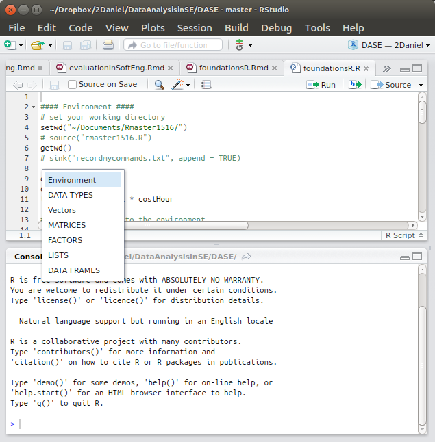
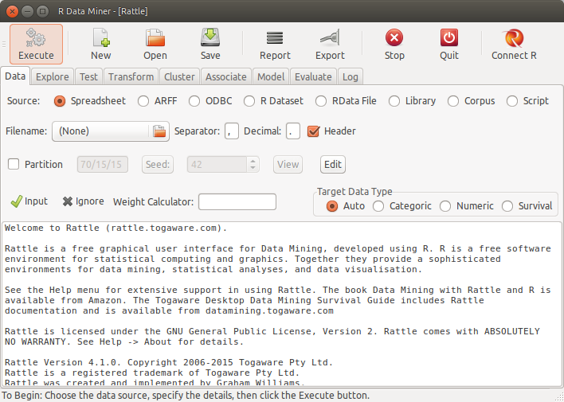

# (PART) Introduction to the R Language {-}

# Introduction to R {#r-intro}

The goal of the first part of this book is to get you up to speed with the basics of __R__ as quickly as possible. 

## Installation 
  * Follow the procedures according to your operating system.
  * Linux: You need to have blas and gfortran installed on your Linux, for installing the 'coin' package.
  * _Rgraphviz_ requires installation from  `source("http://bioconductor.org/biocLite.R")`, then `biocLite("Rgraphviz")`.
  * Install missing packages:
```{r}
listofpackages <- c("ggplot2", "vioplot", "UsingR", "fpc", "reshape", "arules","arulesViz", "party", "C50", "utils", "rpart", "rpart.plot", "class", "klaR", "e1071", "popbio", "boot", "dplyr", "doParallel", "gbm", "DMwR", "pROC", "neuralnet", "igraph", "RMySQL", "caret", "randomForest", "tm", "wordcloud", "xts", "lubridate", "forecast")
newpackages <- listofpackages[!(listofpackages %in% installed.packages()[,"Package"])]
if(length(newpackages)>0) install.packages(newpackages)

# install from archive
if (!is.element("rgp", installed.packages()[,1]))
{ install.packages("https://cran.r-project.org/src/contrib/Archive/rgp/rgp_0.4-1.tar.gz", 
                                                    repos = NULL)
}

```

## R and RStudio
  * R is a programming language for statistical computing and data analysis that supports a variety of programming styles. See [R in Wikipedia](https://en.wikipedia.org/wiki/R_(programming_language))
  * R has multiple online resources and books.
  * [R coding style](https://google.github.io/styleguide/Rguide.xml)
  * Getting help in R
    + [RStudio cheat sheet](https://www.rstudio.com/wp-content/uploads/2016/01/rstudio-IDE-cheatsheet.pdf) 
    + [Base R cheat sheet](https://www.rstudio.com/wp-content/uploads/2016/10/r-cheat-sheet-3.pdf)
    + [Advanced R cheat sheet](https://www.rstudio.com/wp-content/uploads/2016/02/advancedR.pdf)
    + [Data Visualization cheat sheet](https://www.rstudio.com/wp-content/uploads/2015/12/ggplot2-cheatsheet-2.0.pdf)
    + [R Markdown cheat sheet](https://www.rstudio.com/wp-content/uploads/2015/02/rmarkdown-cheatsheet.pdf)
    + [R Markdown Basics] (http://rmarkdown.rstudio.com/authoring_basics.html)
    + help("    ") command 
  - R as a calculator. Console: It uses the command-line interface. 

Examples:
```{r}
x <- c(1,2,3,4,5,6)   # Create ordered collection (vector)
y <- x^2              # Square the elements of x
print(y)              # print (vector) y
mean(y)               # Calculate average (arithmetic mean) of (vector) y; result is scalar
var(y)                # Calculate sample variance
lm_1 <- lm(y ~ x)     # Fit a linear regression model "y = f(x)" or "y = B0 + (B1 * x)"
                      # store the results as lm_1
print(lm_1)           # Print the model from the (linear model object) lm_1
summary(lm_1)         # Compute and print statistics for the fit
                      # of the (linear model object) lm_1
par(mfrow=c(2, 2))    # Request 2x2 plot layout
plot(lm_1)            # Diagnostic plot of regression model
```  
  * R script. # A file with R commands
    `# comments`
    `source("filewithcommands.R")`
    `sink("recordmycommands.lis")`
    `savehistory()`
  * From command line:
    + Rscript  
    + Rscript file with `-e` (e.g. `Rscript -e 2+2`)  
    + To exit R: `quit()`
 
  * Variables
  * Operators
    + assign operator `<-`   
    + sequence operator : Example: `mynums <- 0:20`
    + arithmetic operators: + - = / ^   %/% (integer division) %% (modulus operator)
  * The workspace. Objects.
    + `ls()` `objects()`  `ls.str()` lists and describes the objects   
    + `rm(x)` delete a variable. E.g., `rm(totalCost)`
    + `s.str()`
    + `objects()`
    + `str()`  The structure function provides information about the variable
  * RStudio, RCommander and RKWard are the well-known IDEs for R (more later). 

***
  * Four # ('####') create an _environment_ in RStudio. An environment binds a set of names to a set of values. You can think of an environment as a bag of names. 
    + [Environment basics](http://adv-r.had.co.nz/Environments.html#env-basics)


```{r rstudio, echo = FALSE, out.width = "75%"}

```

Working directories:

```{r}
# set your working directory
# setwd("~/workingDir/")
getwd()
# record R commands:
# sink("recordmycommands.txt", append = TRUE)
```

***
    
## Basic Data Types
  - class(   )
  - logical: TRUE  FALSE
  - numeric, integer:  
      * is.numeric(  )
      * is.integer(  )  
  - character


Examples:
```{r}
TRUE
class(TRUE)
FALSE
NA  # missing
class(NA)
T
F

# numeric data type
2
class(2)
2.5
2L  # integer
class(2L)

is.numeric(2)
is.numeric(2L)
is.integer(2)
is.integer(2L)
```

  - data type coercion:  
      * as.numeric(  )
      * as.character(  )   
      * as.integer(  )

Examples:
```{r}
truenum <- as.numeric(TRUE)
truenum
class(truenum)
falsenum <- as.numeric(FALSE)
falsenum

num2char <- as.character(55)
num2char
char2num  <- as.numeric("55.3")

char2int  <- as.integer("55.3")

```


### Mising values

  - NA Not Available, which is not a number as well. It applies to missing values. 
  - NaN means 'Not a Number'

Examples:
```{r}
NA + 1
mean(c(5,NA,7))
mean(c(5,NA,7), na.rm=TRUE)  # some functions allow to remove NAs
```

***
  
## Vectors

Examples:

```{r}
phases <- c("reqs", "dev", "test1", "test2", "maint")
str(phases)
is.vector(phases)

thevalues <- c(15, 60, 30, 35, 22)
names(thevalues) <- phases
str(thevalues)
thevalues

# a single value is a vector
aphase <- 44
is.vector(aphase)

```

A single value is a vector! Example:
```{r}
aphase <- 44
is.vector(aphase)

length(aphase)
length(thevalues)
```

### Coercion for vectors
```{r}
thevalues1 <- c(15, 60, "30", 35, 22)
class(thevalues1)
thevalues1


# <-  is equivalent to   assign ( )

assign("costs", c(50, 100, 30))
```

### Vector arithmetic

It is done in all elements. For example:

```{r}
assign("costs", c(50, 100, 30))
costs/3
costs - 5
costs <- costs - 5

incomes <- c(200, 800, 10)
earnings <- incomes - costs
sum(earnings)
# R recycles values in vectors!
```

Subsetting vectors
```{r}
### Subsetting vectors  []

phase1 <- phases[1]
phase1
phase3 <- phases[3]
phase3

thevalues[phase1]
thevalues["reqs"]

testphases <- phases[c(3,4)]
thevalues[testphases]

### Negative indexes

phases1 <- phases[-5]
phases
phases1

#phases2 <- phases[-testphases] ## error in argument
phases2 <- phases[-c(3,4)]
phases2

### subset using logical vector

phases3 <- phases[c(FALSE, TRUE, TRUE, FALSE)] #recicled first value
phases3

selectionv <- c(FALSE, TRUE, TRUE, FALSE)
phases3 <- phases[selectionv]
phases3

selectionvec2 <- c(TRUE, FALSE)

thevalues2 <- thevalues[selectionvec2]
thevalues2


### Generating regular sequenceswith  : and seq

aseqofvalues <- 1:20

aseqofvalues2 <- seq(from=-3, to=3, by=0.5 )
aseqofvalues2

aseqofvalues3 <- seq(0, 100, by=10)
aseqofvalues4 <- aseqofvalues3[c(2, 4, 6, 8)]
aseqofvalues4
aseqofvalues4 <- aseqofvalues3[-c(2, 4, 6, 8)]
aseqofvalues4

aseqofvalues3[c(1,2)] <- c(666,888)
aseqofvalues3

### Logical values in vectors TRUE/FALSE

aseqofvalues3 > 50
aseqofvalues5 <- aseqofvalues3[aseqofvalues3 > 50]
aseqofvalues5
aseqofvalues6 <- aseqofvalues3[!(aseqofvalues3 > 50)]
aseqofvalues6

### Comparison functions

aseqofvalues7 <- aseqofvalues3[aseqofvalues3 == 50]
aseqofvalues7

aseqofvalues8 <- aseqofvalues3[aseqofvalues3 == 22]
aseqofvalues8

aseqofvalues9 <- aseqofvalues3[aseqofvalues3 != 50]
aseqofvalues9

logicalcond <- aseqofvalues3 >= 50
aseqofvalues10 <- aseqofvalues3[logicalcond]
aseqofvalues10


### Remove Missing Values (NAs)

aseqofvalues3[c(1,2)] <- c(NA,NA)
aseqofvalues3

aseqofvalues3 <- aseqofvalues3[!is.na(aseqofvalues3)]
aseqofvalues3
```

***

## Arrays and Matrices
```{r}
mymat <- matrix(1:12, nrow =2)
mymat

mymat <- matrix(1:12, ncol =3)
mymat

mymat <- matrix(1:12, nrow=2, byrow = TRUE)
mymat

mymat <- matrix(1:12, nrow=3, ncol=4)
mymat

mymat <- matrix(1:12, nrow=3, ncol=4, byrow=TRUE)
mymat

### recycling
mymat <- matrix(1:5, nrow=3, ncol=4, byrow=TRUE)
mymat

### rbind  cbind

cbind(1:3, 1:3)
rbind(1:3, 1:3)

mymat <- matrix(1)

mymat <- matrix(1:8, nrow=2, ncol=4, byrow=TRUE)
mymat

rbind(mymat, 9:12)
mymat <- cbind(mymat, c(5,9))
mymat

mymat  <- matrix(1:8, byrow = TRUE, nrow=2)
mymat
rownames(mymat) <- c("row1", "row2")
mymat
colnames(mymat) <- c("col1", "col2", "col3", "col4")
mymat

mymat2 <- matrix(1:12, byrow=TRUE, nrow=3, dimnames=list(c("row1", "row2", "row3"),
                                                         c("col1", "col2", "col3", "col4")))
mymat2

### Coercion in Arrays

matnum <- matrix(1:8, ncol = 2)
matnum
matchar <- matrix(LETTERS[1:6], nrow = 4, ncol = 3)
matchar

matchars <- cbind(matnum, matchar)
matchars

### Subsetting  

mymat3 <- matrix(sample(-8:15, 12), nrow=3)
mymat3
mymat3[2,3]
mymat3[1,4]
mymat3[3,]
mymat3[,4]
mymat3[5] # counts elements by column
mymat3[9]

## Subsetting multiple elements

mymat3[2, c(1,3)]
mymat3[c(2,3), c(1,3,4)]

rownames(mymat3) <- c("r1", "r2", "r3")
colnames(mymat3) <- c("c1", "c2", "c3", "c4")
mymat3["r2", c("c1", "c3")]

### Subset by logical vector
mymat3[c(FALSE, TRUE, FALSE),
       c(TRUE, FALSE, TRUE, FALSE)]
mymat3[c(FALSE, TRUE, TRUE),
       c(TRUE, FALSE, TRUE, TRUE)]

### matrix arithmetic

row1 <- c(220, 137)
row2 <- c(345, 987)
row3 <- c(111, 777)

mymat4 <- rbind(row1, row2, row3)
rownames(mymat4) <- c("row_1", "row_2", "row_3")
colnames(mymat4) <- c("col_1", "col_2")
mymat4

mymat4/10
mymat4 -100

mymat5 <- rbind(c(50,50), c(10,10), c(100,100))
mymat5

mymat4 - mymat5

mymat4 * (mymat5/100)


### index matrices

m1 <- array(1:20, dim=c(4,5))
m1

index <- array(c(1:3, 3:1), dim=c(3,2))
index

m1[index] <-0
m1
```
***
## Factors  
  - Factors in R are stored as a vector of integer values with a corresponding set of character values to use when the factor is displayed.

```{r}
personnel <- c("Analyst1", "ManagerL2", "Analyst1", "Analyst2",  "Boss", "ManagerL1", "ManagerL2", "Programmer1", "Programmer2", "Programmer3", "Designer1","Designer2", "OtherStaff")  # staff in a company

personnel_factors <- factor(personnel)
personnel_factors  #sorted alphabetically
str(personnel_factors)

personnel2 <- factor(personnel, 
                       levels = c("Boss", "ManagerL1", "ManagerL2", "Analyst1", "Analyst2",  "Designer1","Designer2", "Programmer1", "Programmer2", "Programmer3", "OtherStaff"))  #do not duplicate the same factors
personnel2
str(personnel2)

# a factor's levels will always be character values.

levels(personnel2) <- c("B", "M1", "M2", "A1", "A2", "D1", "D2", "P1", "P2", "P3", "OS")
personnel2

personnel3 <- factor(personnel,
                     levels = c("Boss", "ManagerL1", "ManagerL2", "Analyst1", "Analyst2",  "Designer1","Designer2", "Programmer1", "Programmer2", "Programmer3", "OtherStaff"),
                     c("B", "M1", "M2", "A1", "A2", "D1", "D2", "P1", "P2", "P3", "OS"))
personnel3


### Nominal versus ordinal, ordered factors
personnel3[1] < personnel3[2]  # error, factors not ordered

tshirts <- c("M", "L", "S", "S", "L", "M", "L", "M")

tshirt_factor <- factor(tshirts, ordered = TRUE,
                        levels = c("S", "M", "L"))
tshirt_factor

tshirt_factor[1] < tshirt_factor[2]
```

***
## Lists

  - '['  returns a list
  - '[[' returns the list element
  - '$' returns the content of that element in the list
  
```{r}

c("R good times", 190, 5)

song <- list("R good times", 190, 5)
is.list(song)
str(song)

names(song) <- c("title", "duration", "track")
song
song$title

song2 <- list(title="Good Friends", 
              duration = 125,
              track = 2,
              rank = 6)

song3 <- list(title="Many Friends", 
              duration = 125,
              track= 2,
              rank = 1,
              similar2 = song2)

song[1]
song$title
str(song[1])
song[[1]]
str(song[[1]])

song2[3]

song3[5]  # a list
str(song3[5])
song3[[5]]
song3$similar2

song[c(1,3)]
str(song[c(1,3)])

result <- song[c(1,3)]
result[1]
result[[1]]
str(result)
result$title
result$track

# access with [[ to content 
song3[[5]][[1]]
song3$similar2[[1]]

# Subsets
### subset by names
song[c("title", "track")]

song3["similar2"]
resultsimilar <- song3["similar2"]
str(resultsimilar)
resultsimilar1 <-song3[["similar2"]]
str(resultsimilar1)
resultsimilar1$title

# subset by logicals
song[c(TRUE, FALSE, TRUE, FALSE)]
result3 <- song[c(TRUE, FALSE, TRUE, FALSE)]  # is a list of two elements

# extending the list
shared <- c("Hillary", "Javi", "Mikel", "Patty")

song3$shared <- shared
str(song3)

cities <- list("Bilbao", "New York", "Tartu")
song3[["cities"]] <- cities
str(song3)
```
***
## Data frames
```{r}
thenames <- c("Ane", "Mike", "Xabi", "Viktoria", "Edurne")
ages <- c(44, 20, 33, 15, 65)
employee <- c(FALSE, FALSE, TRUE, TRUE, FALSE)

mydataframe <- data.frame(thenames, ages, employee)
mydataframe

names(mydataframe) <- c("FirstName", "Age", "Employee")
str(mydataframe)

#strings are not factors!

mydataframe <- data.frame(thenames, ages, employee,
                          stringsAsFactors=FALSE)
names(mydataframe) <- c("FirstName", "Age", "Employee")
str(mydataframe)


# subset data frame

mydataframe[4,2]
mydataframe[4, "Age"]
mydataframe[, "FirstName"]

mydataframe[c(2,5), c("Age", "Employee")]
matfromframe <- as.matrix(mydataframe[c(2,5), c("Age", "Employee")])
str(matfromframe)

mydataframe[3]

# convert to vector
mydf0 <- mydataframe[3] #data.frame
str(mydf0)


myvec <- mydataframe[[3]]  #vector
str(myvec)

mydf0asvec <- as.vector(mydataframe[3]) # but it doesn't work . Use [[]]
str(mydf0asvec)
mydf0asvec <- as.vector(mydataframe[[3]])
str(mydf0asvec)

# add column
height <- c(166, 165, 158, 176, 199)
weight <- c(66, 77, 99, 88, 109)
mydataframe$height <- height 
mydataframe[["weight"]] <- weight
mydataframe

# add a column 

birthplace <- c("Tallinn", "London", "Donostia", "Paris", "New York")

mydataframe <- cbind(mydataframe, birthplace)
mydataframe

# add a row 

anton <- data.frame(FirstName = "Anton", Age = 77, Employee=TRUE, height= 170, weight = 65, birthplace ="Amsterdam", stringsAsFactors=FALSE)
mydataframe <- rbind (mydataframe, anton)
mydataframe

# sorting 

mydataframeSorted <- mydataframe[order(mydataframe$Age, decreasing = TRUE), ]  #all columns
mydataframeSorted
mydataframeSorted2 <- mydataframe[order(mydataframe$Age, decreasing = TRUE), c(1,2,6) ]
mydataframeSorted2
```

## Reading Data

```{r}
library(foreign)
isbsg <- read.arff("datasets/effortEstimation/isbsg10teaser.arff")

mydataISBSG <- isbsg[, c("FS", "N_effort")]

str(mydataISBSG)
```

***

## Plots

There are several graphic packages that are recommended, in particular `ggplot`. However, there is some basic support in the R base for graphics. The following Figure \@ref(fig:plotExample) shows a simple plot.

```{r plotExample, fig.cap="Simple plot"}
plot(mydataISBSG$FS, mydataISBSG$N_effort)
```


***
## Flow of Control 

Ifelse:

```{r}
library(foreign)
kc1 <- read.arff("datasets/defectPred/D1/KC1.arff")
kc1$Defective <- ifelse(kc1$Defective == "Y", 1, 0)
head(kc1, 1)
```

## Rattle

There is graphical interface, Rattle, that allow us to perform some data mining tasks [@Williams11].  




