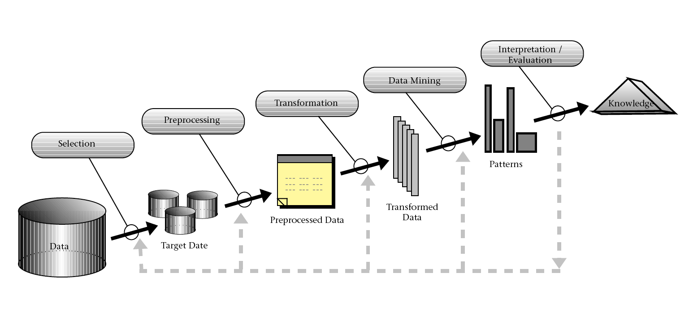
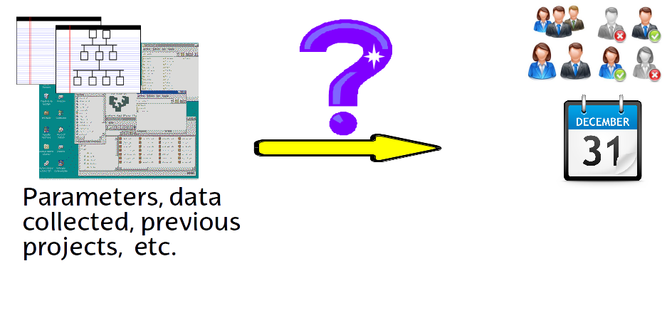

# (PART) Introduction to Data Mining {-}

We will deal with extracting information from data, either for estimation, defect prediction, planning, etc. 

We will provide an overview of data analsyis using different techniques. 

# What is Data Mining / Knowledge Discovery in Databases (KDD)

The non-trivial process of identifying valid, novel, potentially useful, and ultimately understandable patterns in data [@FayyadPS1996]

The Cross Industry Process for Data Mining (CRISP-DM) also provides a common and well-developed framework for delivering data mining projects identifying six steps [@shearer00crisp]:

  1. Problem Understanding
  2. Data Understanding
  3. Data Preparation
  4. Modeling
  5. Evaluation
  6. Deployment

## The Aim of Data Analysis and Statistical Learning
  - The aim of any data analysis is to  **understand the data** 
  - and to build models for making predictions and estimating future events based on past data
  - and to make statistical inferences from our data.
  - We may want to test different hypothesis on the data
  - We want to generate conclusions about the population where our sample data comes from
  - Most probably we are interested in building a model for quality, time, defects or effort prediction
    
  
  
  - We want to find a function $f()$, that given $X1, X2, ...$  computes $Y=f(X1, X2, ..., Xn)$

## Data Science 

Data science (DS) is an inter-disciplinary field that uses scientific methods, processes, algorithms and systems to extract knowledge and insights from many structured and unstructured data. Data science is related to data mining, machine learning and big data. 

We may say that the term DS embraces all terms related to data analysis that previously were under different disciplines. 

## Some References 

* [W.N. Venables, D.M. Smith and the R Core Team, An Introduction to R](https://cran.r-project.org/doc/manuals/r-release/R-intro.pdf)

Generic books about statistics:

  * [John Verzani, *simpleR - Using R for Introductory Statistics*](https://cran.r-project.org/doc/contrib/Verzani-SimpleR.pdf)
  
  * [Peter Dalgaard, *Introductory Statistics with R*, 2nd Edt., Springer, 2008](https://www.springer.com/gp/book/9780387790534)

  * [Gareth James, Daniela Witten, Trevor Hastie, Robert Tibshirani, *An Introduction to Statistical Learning with Applications in R*, Springer, 2013](http://www.springer.com/it/book/9781461471370)

  * [Geoff Cumming, *Understanding the New Statistics: Effect Sizes, Confidence Intervals, and Meta-Analysis*, Routledge, New York, 2012](https://www.routledge.com/products/9780415879682)
    

## Data Mining and Data Science with R
* [R for Data Science](https://r4ds.had.co.nz/)
* [Practical Data Science with R](https://www.manning.com/books/practical-data-science-with-r-second-edition)
*[R for Everyone: Advanced Analytics and Graphics](https://www.jaredlander.com/r-for-everyone/)

  * [Graham Williams, *Data Mining with Rattle and R: The Art of Excavating Data for Knowledge Discovery*, Springer 2011](http://www.springer.com/gp/book/9781441998897)
  
    Also the author maintains a Web site:
    [http://rattle.togaware.com/](http://rattle.togaware.com/)
  
  * [Luis Torgo, *Data Mining with R: Learning with Case Studies*, Chapman and Hall/CRC, 2010](https://www.crcpress.com/Data-Mining-with-R-Learning-with-Case-Studies/Torgo/9781439810187)
  
  * [http://www.rdatamining.com/](http://www.rdatamining.com/)
  
  
## Data Mining with Weka

Weka is another popular framework written in Java that can be used and extended with other languages and frameworks. The authors of Weka also have a popular book:

  *  Ian Witten, Eibe Frank, Mark Hall, Christopher J. Pal, Data Mining: Practical Machine Learning Tools and Techniques (4th Edt), Morgan Kaufmann, 2016, ISBN: 978-0128042915

