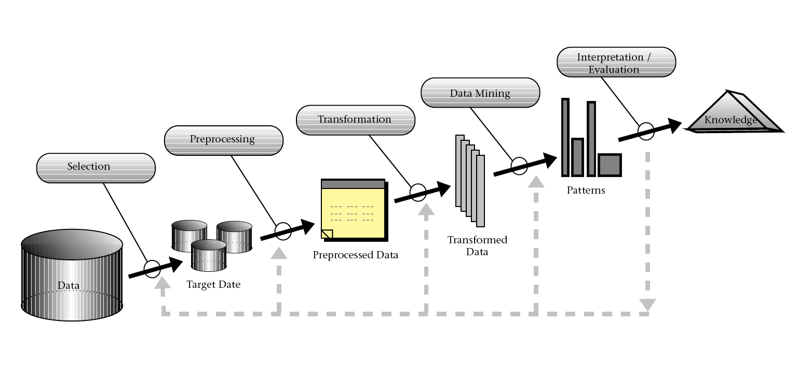
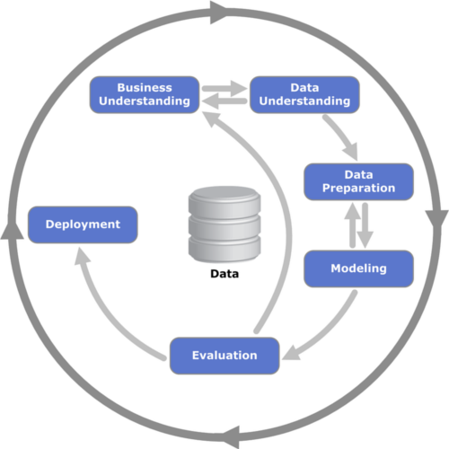
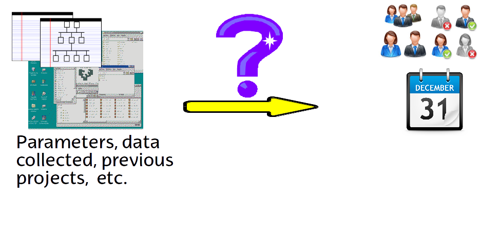
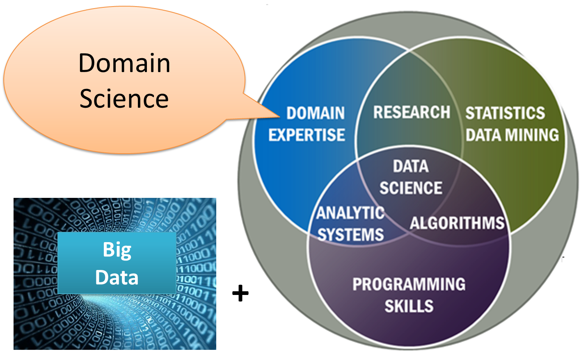

# What is Data Mining {#sec-intro}

In this course we extract useful information from **software engineering data** such as commits, issues, static metrics, test results, and release histories.

Typical goals include effort estimation, defect prediction, risk-aware planning, and quality assessment.

We provide an overview of data analysis using techniques that are directly applicable to software projects.

A definition we will like to highlight is the one about Knowledge Discovery in Databases (KDD), which is the non-trivial process of identifying valid, novel, potentially useful, and ultimately understandable patterns in data [@FayyadPS1996]

The Cross Industry Process for Data Mining (CRISP-DM) also provides a common and well-developed framework for delivering data mining projects identifying six steps [@shearer00crisp]:

  1. Problem Understanding
  2. Data Understanding
  3. Data Preparation
  4. Modeling
  5. Evaluation
  6. Deployment

## The Aim of Data Analysis and Statistical Learning
  - The first aim is to **understand software project data** (distributions, missing values, outliers, and correlations).
  - We build models that predict future engineering outcomes from historical repositories.
  - We make statistical inferences to support engineering decisions.
  - We test hypotheses such as: "Do larger modules have significantly higher defect risk?"
  - We draw conclusions about the broader project or organization from the sampled systems.
  - In this domain, common targets are defect proneness, effort, delivery time, test failures, and maintenance risk.
    
  
  
  - We want to learn a function $f()$ such that software metrics $X_1, X_2, ...$ predict an engineering outcome $Y = f(X_1, X_2, ..., X_n)$.

## Data Science 

Data science (DS) is an inter-disciplinary field that uses scientific methods, processes, algorithms and systems to extract knowledge and insights from many structured and unstructured data. Data science is related to data mining, machine learning and big data. 

In software engineering, data science combines software analytics, statistics, and machine learning to improve products and processes (for example, code quality monitoring, release-readiness prediction, and incident analysis). 

## Further Information {#sec-further-info-intro}

### Official R Documentation

- [W.N. Venables et al., *An Introduction to R*](https://cran.r-project.org/doc/manuals/r-release/R-intro.pdf) — free official manual
- [CRAN Task Views](https://cran.r-project.org/web/views/) — curated package lists by topic (Machine Learning, Time Series, etc.)
- [Posit cheatsheets](https://posit.co/resources/cheatsheets/) — quick-reference cards for tidyverse, ggplot2, tidymodels, and more

### Free Online Books

- [R for Data Science (2nd ed.)](https://r4ds.hadley.nz/) — Wickham, Çetinkaya-Rundel & Grolemund
- [Tidy Modeling with R](https://www.tmwr.org/) — Kuhn & Silge (tidymodels framework)
- [An Introduction to Statistical Learning with R (2nd ed.)](https://www.statlearning.com/) — James, Witten, Hastie & Tibshirani (free PDF)
- [Hands-On Machine Learning with R](https://bradleyboehmke.github.io/HOML/) — Boehmke & Greenwell
- [John Verzani, *simpleR – Using R for Introductory Statistics*](https://cran.r-project.org/doc/contrib/Verzani-SimpleR.pdf)
- [Peter Dalgaard, *Introductory Statistics with R* (2nd ed.), Springer, 2008](https://www.springer.com/gp/book/9780387790534)
- [Geoff Cumming, *Understanding the New Statistics*, Routledge, 2012](https://www.routledge.com/products/9780415879682)

### Data Mining and Machine Learning with R

- [Luis Torgo, *Data Mining with R: Learning with Case Studies* (2nd ed.), Chapman & Hall/CRC, 2020](https://www.routledge.com/Data-Mining-with-R-Learning-with-Case-Studies-Second-Edition/Torgo/p/book/9781482234893)
- [Graham Williams, *Data Mining with Rattle and R*, Springer, 2011](https://www.springer.com/gp/book/9781441998897) — GUI-oriented; see also [rattle.togaware.com](https://rattle.togaware.com/)
- [Practical Data Science with R (2nd ed.)](https://www.manning.com/books/practical-data-science-with-r-second-edition) — Zumel & Mount

For an overview of popular R packages used in data mining see @sec-rpackages.

### Other Frameworks

**Weka** is a widely-used Java-based data mining platform with a comprehensive GUI. The accompanying book is:

- Ian Witten, Eibe Frank, Mark Hall & Christopher J. Pal, *Data Mining: Practical Machine Learning Tools and Techniques* (4th ed.), Morgan Kaufmann, 2016. ISBN: 978-0128042915

**Python** is complementary to R; see @sec-rnpython for running Python from R via `reticulate`.

