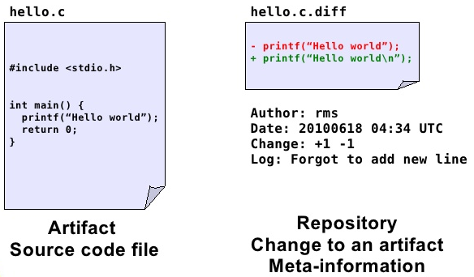
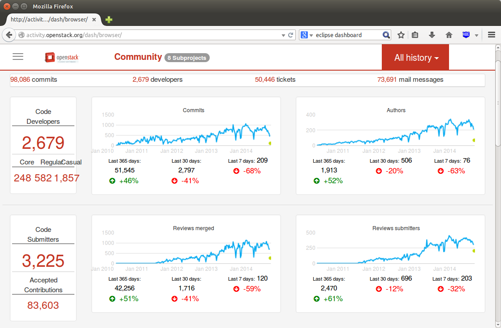
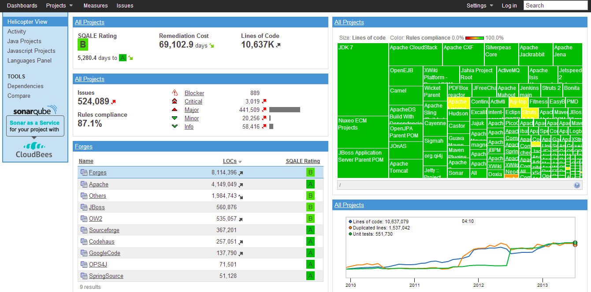

# Data Sources in Software Engineering

We classify this trail in the following categories:

* _Source code_ can be studied to measure its properties, such as size or complexity.

* _Source Code Management Systems_ (SCM) make it possible to store all the changes that the different source code files undergo during the project. Also, SCM systems allow for work to be done in parallel by different developers over the same source code tree. Every change recorded in the system is accompanied with meta-information (author, date, reason for the change, etc) that can be used for research purposes.

* _Issue or Bug tracking systems_ (ITS). Bugs, defects and user requests are managed in ISTs, where users and developers can fill tickets with a description of a defect found, or a desired new functionality. All the changes to the ticket are recorded in the system, and most of the systems also record the comments and communications among all the users and developers implied in the task. 

* _Messages_ between developers and users. In the case of free/open source software, the projects are open to the world, and the messages are archived in the form of mailing lists and social networks which can also be mined for research purposes. There are also some other open message systems, such as IRC or forums. 

* _Meta-data about the projects_. As well as the low level information of the software processes, we can also find meta-data about the software projects which can be useful for research. This meta-data may include intended-audience, programming language, domain of application, license (in the case of open source), etc.

* _Usage data_. There are statistics about software downloads, logs from servers, software reviews, etc. 

Types of information stored in the repositories:

  * Meta-information about the project itself and the
people that participated.

    + Low-level information

        * Mailing Lists (ML)

        * Bug Tracking Systems (BTS) or Project Tracker System (PTS)

        * Software Configuration Management Systems (SCM)

    + Processed information. For example project management information about the effort estimation and cost of the project.

* Whether the repository is public or not

* Single project vs. multiprojects. Whether the repository contains information of a single project with multiples versions or multiples projects and/or versions.

* Type of content, open source or industrial projects

* Format in which the information is stored and formats or technologies for accessing the information:
  
    + Text. It can be just plain text, CSV (Comma Separated Values) files, Attribute-Relation File Format
(ARFF) or its variants
    
    + Through databases. Downloading dumps of the database.
    
    + Remote access such as APIs of Web services or REST

# Repositories

The repository ecosystem has changed substantially in recent years. In
practice, it is useful to distinguish between large-scale open infrastructures,
curated benchmark collections, and restricted datasets.

## Large-scale Open Infrastructures (Current)

- **GitHub Archive** (event stream for public GitHub activity)
  [https://www.gharchive.org/](https://www.gharchive.org/)
- **GitHub public data on BigQuery** (queryable snapshots/events and metadata)
  [https://console.cloud.google.com/marketplace/product/github/github-repos](https://console.cloud.google.com/marketplace/product/github/github-repos)
- **Software Heritage** (universal archive of publicly available source code)
  [https://www.softwareheritage.org/](https://www.softwareheritage.org/)
- **World of Code** (very large source-code and commit graph; research access model)
  [https://worldofcode.org/](https://worldofcode.org/)
- **Libraries.io** (package/dependency metadata across many ecosystems)
  [https://libraries.io/](https://libraries.io/)

## Curated and Reproducible Research Collections

- **Zenodo** (datasets/code with DOI for reproducibility)
  [https://zenodo.org/](https://zenodo.org/)
- **PROMISE repository** (classic SE benchmark datasets)
  [http://promise.site.uottawa.ca/SERepository/datasets-page.html](http://promise.site.uottawa.ca/SERepository/datasets-page.html)
- **Awesome MSR list** (curated pointers to mining software repositories resources)
  [https://github.com/dspinellis/awesome-msr](https://github.com/dspinellis/awesome-msr)

## Restricted / Controlled-Access Datasets

- **ISBSG** (industry benchmark data, mainly effort/cost)
  [http://www.isbsg.org/](http://www.isbsg.org/)
- **World of Code** can also fall into this category depending on requested access level and usage mode.

## Legacy Resources (Still Cited, Use with Caution)

Several repositories frequently cited in older literature are partially
inactive, changed, or difficult to reproduce exactly in their original form
(for example, FLOSSMole, FLOSSMetrics, some SourceForge archives, and
project-specific mirrors). They remain useful for historical comparison, but
new studies should prefer modern, actively maintained infrastructures.

For PROMISE/NASA-style defect datasets, note the well-documented quality issues
and the limited availability of original source context.

# Open Tools/Dashboards to extract data

Process to extract data:

Within the open source community, several toolkits allow us to extract data that can be used to explore projects:

Metrics Grimoire
[http://metricsgrimoire.github.io/](http://metricsgrimoire.github.io/)

SonarQube
[http://www.sonarqube.org/](http://www.sonarqube.org/)

CKJM (OO Metrics tool)
[http://gromit.iiar.pwr.wroc.pl/p_inf/ckjm/](http://gromit.iiar.pwr.wroc.pl/p_inf/ckjm/)

Collects a large number of object-oriented metrics from code.

## Issues

There are problems such as different tools report different values for the same metric [@Lincke2008]

It is well known that the NASA datasets have some problems:

 + [@Gray2011] The misuse of the NASA metrics data program data sets for automated software defect prediction

 + [@Shepperd2013] Data Quality: Some Comments on the NASA Software Defect Datasets

## Critical Data Quality Threats in SE Mining

When mining software repositories, several systematic threats can corrupt datasets
before any analysis begins. These are distinct from the general data quality
issues above and are specific to the sociotechnical nature of software repositories.

**Bot activity.** A substantial fraction of commits, issues, pull requests, and
comments in modern repositories originate from automated agents — dependency
updaters (Dependabot, Renovate), CI bots (GitHub Actions), or project management
bots. Including bot activity inflates author counts, commit frequencies, and
issue-close rates in ways that distort any analysis based on those signals.
Detecting bots requires heuristics or classifiers trained on names, email
patterns, and behavioral regularity [@Rosa2021Bot].

**Identity and alias merging.** The same developer may appear under multiple
email addresses, usernames, or display names across systems. Without alias
resolution, contributor statistics, author-level effort models, and social
network analyses are unreliable. Tools such as *git-fame*, *SortingHat*, or
custom string-similarity heuristics are commonly used for this step
[@Kalliamvakou2014Perils].

**Tangled commits.** A single commit may fix a bug, refactor existing code, and
add a new feature simultaneously. SZZ-based defect datasets assume that
bug-fixing commits cleanly identify the bug-introducing change — a fragile
assumption when commits are tangled. Untangling methods exist but are rarely
applied in published datasets.

**The SZZ algorithm and its known flaws.** Most defect prediction datasets
label bug-introducing changes by tracing bug-fixing commits back to the lines
they modified, a process codified in the SZZ algorithm. SZZ is known to be
noisy: it misattributes whitespace changes, comment edits, and moved code as
bug introductions. Multiple variants (B-SZZ, AG-SZZ, MA-SZZ, RA-SZZ) have
been proposed to reduce these errors; Borg et al. provide a systematic
comparison [@Borg2019SZZ].

**Near-duplicate and forked repositories.** GitHub hosts millions of repository
forks. Mining without fork-filtering inflates dataset size and introduces
near-identical observations, inflating apparent sample size and correlation.
World of Code and GHTorrent both document the extent of this problem.

**Survivorship bias.** Analyses on "active" or "popular" repositories
systematically exclude projects that died, stalled, or were kept private.
Kalliamvakou et al. identified this as one of the central perils of mining
GitHub; findings from surviving projects may not generalise to the full
population of software development [@Kalliamvakou2014Perils].

## What Is Often Missing in SE Data Sources

When selecting a dataset, it is common to focus on size and number of attributes, but several critical aspects are often under-reported:

- **Provenance**: exact extraction query/script, extraction date, and tool version.
- **Versioning**: whether the data corresponds to one release, multiple releases, or moving snapshots.
- **Unit of analysis**: file-level, class-level, module-level, commit-level, or issue-level.
- **Ground truth definition**: how labels were assigned (for example, how a file is marked as defective).
- **Missing data policy**: whether missing values were removed, imputed, or left as-is.
- **Data quality checks**: duplicate records, inconsistent identifiers, impossible values.
- **Licensing and legal constraints**: redistribution rights and terms of use.
- **Privacy/security**: anonymization of developer identities and removal of sensitive fields.

These elements are essential to make replication and fair comparison possible.

## Minimum Dataset Card for Reproducibility

For each dataset used in this course/project, document at least:

1. Source repository and URL
2. Extraction period and timezone
3. Granularity and keys (e.g., file, commit, issue)
4. Label definition and class distribution
5. Number of records before/after cleaning
6. Features removed and rationale
7. Known threats to validity

This small checklist dramatically improves transparency and repeatability.

