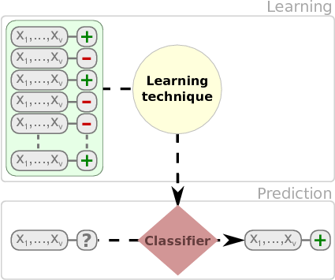
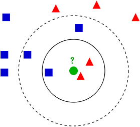
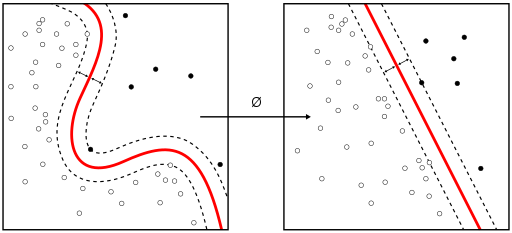
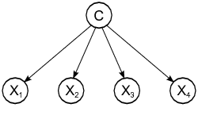
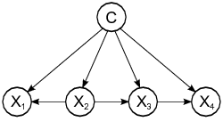
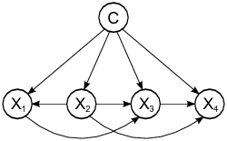

# (PART) Supervised Models {-}

# Supervised Classification

A classification problem can be defined as the induction, from a dataset $\cal D$, of a classification function $\psi$ that, given the attribute vector of an instance/example, returns a class ${c}$. A regression problem, on the other hand, returns an numeric value.

Dataset, $\cal D$, is typically composed of $n$ attributes and a class attribute $C$. 

| $Att_1$  | ... | $Att_n$  | $Class$ |
|----------|-----| ---------|---------|
| $a_{11}$ | ... | $a_{1n}$ | $c_1$   |
| $a_{21}$ | ... | $a_{2n}$ | $c_2$   |
| ...      | ... | ...      | ...     |
| $a_{m1}$ | ... | $a_{mn}$ | $c_m$   |


Columns are usually called _attributes_ or _features_. Typically, there is a _class_ attribute, which can be numeric or discrete. When the class is numeric, it is a regression problem. With discrete values, we can talk about binary classification or multiclass (multinomial classification) when we have more than three values. There are variants such _multi-label_ classification (we will cover these in the advanced models section).

Once we learn a model, new instances are classified. As shown in the next figure.




We have multiple types of models such as _classification trees_, _rules_, _neural networks_,  and _probabilistic classifiers_ that can be used to classify instances.

Fernandez et al provide an extensive comparison of 176 classifiers using the UCI dataset [@FernandezCBA14].

We will show the use of different classification techniques in the problem of defect prediction as running example. In this example,the different datasets are composed of classical metrics (_Halstead_ or _McCabe_ metrics) based on counts of operators/operands and like or object-oriented metrics (e.g. Chidamber and Kemerer) and the class attribute indicating whether the module or class was defective.


## Classification Trees

There are several packages for inducing classification trees, for example with the [partykit package](https://cran.r-project.org/web/packages/partykit/index.html) (recursive partitioning):


```{r warning=FALSE, message=FALSE}
library(foreign) # To load arff file
library(partykit) # Build a decision tree
library(rsample)
library(yardstick)

jm1 <- read.arff("./datasets/defectPred/D1/JM1.arff")
str(jm1)

# Stratified partition (training and test sets)
set.seed(1234)
split <- initial_split(jm1, prop = 0.60, strata = Defective)
jm1.train <- training(split)
jm1.test <- testing(split)

jm1.formula <- jm1$Defective ~ . # formula approach: defect as dependent variable and the rest as independent variables
jm1.ctree <- ctree(jm1.formula, data = jm1.train)

# predict on test data
pred <- predict(jm1.ctree, newdata = jm1.test)
# check prediction result
table(pred, jm1.test$Defective)
plot(jm1.ctree)
```

Using the C50 package, there are two ways, specifying train and testing

```{r, eval=FALSE}
library(C50)
require(utils)
# c50t <- C5.0(jm1.train[,-ncol(jm1.train)], jm1.train[,ncol(jm1.train)])
c50t <- C5.0(Defective ~ ., jm1.train)
summary(c50t)
plot(c50t)
c50tPred <- predict(c50t, jm1.train)
# table(c50tPred, jm1.train$Defective)
```


Using the ['rpart'](https://cran.r-project.org/web/packages/rpart/index.html) package

``` {r}
# Using the 'rpart' package
library(rpart)
jm1.rpart <- rpart(Defective ~ ., data=jm1.train, parms = list(prior = c(.65,.35), split = "information"))
# par(mfrow = c(1,2), xpd = NA)
plot(jm1.rpart)
text(jm1.rpart, use.n = TRUE)
jm1.rpart

library(rpart.plot)
# asRules(jm1.rpart)
# fancyRpartPlot(jm1.rpart)
```


## Rules

C5 Rules

```{r}
library(C50)
c50r <- C5.0(jm1.train[,-ncol(jm1.train)], jm1.train[,ncol(jm1.train)], rules = TRUE)
summary(c50r)
# c50rPred <- predict(c50r, jm1.train)
# table(c50rPred, jm1.train$Defective)
```


## Distanced-based Methods

In this case, there is no model as such. Given a new instance to classify, this approach finds the closest $k$-neighbours to the given instance. 


(Source: Wikipedia - https://en.wikipedia.org/wiki/K-nearest_neighbors_algorithm)


```{r}
library(class)
m1 <- knn(train=jm1.train[,-22], test=jm1.test[,-22], cl=jm1.train[,22], k=3)

table(jm1.test[,22],m1)
```

## Neural Networks


## Support Vector Machine


(Source: wikipedia https://en.wikipedia.org/wiki/Support_vector_machine)

## Probabilistic Methods

### Naive Bayes

Probabilistic graphical model assigning a probability to each possible outcome $p(C_k, x_1,\ldots,x_n)$ 




Using the `klaR` package:

```{r warning=FALSE}
library(klaR)
model <- NaiveBayes(Defective ~ ., data = jm1.train)
predictions <- predict(model, jm1.test[,-22])
table(truth = jm1.test$Defective, estimate = predictions$class)
```


Using the `e1071` package:

```{r warning=FALSE, message=FALSE}
library (e1071)
n1 <-naiveBayes(jm1.train$Defective ~ ., data=jm1.train)

# Show first 3 results using 'class'
head(predict(n1,jm1.test, type = c("class")),3) # class by default

# Show first 3 results using 'raw'
head(predict(n1,jm1.test, type = c("raw")),3)

```


There are other variants such as TAN and KDB that do not assume the independence condition allowing us more complex structures.








A comprehensive comparison of 


## Linear Discriminant Analysis (LDA)

One classical approach to classification is Linear Discriminant Analysis (LDA), a generalization of Fisher's linear discriminant, as a method used to find a linear combination of features to separate two or more classes.

```{r warning=FALSE}
library(MASS)

ldaModel <- MASS::lda(Defective ~ ., data = jm1.train)
ldaPred <- predict(ldaModel, jm1.test)$class
table(truth = jm1.test$Defective, estimate = ldaPred)
```

We can observe that we are training our model using `Defective ~ .` as a formula were `Defective` is the class variable separated by `~` and the ´.´ means the rest of the variables. Also, we are using a filter for the training data to (preProc) to center and scale. 

For modern workflows, see the `tidymodels` modeling and tuning guides:
> https://www.tidymodels.org/

```{r warning=FALSE, eval=FALSE}
# Tidymodels equivalent for repeated CV (example template)
# library(tidymodels)
# folds <- vfold_cv(jm1.train, v = 10, repeats = 3, strata = Defective)
# wf <- workflow() |>
#   add_recipe(recipe(Defective ~ ., data = jm1.train) |>
#                step_normalize(all_numeric_predictors())) |>
#   add_model(discrim_linear() |> set_engine("MASS"))
# fit_resamples(wf, folds, metrics = metric_set(accuracy, roc_auc))
```

Instead of accuracy we can activate other metrics using `summaryFunction=twoClassSummary` such as `ROC`, `sensitivity` and `specificity`. To do so, we also need to speficy `classProbs=TRUE`.

```{r warning=FALSE, eval=FALSE}
# In tidymodels, use metric_set(roc_auc, sensitivity, specificity)
# together with fit_resamples() on stratified v-fold splits.
```


Most methods have parameters that need to be optimised and that is one of the

```{r warning=FALSE, message=FALSE, eval=FALSE}
# PLS classification can be done with tidymodels using
# pls(engine = "mixOmics") within a workflow.
```


The parameter `tuneLength` allow us to specify the number values per parameter to consider.

```{r warning=FALSE, eval=FALSE}
# Tune model hyper-parameters with tune_grid() and select_best().
``` 


Finally, predict new cases using the best tuned model from your `tidymodels`
workflow.

```{r warning=FALSE, eval=FALSE}
# Example after fitting tuned workflow:
# plsProbs <- predict(pls_fit, new_data = jm1.test, type = "prob")
```

```{r warning=FALSE, eval=FALSE}
# plsClasses <- predict(pls_fit, new_data = jm1.test, type = "class")
# conf_mat(bind_cols(jm1.test, plsClasses), truth = Defective, estimate = .pred_class)
```

### Predicting the number of defects (numerical class)

From the Bug Prediction Repository (BPR) [http://bug.inf.usi.ch/download.php](http://bug.inf.usi.ch/download.php)

Some datasets contain CK and other 11 object-oriented metrics for the last version of the system plus categorized (with severity and priority) post-release defects. Using such dataset:

```{r warning=FALSE, message=FALSE}
jdt <- read.csv("./datasets/defectPred/BPD/single-version-ck-oo-EclipseJDTCore.csv", sep=";")

# We just use the number of bugs, so we removed others
jdt$classname <- NULL
jdt$nonTrivialBugs <- NULL
jdt$majorBugs <- NULL
jdt$minorBugs <- NULL
jdt$criticalBugs <- NULL
jdt$highPriorityBugs <- NULL
jdt$X <- NULL

library(tidymodels)

# Split data into training and test datasets
set.seed(1)
split_jdt <- initial_split(jdt, prop = 0.8)
jdt.train <- training(split_jdt)
jdt.test <- testing(split_jdt)
```

```{r warning=FALSE}
glm_wf <- workflow() |>
	add_recipe(recipe(bugs ~ ., data = jdt.train) |>
							 step_normalize(all_numeric_predictors())) |>
	add_model(linear_reg() |> set_engine("lm"))

glm_fit <- fit(glm_wf, data = jdt.train)
glm_fit
```


Others such as Elasticnet:

```{r warning=FALSE}
glmnet_wf <- workflow() |>
	add_recipe(recipe(bugs ~ ., data = jdt.train) |>
							 step_normalize(all_numeric_predictors())) |>
	add_model(linear_reg(penalty = 0.01, mixture = 0.5) |> set_engine("glmnet"))

glmnetModel <- fit(glmnet_wf, data = jdt.train)
glmnetModel
```


## Binary Logistic Regression (BLR)

Binary Logistic Regression (BLR) can models fault-proneness as follows

$$fp(X) = \frac{e^{logit()}}{1 + e^{logit(X)}}$$

where the simplest form for logit is:

$logit(X) = c_{0} + c_{1}X$

```{r warning=FALSE}
jdt <- read.csv("./datasets/defectPred/BPD/single-version-ck-oo-EclipseJDTCore.csv", sep=";")

# Convert the response variable into a boolean variable (0/1)
jdt$bugs[jdt$bugs>=1]<-1

cbo <- jdt$cbo
bugs <- jdt$bugs

# Split data into training and test datasets
jdt2 = data.frame(cbo, bugs)
split_jdt2 <- initial_split(jdt2, prop = 0.8)
jdtTrain <- training(split_jdt2)
jdtTest <- testing(split_jdt2)
```

BLR models fault-proneness are as follows $fp(X) = \frac{e^{logit()}}{1 + e^{logit(X)}}$

where the simplest form for logit is $logit(X) = c_{0} + c_{1}X$

```{r warning=FALSE}
# logit regression
# glmLogit <- train (bugs ~ ., data=jdt.train, method="glm", family=binomial(link = logit))       

glmLogit <- glm (bugs ~ ., data=jdtTrain, family=binomial(link = logit))
summary(glmLogit)

```


Predict a single point:
```{r warning=FALSE}
newData = data.frame(cbo = 3)
predict(glmLogit, newData, type = "response")
```

Draw the results, modified from:
http://www.shizukalab.com/toolkits/plotting-logistic-regression-in-r


```{r warning=FALSE}
results <- predict(glmLogit, jdtTest, type = "response")

range(jdtTrain$cbo)
range(results)

plot(jdt2$cbo,jdt2$bugs)
curve(predict(glmLogit, data.frame(cbo=x), type = "response"),add=TRUE)
# points(jdtTrain$cbo,fitted(glmLogit))
```


Another type of graph:

```{r warning=FALSE}
library(popbio)
logi.hist.plot(jdt2$cbo,jdt2$bugs,boxp=FALSE,type="hist",col="gray")
```


## Modeling Frameworks in R

Historically, many examples in this course used `caret`. The modern standard is
to use `tidymodels`, which offers a modular and consistent workflow across
preprocessing, modeling, tuning and evaluation.

`tidymodels` provides tools for:

 + data splitting
    
 + pre-processing
    
 + feature selection
    
 + model tuning using resampling
    
 + variable importance estimation, etc.


Website: [https://www.tidymodels.org/](https://www.tidymodels.org/)

Reference: [https://www.tmwr.org/](https://www.tmwr.org/)

Book: [Applied Predictive Modeling](http://AppliedPredictiveModeling.com/) 


