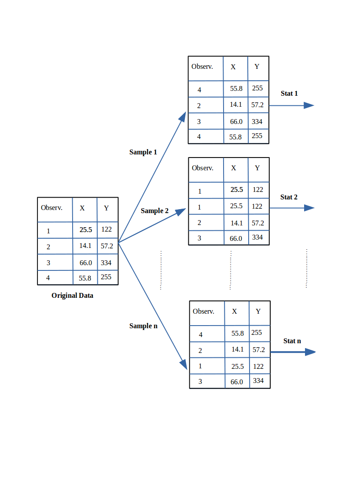

# Measures of Evaluation used in Software Engineering
  
There are several measures usually used:

  - *Mean of the Absolute Error* (MAR): compute the absolute errors and take the mean

  - *Geometric Mean of the Absolute Error* (gMAR): more appropriate when the distribution is skewed

  - *Mean Magnitude of the Relative Error (MMRE)*: this measure has been critisized many times as a biased measure 
($\frac{\sum_{i=1}^{n}{|{\hat{y}_i-y_i}|}/y_i}{n}$)

  - *Median Magnitude of the Relative Error (MdMRE)*: using the median insted of the mean

  - *Level of Prediction* ($Pred(l)$) defined as the percentage of estimates that are within the percentage level $l$ of the actual values. The level of prediction is typically set at 25% below and above the actual value and an estimation method is considered good if it gives a result of more than 75%.
 
  - *Standardised Accuracy (SA)* (proposed by Shepperd&MacDonnell): this measure overcomes all the problems of the MMRE. It is defined as the MAR relative to random guessing
($SA=1-{\frac{MAR}{\overline{MAR}_{P_0}}\times100}$)

  - *Random guessing*: $\overline{MAR}_{P_0}$ is defined as: predict a $\hat{y}_t$ for the target case *t* by randomly sampling (with equal probability) over all the remaining n-1 cases and take $\hat{y}_t=y_r$ where $r$ is drawn randomly from $1$ to $n$ and $r\neq t$.

## Evaluation of the model in the Testing data

```{r}
library(foreign)
gm_mean = function(x, na.rm=TRUE){
  exp(sum(log(x[x > 0]), na.rm=na.rm) / length(x))}

chinaTrain <- read.arff("datasets/effortEstimation/china3AttSelectedAFPTrain.arff")
logchina_size <- log(chinaTrain$AFP)
logchina_effort <- log(chinaTrain$Effort)
linmodel_logchina_train <- lm(logchina_effort ~ logchina_size)


chinaTest <- read.arff("datasets//effortEstimation/china3AttSelectedAFPTest.arff")
b0 <- linmodel_logchina_train$coefficients[1]
b1 <- linmodel_logchina_train$coefficients[2]
china_size_test <- chinaTest$AFP
actualEffort <- chinaTest$Effort
predEffort <- exp(b0+b1*log(china_size_test))

err <- actualEffort - predEffort  #error or residual
ae <- abs(err)
hist(ae, main="Absolute Error in the China Test data")
mar <- mean(ae)
mre <- ae/actualEffort
mmre <- mean(mre)
mdmre <- median(mre)
gmar <- gm_mean(ae)
mar
mmre
mdmre
gmar
```

```{r}
level_pred <- 0.25 #below and above (both)
lowpred <- actualEffort*(1-level_pred)
uppred <-  actualEffort*(1+level_pred)
pred  <-  predEffort <= uppred & predEffort >= lowpred  #pred is a vector with logical values 
Lpred <- sum(pred)/length(pred)
Lpred
```


## Building a Linear Model on the Telecom1 dataset  
  - Although there are few datapoints we split the file into Train (2/3) and Test (1/3)
  
```{r}
telecom1 <- read.table("datasets/effortEstimation/Telecom1.csv", sep=",",header=TRUE, stringsAsFactors=FALSE, dec = ".") #read data

samplesize <- floor(0.66*nrow(telecom1))
set.seed(012) # to make the partition reproducible
train_idx <- sample(seq_len(nrow(telecom1)), size = samplesize)
telecom1_train <- telecom1[train_idx, ]
telecom1_test <- telecom1[-train_idx, ]

par(mfrow=c(1,1))
# transformation of variables to log-log
xtrain <- log(telecom1_train$size)
ytrain <- log(telecom1_train$effort)
lmtelecom1 <- lm( ytrain ~ xtrain)
plot(xtrain, ytrain)
abline(lmtelecom1, lwd=2, col="blue")
b0_tel1 <- lmtelecom1$coefficients[1]
b1_tel1 <- lmtelecom1$coefficients[2]
# calculate residuals and predicted values
res <- signif(residuals(lmtelecom1), 5)

xtest <- telecom1_test$size
ytest <- telecom1_test$effort
pre_tel1 <- exp(b0+b1*log(xtest))
# plot distances between points and the regression line
plot(xtest, ytest)
curve(exp(b0_tel1+b1_tel1*log(x)), from=0, to=300, add=TRUE, col="blue", lwd=2)
segments(xtest, ytest, xtest, pre_tel1, col="red")

```

## Building a Linear Model on the Telecom1 dataset with all observations

  - Just to visualize results
  
```{r}
par(mfrow=c(1,1))

effort_telecom1 <- telecom1$effort
size_telecom1 <- telecom1$size

lmtelecom <- lm(effort_telecom1 ~ size_telecom1)
plot(size_telecom1, effort_telecom1)
abline(lmtelecom, lwd=3, col="blue")
# calculate residuals and predicted values
res <- signif(residuals(lmtelecom), 5) 
predicted <- predict(lmtelecom)
# plot distances between points and the regression line
segments(size_telecom1, effort_telecom1, size_telecom1, predicted, col="red")

level_pred <- 0.25 #below and above (both)
lowpred <- effort_telecom1*(1-level_pred)
uppred <-  effort_telecom1*(1+level_pred)
predict_inrange  <-  predicted <= uppred & predicted >= lowpred  #pred is a vector with logical values 
Lpred <- sum(predict_inrange)/length(predict_inrange)
Lpred
#Visually plot lpred
segments(size_telecom1, lowpred, size_telecom1, uppred, col="red", lwd=3)

err_telecom1 <- abs(effort_telecom1 - predicted)
mar_tel1 <- mean(err_telecom1)
mar_tel1

```


## Standardised Accuracy. MARP0. ChinaTest

- Computing $MARP_0$ in the China Test data

```{r}
estimEffChinaTest <- predEffort  # This will be overwritten, no problem
numruns <- 9999
randguessruns <- rep(0, numruns)
for (i in 1:numruns) { 
  for (j in 1:length(estimEffChinaTest)) {
    estimEffChinaTest[j] <- sample(actualEffort[-j],1)}#replacement with random guessingt    
  randguessruns[i] <- mean(abs(estimEffChinaTest-actualEffort))
  } 
marp0Chinatest <- mean(randguessruns)
marp0Chinatest
hist(randguessruns, main="MARP0 distribution of the China dataset")

saChina = (1- mar/marp0Chinatest)*100
saChina
```


## Standardised Accuracy. MARP0. Telecom1
  - Computing $MARP_0$

```{r}
telecom1 <- read.table("./datasets/effortEstimation/Telecom1.csv", sep=",",header=TRUE, stringsAsFactors=FALSE, dec = ".") #read data
#par(mfrow=c(1,2))
#size <- telecom1[1]$size   not needed now
actualEffTelecom1 <- telecom1[2]$effort
estimEffTelecom1 <- telecom1[3]$EstTotal # this will be overwritten
numruns <- 9999
randguessruns <- rep(0, numruns)
for (i in 1:numruns) { 
  for (j in 1:length(estimEffTelecom1)) {
    estimEffTelecom1[j] <- sample(actualEffTelecom1[-j],1)}#replacement with random guessingt    
  randguessruns[i] <- mean(abs(estimEffTelecom1-actualEffTelecom1))
  } 
marp0telecom1 <- mean(randguessruns)
marp0telecom1
hist(randguessruns, main="MARP0 distribution of the Telecom1 dataset")
saTelecom1 <- (1- mar_tel1/marp0telecom1)*100
saTelecom1

```

### MARP0 in the Atkinson dataset
  - For checking results you may use figure Atkinson in Shepperd&MacDonnell
```{r, echo=FALSE}
act_effort <- c(670,912,218,595,267,344,229,190,869,109,289,616,557,416,578,438)
estim_effort <- rep(0, length(act_effort))
numruns <- 9999
randnaiveruns <- rep(0, numruns)
for (i in 1:numruns) { 
  for (j in 1:length(act_effort)) {
    estim_effort[j] <- sample(act_effort[-j],1)}#replacement with random guessingt    
  randnaiveruns[i] <- mean(abs(estim_effort-act_effort))
  } 
marp0atkinson <- mean(randnaiveruns)
marp0atkinson
hist(randnaiveruns, main="MARP0 distribution of the Atkinson dataset")
```


```{r, echo=FALSE}
## ISBSG dataset
##   to do
# isbsgTrain8 <- read.arff("ISBSGv10_AttributesSelected_952Instances_8Att_Train_CLast.arff")
# isbsgTest8 <- read.arff("ISBSGv10_AttributesSelected_952Instances_8Att_Test_CLast.arff")
```


## Confidence Intervals. Bootstrap
  - Until now we have generated point estimates
  - A *confidence interval* (CI) is an interval estimate of a population parameter. The parameter can be the mean, the median or other. The frequentist CI is an observed interval that is different from sample to sample. It frequently includes the value of the unobservable parameter of interes if the experiment is repeated. The *confidence level* is the value that measures the frequency that the constructed intervals contain the true value of the parameter. 
  - The construction of a confidence interval with an exact value of confidence level for a distribution requires some statistical properties. Usually, *normality* is one of the properties required for computing confidence intervals. 
    - Not all confidence intervals contain the true value of the parameter.
    - Simulation of confidence intervals


```{r, echo=FALSE}
# code from the book by Ugerte et al. Probability and statistics with R
  norsim <- function(sims = 100, n = 36, mu = 100, sigma = 18, 
                   conf.level = 0.95){
  alpha <- 1 - conf.level
  CL <- conf.level * 100
  ll <- numeric(sims)
  ul <- numeric(sims)
  for (i in 1:sims){
    xbar <- mean(rnorm(n , mu, sigma))
    ll[i] <- xbar - qnorm(1 - alpha/2)*sigma/sqrt(n)
    ul[i] <- xbar + qnorm(1 - alpha/2)*sigma/sqrt(n)
  }
  notin <- sum((ll > mu) + (ul < mu))
  percentage <- round((notin/sims) * 100, 2)
  SCL <- 100 - percentage
  plot(ll, type = "n", ylim = c(min(ll), max(ul)), xlab = " ", 
       ylab = " ")
  for (i in 1:sims) {
    low <- ll[i]
    high <- ul[i]
    if (low < mu & high > mu) {
      segments(i, low, i, high)
    }
    else if (low > mu & high > mu) {
      segments(i, low, i, high, col = "red", lwd = 5)
    }
    else {
      segments(i, low, i, high, col = "blue", lwd = 5)
    }
  }
  abline(h = mu)
#   cat(SCL, "\b% of the random confidence intervals contain Mu =", mu, "\b.", "\n")
}
```

```{r}
set.seed(10)
norsim(sims = 100, n = 36, mu = 100, sigma = 18, conf.level = 0.95)
```

  - The range defined by the confidence interval will vary with each sample, because the sample size will vary each time and the standard deviation will vary too.
  - 95% confidence interval: it is the probability that the hypothetical confidence intervals (that would be computed from the hypothetical repeated samples) will contain the population mean.
  - the particular interval that we compute on one sample does not mean that the population mean lies within that interval with a probability of 95%.
  - recommended reading:  *Robust misinterpretation of confidence intervals*, Rink Hoekstra, Richard D. Morey, Jeffrey N. Rouder, Eric-Jan Wagenmakers.  Psychonomic Bulletin & Review, October 2014 


## Nonparametric Bootstrap
  - For computing CIs the important thing is to know the assumptions that are made to “know” the
distribution of the statistic.
  - There is a way to compute confidence intervals without meeting the requirements of parametric methods. 
  - **Resampling** or **bootstraping** is a method to calculate estimates of a parameter taking samples from the original data and using those *resamples* to calculate statistics. Using the resamples usually gives more accurate results than using the original single sample to calculate an estimate of a parameter. 
  
  
  
  
  - Computing the bootstraped confidence interval of the mean for the Test observations of the China dataset:
  
```{r}
library(boot)
hist(ae, main="Absolute Errors of the China Test data")
level_confidence <- 0.95
repetitionsboot <- 9999
samplemean <- function(x, d){return(mean(x[d]))}
b_mean <- boot(ae, samplemean, R=repetitionsboot)
confint_mean_China <- boot.ci(b_mean)
confint_mean_China
```

  - Computing the bootstraped geometric mean


```{r}
boot_geom_mean <- function(error_vec){
  log_error <- log(error_vec[error_vec > 0])
  log_error <-log_error[is.finite(log_error)] #remove the -Inf value before calculating the mean, just in case
  samplemean <- function(x, d){return(mean(x[d]))}
  b <- boot(log_error, samplemean, R=repetitionsboot) # with package boot
  # this is a boot for the logs
  return(b)
}
# BCAconfidence interval for the geometric mean
BCAciboot4geommean <- function(b){  
  conf_int <- boot.ci(b, conf=level_confidence, type="bca")$bca #following 10.9 of Ugarte et al.'s book
  conf_int[5] <- exp(conf_int[5]) # the boot was computed with log. Now take the measure back to its previous units
  conf_int[4] <- exp(conf_int[4])
  return (conf_int)
}
# this is a boot object
b_gm <- boot_geom_mean(ae) #"ae" is the absolute error in the China Test data
print(paste0("Geometric Mean of the China Test data: ", round(exp(b_gm$t0), digits=3)))
b_ci_gm <- BCAciboot4geommean(b_gm)
print(paste0("Confidence Interval: ", round(b_ci_gm[4], digits=3), " - ", round(b_ci_gm[5], digits=3)))

# Make a % confidence interval bca
# BCAciboot <- function(b){  
#   conf_int <- boot.ci(b, conf=level_confidence, type="bca")$bca #following 10.9 of Ugarte et al.'s book
#   return (conf_int)
# }
```


