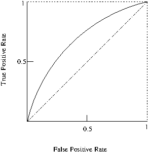

# Graphical Evaluation

## Learning Objectives and Evaluation Lens

- **Objective**: use graphical diagnostics to compare classifiers beyond a single metric value.
- **Primary plots**: ROC and Precision-Recall curves.
- **Imbalanced data focus**: prioritize PR curves and PR-AUC interpretation.
- **Common pitfalls**: comparing curves from different test sets or using one operating point only.

### Receiver Operating Characteristic (ROC)

The *Receiver Operating Characteristic* ($ROC$)[@Fawcett2006] curve which provides a graphical visualisation of the results.





The Area Under the ROC Curve (AUC) also provides a quality measure between positive and negative rates with a single value. 

A simple way to approximate the AUC is with the following equation:
$AUC=\frac{1+TP_{r}-FP_{r}}{2}$


### Precision-Recall Curve (PRC)

Similarly to ROC, another widely used evaluation technique is the Precision-Recall Curve (PRC), which depicts a trade off between precision and recall and can also be summarised into a single value as the area under the precision-recall curve (PR-AUC)~\cite{Davis2006}.

### Calibration Plot (Reliability Diagram)

When classifier outputs are used as probabilities (not only as ranks), a
calibration plot compares predicted probabilities with observed frequencies.

- Perfect calibration: points close to the diagonal
- Overconfident model: points below diagonal
- Underconfident model: points above diagonal

```{r eval=FALSE}
# p_hat: predicted probabilities, y_true: 0/1 labels
bins <- cut(p_hat, breaks = seq(0, 1, by = 0.1), include.lowest = TRUE)
cal_tbl <- aggregate(cbind(pred = p_hat, obs = y_true) ~ bins, FUN = mean)

plot(cal_tbl$pred, cal_tbl$obs,
	xlab = "Mean predicted probability",
	ylab = "Observed positive rate",
	main = "Calibration plot", pch = 19)
abline(0, 1, col = "red", lwd = 2)
```

## Practical interpretation notes

- ROC curves can look optimistic on heavily imbalanced datasets.
- PR curves are often more informative when the positive class is rare.
- Report the selected operating threshold together with the curve/AUC values.
- If probability outputs are used for decision-making, add calibration plots in addition to ROC/PRC.

%AUPCR is more accurate than the ROC for testing performances when dealing with imbalanced datasets as well as optimising ROC values does not necessarily optimises AUPR values, i.e., a good classifier in AUC space may not be so good in PRC space.
%The weighted average uses weights proportional to class frequencies in the data.
%The weighted average is computed by weighting the measure of class (TP rate, precision, recall ...) by the proportion of instances there are in that class. Computing the average can be sometimes be misleading. For instance, if class 1 has 100 instances and you achieve a recall of 30%, and class 2 has 1 instance and you achieve recall of 100% (you predicted the only instance correctly), then when taking the average (65%) you will inflate the recall score because of the one instance you predicted correctly. Taking the weighted average will give you 30.7%, which is much more realistic measure of the performance of the classifier.


