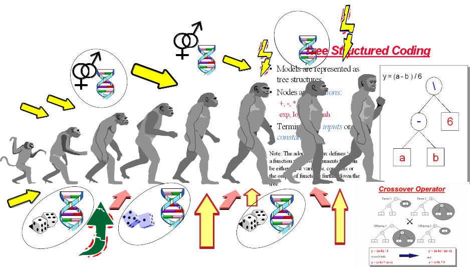
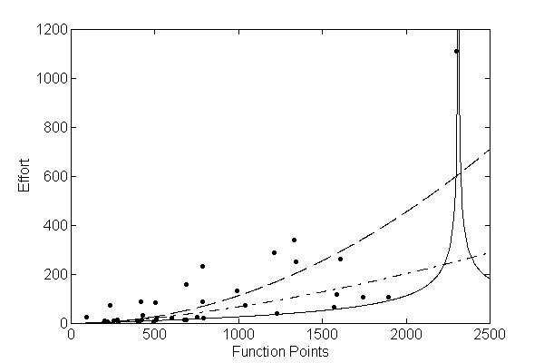
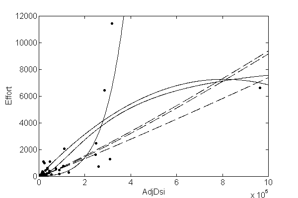
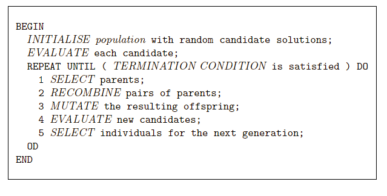
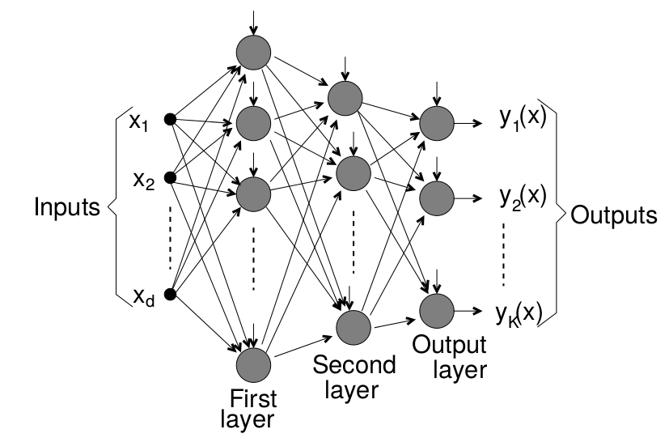
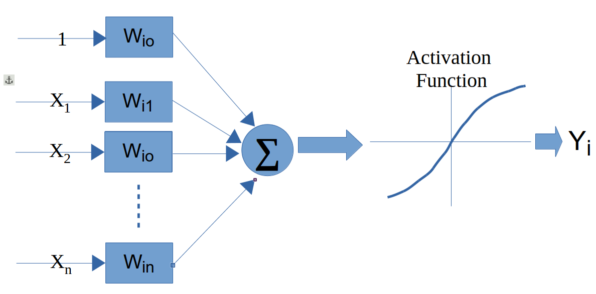

# Advanced Models

## Learning Objectives and Evaluation Lens

- **Objective**: understand when advanced models provide value beyond strong baselines.
- **Data context**: same SE tasks as prior chapters, with higher model complexity.
- **Validation**: strict baseline comparison, reproducible tuning, and held-out evaluation.
- **Primary metrics**: task-specific predictive metrics plus complexity/interpretability trade-offs.
- **Common pitfalls**: unnecessary complexity, unstable tuning, and weak reproducibility reporting.

Advanced models can capture complex relationships, but they also increase
variance, tuning cost, and reproducibility risks.

## When to use advanced models

Use them when at least one of these conditions holds:

- baseline models are consistently underfitting
- nonlinear effects are strong and interpretable baselines fail
- the objective justifies additional complexity and tuning cost

Always compare against strong baselines (for example, linear models, random
forest, gradient boosting) before adopting a more complex method.

## Minimum reporting checklist

For consistency with other chapters, report:

1. data split strategy and seed
2. preprocessing applied and leakage safeguards
3. hyper-parameter search space and selection criterion
4. test-set metrics with uncertainty (or repeated CV summary)
5. model complexity vs. performance trade-off

### Nested resampling is strongly recommended

Advanced models are usually heavily tuned; therefore, nested resampling should
be preferred to reduce optimistic bias.

```{r eval=FALSE}
# Template:
# outer folds for performance estimation
# inner folds for hyper-parameter tuning
# report outer-fold distribution of final metrics
```

## Genetic Programming for Symbolic Regression

This technique is inspired by Darwin's evolution theory.

  + 1960s by I. Rechenberg in his work "Evolution strategies“
  + 1975 Genetic Algorithms (GAs) invented by J Holland and published in his book "Adaption in Natural and Artificial Systems“
  + 1992 J. Koza has used genetic algorithm to evolve programs to perform certain tasks. He called his method "genetic programming" 
 

Other reference for GP: Langdon WB, Poli R (2001) Foundations of Genetic Programming. Springer.




  - Depending on the function set used and the function to be minimised, GP can generate almost any type of curve
  
  
  
  


  

In R, we can use the "rgp" package

## Genetic Programming Example

### Load Data

```{r loadData, eval = FALSE}
# library(foreign)

#read data
# telecom1 <- read.table("./datasets/effortEstimation/Telecom1.csv", sep=",",header=TRUE, stringsAsFactors=FALSE, dec = ".") 
 
# size_telecom1 <- telecom1$size
# effort_telecom1 <- telecom1$effort

# chinaTrain <- read.arff("./datasets/effortEstimation/china3AttSelectedAFPTrain.arff")
# china_train_size <- chinaTrain$AFP 
# china_train_effort <- chinaTrain$Effort
# chinaTest <- read.arff("./datasets/effortEstimation/china3AttSelectedAFPTest.arff")
#china_size_test <- chinaTest$AFP
# actualEffort <- chinaTest$Effort
```


### Genetic Programming for Symbolic Regression: China dataset.

```{r geneticProgramingExample, message=FALSE, warning=FALSE, eval = FALSE}
# library("rgp")
# options(digits = 5)
# stepsGenerations <- 100
# initialPopulation <- 100
# Steps <- c(10)
# y <- china_train_effort   #
# x <- china_train_size  # 

# data2 <- data.frame(y, x)  # create a data frame with effort, size
# newFuncSet <- mathFunctionSet
# alternatives to mathFunctionSet
# newFuncSet <- expLogFunctionSet # sqrt", "exp", and "ln"
# newFuncSet <- trigonometricFunctionSet
# newFuncSet <- arithmeticFunctionSet
# newFuncSet <- functionSet("+","-","*", "/","sqrt", "log", "exp") # ,, )

# gpresult <- symbolicRegression(y ~ x, 
#                                 data=data2, functionSet=newFuncSet,
#                                populationSize=initialPopulation,
                                

# stopCondition=makeStepsStopCondition(stepsGenerations))

# bf <- gpresult$population[[which.min(sapply(gpresult$population, gpresult$fitnessFunction))]]
# wf <- gpresult$population[[which.max(sapply(gpresult$population, gpresult$fitnessFunction))]]

# bf1 <- gpresult$population[[which.min((gpresult$fitnessValues))]]
# plot(x,y)
# lines(x, bf(x), type = "l", col="blue", lwd=3)
# lines(x,wf(x), type = "l", col="red", lwd=2)

# x_test <- china_size_test
# estim_by_gp <- bf(x_test)
# ae_gp <- abs(actualEffort - estim_by_gp)
# mean(ae_gp)

```


### Genetic Programming for Symbolic Regression. Telecom1 dataset.

  - For illustration purposes only. We use all data points. 
  
```{r, eval = FALSE}
# y <- effort_telecom1   # all data points
# x <- size_telecom1   # 
# 
# data2 <- data.frame(y, x)  # create a data frame with effort, size
# # newFuncSet <- mathFunctionSet
# # alternatives to mathFunctionSet
# newFuncSet <- expLogFunctionSet # sqrt", "exp", and "ln"
# # newFuncSet <- trigonometricFunctionSet
# # newFuncSet <- arithmeticFunctionSet
# # newFuncSet <- functionSet("+","-","*", "/","sqrt", "log", "exp") # ,, )
# 
# gpresult <- symbolicRegression(y ~ x, 
#                                 data=data2, functionSet=newFuncSet,
#                                 populationSize=initialPopulation,
#                                 stopCondition=makeStepsStopCondition(stepsGenerations))
# 
# bf <- gpresult$population[[which.min(sapply(gpresult$population, gpresult$fitnessFunction))]]
# wf <- gpresult$population[[which.max(sapply(gpresult$population, gpresult$fitnessFunction))]]
# 
# bf1 <- gpresult$population[[which.min((gpresult$fitnessValues))]]
# plot(x,y)
# lines(x, bf(x), type = "l", col="blue", lwd=3)
# lines(x,wf(x), type = "l", col="red", lwd=2)

```


## Neural Networks 

A neural network (NN) simulates some of the learning functions of the human brain. 

It can recognize patterns and "learn" . Through the use of a trial and error method the system “learns” to become an “expert” in the field.

A NN is composed of a set of nodes (units, neurons, processing elements) 
  + Each node has input and output
  + Each node performs a simple computation by its node function

Weighted connections between nodes
  + Connectivity gives the structure/architecture of the net
  + What can be computed by a NN is primarily determined by the connections and their weights

  
  

There are several packages in R to work with NNs 

  + [neuralnet](https://cran.r-project.org/web/packages/neuralnet/index.html)
  + [nnet](https://cran.r-project.org/web/packages/nnet/index.html)
  + [RSNNS](https://cran.r-project.org/web/packages/RSNNS/index.html)

The following example uses the `neuralnet` package. For real projects, keep
track of scaling parameters and apply an inverse transform to predictions when
you need values on the original effort scale.
    
```{r NeuralNetExample, message=FALSE, warning=FALSE}
library(foreign)
library(neuralnet)

chinaTrain <- read.arff("datasets/effortEstimation/china3AttSelectedAFPTrain.arff")

afpsize <- chinaTrain$AFP
effort_china <- chinaTrain$Effort

chinaTest <- read.arff("datasets/effortEstimation/china3AttSelectedAFPTest.arff")
AFPTest <- chinaTest$AFP
actualEffort <- chinaTest$Effort

trainingdata <- cbind(afpsize,effort_china)
colnames(trainingdata) <- c("Input","Output")

testingdata <- cbind(afpsize,effort_china)
colnames(trainingdata) <- c("Input","Output")

#Normalize data
norm.fun = function(x){(x - min(x))/(max(x) - min(x))}
data.norm = apply(trainingdata, 2, norm.fun)
#data.norm

testdata.norm <- apply(trainingdata, 2, norm.fun)
#testdata.norm


#Train the neural network
#Going to have 10 hidden layers
#Threshold is a numeric value specifying the threshold for the partial
#derivatives of the error function as stopping criteria.
#net_eff <- neuralnet(Output~Input,trainingdata, hidden=5, threshold=0.25)
net_eff <- neuralnet(Output~Input, data.norm, hidden=10, threshold=0.01)

# Print the network
# print(net_eff)

#Plot the neural network
plot(net_eff)

#Test the neural network on some training data
#testdata.norm<-data.frame((testdata[,1] - min(data[, 'displ']))/(max(data[, 'displ'])-min(data[, 'displ'])),(testdata[,2] - min(data[, 'year']))/(max(data[, 'year'])-min(data[, 'year'])),(testdata[,3] - min(data[, 'cyl']))/(max(data[, 'cyl'])-min(data[, 'cyl'])),(testdata[,4] - min(data[, 'hwy']))/(max(data[, 'hwy'])-min(data[, 'hwy'])))

# Run them through the neural network
# net.results <- compute(net_eff, testdata.norm[,2]) 


#net.results <- compute(net_eff, dataTest.norm) # With normalized data

#Lets see what properties net.sqrt has
#ls(net.results)
#Lets see the results
#print(net.results$net.result)

#Lets display a better version of the results
#cleanoutput <- cbind(testdata.norm[,2],actualEffort,
#                     as.data.frame(net.results$net.result))
#colnames(cleanoutput) <- c("Input","Expected Output","Neural Net Output")
#print(cleanoutput)
```


## Support Vector Machines

Support Vector Machines (SVMs) find a hyperplane that maximises the margin
between classes. For linearly non-separable data, the **kernel trick**
implicitly maps inputs to a high-dimensional feature space where a linear
separator exists. Common kernels: linear, radial basis function (RBF), and
polynomial.

In SE defect prediction, SVMs have been competitive with tree ensembles,
particularly on small-to-medium datasets. The main hyperparameters are the
regularisation cost $C$ and, for RBF, the bandwidth $\gamma$.

```{r eval=FALSE}
library(tidymodels)
library(kernlab)

svm_spec <- svm_rbf(cost = tune(), rbf_sigma = tune()) |>
  set_mode("classification") |>
  set_engine("kernlab")

wf <- workflow() |>
  add_recipe(recipe(Defective ~ ., data = kc1.train) |>
               step_normalize(all_numeric_predictors())) |>
  add_model(svm_spec)

# tune cost and sigma with tune_grid()
```

## Ensembles

Ensembles or meta-learners combine multiple models to obtain better predictions, i.e., this technique consists of combining single classifiers (sometimes called weak classifiers).

A problem with ensembles is that their models are difficult to interpret (they behave as blackboxes) in comparison to
decision trees or rules which provide an explanation of their
decision making process.

They are typically classified as Bagging, Boosting and Stacking (Stacked generalization). 

### Bagging
Bagging (also known as Bootstrap aggregating) is an ensemble technique in which a base learner is applied to multiple equal size datasets created from the original data using bootstraping. Predictions are based on voting of the individual predictions. An advantage of bagging is that it does not require any modification to the learning algorithm and takes advantage of the instability of the base classifier to create diversity among individual ensembles so that individual members of the ensemble perform well in different regions of the data. Bagging does not perform well with classifiers if their output is robust to perturbation of the data such as
nearest-neighbour (NN) classifiers.

### Boosting
Boosting techniques generate multiple models that complement each other inducing models that improve regions of the data where previous induced models preformed poorly. This is achieved by increasing the weights of instances wrongly classified, so new learners focus on those instances. Finally, classification is based on a weighted voted among all members of the ensemble. 

In particular, AdaBoost.M1 [15] is a popular boosting algorithm for classification. The set of training examples is assigned an equal weight at the beginning and the weight of instances is either increased or
decreased depending on whether the learner classified that instance incorrectly or not. The following iterations focus on those instances with higher weights. AdaBoost.M1 can be applied to any base learner.

### Rotation Forests

Rotation Forests [40] combine randomly chosen subsets of attributes (random subspaces) and bagging approaches with principal components feature generation to construct an ensemble of decision trees. Principal Component Analysis is used as a feature selection technique combining subsets of
attributes which are used with a bootstrapped subset of the training data by the base classifier. 


### Boosting in R

In R, there are three common package families for boosting workflows: `gbm`,
`xgboost`, and `mboost`. A modern way to orchestrate them is through
`tidymodels`.

```{r, eval=FALSE}
library(tidymodels)
library(gbm)

boost_spec <- boost_tree(
  trees = 500,
  tree_depth = tune(),
  learn_rate = tune(),
  min_n = tune(),
  loss_reduction = tune()
) |>
  set_mode("classification") |>
  set_engine("gbm")
```

Example

```{r, eval=FALSE}
library(tidymodels)
library(gbm)

kc1 <- read.csv("./datasets/defectPred/unified/Unified-file.csv", stringsAsFactors = FALSE)
kc1 <- kc1[, c("McCC", "CLOC", "PDA", "PUA", "LLOC", "LOC", "bug")]
kc1$Defective <- factor(ifelse(kc1$bug > 0, "Y", "N"))
kc1$bug <- NULL

split <- initial_split(kc1, prop = 0.7, strata = Defective)
kc1.train <- training(split)
kc1.test <- testing(split)

rec <- recipe(Defective ~ ., data = kc1.train)

boost_spec <- boost_tree(
  trees = 400,
  tree_depth = 4,
  learn_rate = 0.05,
  min_n = 5,
  loss_reduction = 0.01
) |>
  set_mode("classification") |>
  set_engine("gbm")

wf <- workflow() |>
  add_recipe(rec) |>
  add_model(boost_spec)

objModel <- fit(wf, data = kc1.train)
objModel

```

Evaluate model

```{r, eval=FALSE}
#################################################
# evalutate model
#################################################
pred_cls <- predict(objModel, kc1.test, type = "class")
pred_prb <- predict(objModel, kc1.test, type = "prob")

eval_tbl <- bind_cols(kc1.test, pred_cls, pred_prb)

metrics(eval_tbl, truth = Defective, estimate = .pred_class)
roc_auc(eval_tbl, truth = Defective, .pred_Y)
conf_mat(eval_tbl, truth = Defective, estimate = .pred_class)
```


## Explainability: SHAP and LIME

Ensemble models (bagging, boosting, rotation forests) and neural networks
behave as **black boxes** — their predictions are accurate but their reasoning
is opaque. In SE contexts, stakeholders (developers, managers, auditors) often
require explanations for individual predictions, for example *why is module A
flagged as defect-prone?*

Two popular post-hoc, model-agnostic explainability frameworks are:

- **LIME** (Local Interpretable Model-agnostic Explanations): perturbs the
  input around a single instance and fits a simple local linear model to
  approximate the complex model's behaviour nearby.
- **SHAP** (SHapley Additive exPlanations): uses game-theoretic Shapley
  values to assign a contribution score to each feature for every prediction.
  SHAP values satisfy consistency and local accuracy properties that LIME
  does not guarantee. TreeSHAP provides exact, efficient SHAP for tree-based
  models.

```{r eval=FALSE}
# SHAP with the shapr package
library(shapr)
# x_train and x_test: data frames of predictors
explainer <- shapr(x_train, model = final_fit$fit)
explanation <- explain(x_test, approach = "empirical", explainer = explainer,
                       prediction_zero = mean(train_labels == "Y"))
plot(explanation)
```

```{r eval=FALSE}
# LIME with the lime package
library(lime)
explainer <- lime(x_train, model = final_fit)
explanation <- explain(x_test[1:5, ], explainer, n_labels = 1, n_features = 5)
plot_features(explanation)
```

SHAP global summary plots (beeswarm) reveal which features consistently drive
predictions across the dataset. This is particularly useful for validating that
defect models are not relying on spurious correlates.

For automated parameter optimisation in SE prediction models, Tantithamthavorn
et al. provide a systematic study showing that it substantially affects
model rankings [@Tantithamthavorn2016AutoParam].


## Concept Drift

Software systems and their development processes evolve over time. A model
trained on data from version 1.0 of a project may perform poorly on version
3.0 because the distribution of features and the defect-proneness relationship
has changed — a phenomenon called **concept drift**.

Types of drift relevant to SE:
- **Gradual drift**: natural evolution of coding practices or team composition
  over time.
- **Sudden drift**: architectural overhaul, team restructuring, or adoption of
  a new QA process.
- **Recurring drift**: patterns that reappear in release cycles (e.g., defect
  density spikes near major releases).

**Detection strategies:**
- **ADWIN** (Adaptive Windowing): statistical test on a sliding window of
  recent predictions.
- **DDM** (Drift Detection Method): monitors error rate and triggers when it
  increases significantly.
- **Page-Hinkley test**: sequential change-point detector on prediction
  residuals.

**Mitigation strategies:**
- Time-aware splits and temporal cross-validation (never train on future data).
- Sliding or growing window retraining.
- Weighting recent observations more heavily.

In R, the `river` package (a port of scikit-multiflow concepts) and the
`concept.drift` utilities within `stream` provide drift detection primitives.

```{r eval=FALSE}
# Sketch: detect drift on a rolling window of prediction errors
# errors <- abs(predictions - actuals)
# Use CUSUM or Kolmogorov-Smirnov on a sliding window
# Reference window: first burn-in period
# Sliding window: updated incrementally
# Alert when KS test p-value < threshold
```

For practical SE applications, temporal validation is the first and most
important safeguard against drift-induced optimism: always evaluate on data
from a time period after the training period.
