--- 
title: "Data Analysis in Software Engineering using R"
author: "Daniel Rodriguez and Javier Dolado"
date: "`r Sys.Date()`"
site: bookdown::bookdown_site
output: bookdown::gitbook
documentclass: book
bibliography: [./references/dataSources.bib,
    ./references/RandStatistics.bib,
    ./references/RPackages.bib,
    ./references/referencesFS.bib,
    ./references/referencesIS.bib,
    ./references/evaluation.bib,
    ./references/machinelearning.bib,    
    ./references/effortEstimation.bib,
    ./references/DefectPrediction.bib,
    ./references/SEmetrics.bib
    ]
biblio-style: apalike
link-citations: yes
github-repo: danrodgar/DASE
description: "DASE  Data Analysis in Software Engineering"
---

# Welcome {-}

This __Data Analysis in Software Engineering (DASE)__ book/notes will try teach you how to do data science with R in Software Engineering. 

It is a work in progress.

**Acknowledgments**

Projects:

* PRESI: TIN2013-46928-C3
    + amuSE TIN2013-46928-C3-2-R
    + PERTEST TIN2013-46928-C3-1-R

* QARE: TIN2016-76956-C3
    + BadgePeople: TIN2016-76956-C3-3-R
    + TESTEAMOS: TIN2016-76956-C3-1-R

* Network SBSE ([SEBASENet](https://www.uco.es/investigacion/proyectos/SEBASENet/index.php?title=P%C3%A1gina_principal)): TIN2015-71841-REDT

* TestBUS PID2019-105455GB-C32

This work is licensed under the [Creative Commons Attribution-NonCommtercial-NoDerivs 3.0](http://creativecommons.org/licenses/by-nc-nd/3.0/us/) United States License. 

<!--chapter:end:index.Rmd-->

---
output:
  html_document: default
  pdf_document: default
---

# (PART) Introduction to the R Language {.unnumbered}

# Introduction to R {#r-intro}

The goal of the first part of this book is to get you up to speed with the basics of **R** as quickly as possible.

## Installation

Install the latest preview version for getting all features.

Follow the procedures according to your operating system.

-   Linux: You need to have `blas` and `gfortran` installed on your Linux, for installing the `coin` package.
-   *Rgraphviz* requires installation from `source("http://bioconductor.org/biocLite.R")`, then `biocLite("Rgraphviz")`.
-   Uncomment the following lines for installing all missing packages (this will take some time):

```{r}
# listofpackages <- c("arules","arulesViz", "bookdown", "ggplot2", "vioplot", "UsingR", "fpc", "reshape",  "party", "C50", "utils", "rpart", "rpart.plot", "class", "klaR", "e1071", "popbio", "boot", "dplyr", "doParallel", "gbm", "DMwR", "pROC", "neuralnet", "igraph", "RMySQL", "caret", "randomForest", "tm", "wordcloud", "xts", "lubridate", "forecast", "urca", "glmnet", "FSelector", "pls", "emoa", "foreign" )
# newpackages <- listofpackages[!(listofpackages %in% installed.packages()[,"Package"])]
# if(length(newpackages)>0) install.packages(newpackages,dependencies = TRUE)
# 
# # install from archive
# if (!is.element("rgp", installed.packages()[,1]))
# { install.packages("https://cran.r-project.org/src/contrib/Archive/rgp/rgp_0.4-1.tar.gz", 
#                                                     repos = NULL)
# }
## end of installing packages

# in Linux you may need to run several commands (in the terminal) and install additional libraries, e.g. 
# sudo R CMD javareconf
# sudo apt-get install build-essential
# sudo apt-get install libxml2-dev
# sudo apt-get install libpq
# sudo apt-get install libpq-dev
# sudo apt-get install -y libmariadb-client-lgpl-dev
# sudo apt-get install texlive-xetex
# sudo apt-get install r-cran-rmysql

```

## R and RStudio

-   R is a programming language for statistical computing and data analysis that supports a variety of programming styles. See [R in Wikipedia](https://en.wikipedia.org/wiki/R_(programming_language))

-   R has multiple online resources and books.

-   [R coding style](https://google.github.io/styleguide/Rguide.xml)

-   [R-Bloggers](https://www.r-bloggers.com/)

-   Getting help in R

    -   [RStudio cheat sheet](https://github.com/rstudio/cheatsheets/raw/master/rstudio-ide.pdf)
    -   [Base R cheat sheet](http://github.com/rstudio/cheatsheets/raw/master/base-r.pdf)
    -   [Advanced R cheat sheet](https://www.rstudio.com/wp-content/uploads/2016/02/advancedR.pdf)
    -   [Data Visualization cheat sheet](https://github.com/rstudio/cheatsheets/raw/master/data-visualization-2.1.pdf)
    -   [R Markdown cheatsheet](https://github.com/rstudio/cheatsheets/raw/master/rmarkdown-2.0.pdf)
    -   [R Markdown Basics] (<http://rmarkdown.rstudio.com/authoring_basics.html>)
    -   [Python with R and Reticulate Cheatsheet](https://github.com/rstudio/cheatsheets/raw/master/reticulate.pdf)
    -   [caret](https://github.com/rstudio/cheatsheets/raw/master/caret.pdf)
    -   [All cheatsheets and translations](https://rstudio.com/resources/cheatsheets/)
    -   `help("    ")` command

-   R as a calculator. Console: It uses the command-line interface.

-   This document is an RMarkdown document.

Examples:

```{r}
x <- c(1,2,3,4,5,6)   # Create ordered collection (vector)
y <- x^2              # Square the elements of x
print(y)              # print (vector) y
mean(y)               # Calculate average (arithmetic mean) of (vector) y; result is scalar
var(y)                # Calculate sample variance
lm_1 <- lm(y ~ x)     # Fit a linear regression model "y = f(x)" or "y = B0 + (B1 * x)"
                      # store the results as lm_1
print(lm_1)           # Print the model from the (linear model object) lm_1
summary(lm_1)         # Compute and print statistics for the fit
                      # of the (linear model object) lm_1
par(mfrow=c(2, 2))    # Request 2x2 plot layout
plot(lm_1)            # Diagnostic plot of regression model
```

-   R script. \# A file with R commands `# comments` `source("filewithcommands.R")` `sink("recordmycommands.lis")` `savehistory()`

-   From command line:

    -   Rscript\
    -   Rscript file with `-e` (e.g. `Rscript -e 2+2`)\
    -   To exit R: `quit()`

-   Variables

-   Operators

    -   assign operator `<-`\
    -   sequence operator, for example: `mynums <- 0:20`
    -   arithmetic operators: + - = / \^ %/% (integer division) %% (modulus operator)

-   The workspace. Objects.

    -   `ls()` `objects()` `ls.str()` lists and describes the objects\
    -   `rm(x)` delete a variable. E.g., `rm(totalCost)`
    -   `s.str()`
    -   `objects()`
    -   `str()` The structure function provides information about the variable

-   RStudio, RCommander and RKWard are the well-known IDEs for R (more later).

------------------------------------------------------------------------

-   Four \# ('\#\#\#\#') create an *environment* in RStudio. An environment binds a set of names to a set of values. You can think of an environment as a bag of names.

    -   [Environment basics](http://adv-r.had.co.nz/Environments.html#env-basics)

```{r rstudio, echo = FALSE, out.width = "75%"}
knitr::include_graphics("figures/environments.png")
```

Working directories:

```{r}
# set your working directory
# setwd("~/workingDir/")
getwd()
# record R commands:
# sink("recordmycommands.txt", append = TRUE)
```

------------------------------------------------------------------------

## Basic Data Types

-   `class( )`

-   logical: `TRUE`, `FALSE`

-   numeric, integer:

    -   `is.numeric(  )`
    -   `is.integer(  )`\

-   `character`

Examples:

```{r}
TRUE
class(TRUE)
FALSE
NA  # missing
class(NA)
T
F

# numeric data type
2
class(2)
2.5
2L  # integer
class(2L)

is.numeric(2)
is.numeric(2L)
is.integer(2)
is.integer(2L)
```

-   data type coercion:

    -   `as.numeric(  )`
    -   `as.character(  )`\
    -   `as.integer(  )`

Examples:

```{r}
truenum <- as.numeric(TRUE)
truenum
class(truenum)
falsenum <- as.numeric(FALSE)
falsenum

num2char <- as.character(55)
num2char
char2num  <- as.numeric("55.3")

char2int  <- as.integer("55.3")

```

### Mising values

-   `NA` stands for Not Available, which is not a number as well. It applies to missing values.
-   `NaN` means 'Not a Number'

Examples:

```{r}
NA + 1
mean(c(5,NA,7))
mean(c(5,NA,7), na.rm=TRUE)  # some functions allow to remove NAs
```

------------------------------------------------------------------------

## Vectors

Examples:

```{r}
phases <- c("reqs", "dev", "test1", "test2", "maint")
str(phases)
is.vector(phases)

thevalues <- c(15, 60, 30, 35, 22)
names(thevalues) <- phases
str(thevalues)
thevalues

# a single value is a vector
aphase <- 44
is.vector(aphase)

```

A single value is a vector! Example:

```{r}
aphase <- 44
is.vector(aphase)

length(aphase)
length(thevalues)
```

### Coercion for vectors

```{r}
thevalues1 <- c(15, 60, "30", 35, 22)
class(thevalues1)
thevalues1


# <-  is equivalent to   assign ( )

assign("costs", c(50, 100, 30))
```

### Vector arithmetic

It is done in all elements. For example:

```{r}
assign("costs", c(50, 100, 30))
costs/3
costs - 5
costs <- costs - 5

incomes <- c(200, 800, 10)
earnings <- incomes - costs
sum(earnings)
# R recycles values in vectors!
```

Subsetting vectors

```{r}
### Subsetting vectors  []

phase1 <- phases[1]
phase1
phase3 <- phases[3]
phase3

thevalues[phase1]
thevalues["reqs"]

testphases <- phases[c(3,4)]
thevalues[testphases]

### Negative indexes

phases1 <- phases[-5]
phases
phases1

#phases2 <- phases[-testphases] ## error in argument
phases2 <- phases[-c(3,4)]
phases2

### subset using logical vector

phases3 <- phases[c(FALSE, TRUE, TRUE, FALSE)] #recicled first value
phases3

selectionv <- c(FALSE, TRUE, TRUE, FALSE)
phases3 <- phases[selectionv]
phases3

selectionvec2 <- c(TRUE, FALSE)

thevalues2 <- thevalues[selectionvec2]
thevalues2


### Generating regular sequenceswith  : and seq

aseqofvalues <- 1:20

aseqofvalues2 <- seq(from=-3, to=3, by=0.5 )
aseqofvalues2

aseqofvalues3 <- seq(0, 100, by=10)
aseqofvalues4 <- aseqofvalues3[c(2, 4, 6, 8)]
aseqofvalues4
aseqofvalues4 <- aseqofvalues3[-c(2, 4, 6, 8)]
aseqofvalues4

aseqofvalues3[c(1,2)] <- c(666,888)
aseqofvalues3

### Logical values in vectors TRUE/FALSE

aseqofvalues3 > 50
aseqofvalues5 <- aseqofvalues3[aseqofvalues3 > 50]
aseqofvalues5
aseqofvalues6 <- aseqofvalues3[!(aseqofvalues3 > 50)]
aseqofvalues6

### Comparison functions

aseqofvalues7 <- aseqofvalues3[aseqofvalues3 == 50]
aseqofvalues7

aseqofvalues8 <- aseqofvalues3[aseqofvalues3 == 22]
aseqofvalues8

aseqofvalues9 <- aseqofvalues3[aseqofvalues3 != 50]
aseqofvalues9

logicalcond <- aseqofvalues3 >= 50
aseqofvalues10 <- aseqofvalues3[logicalcond]
aseqofvalues10


### Remove Missing Values (NAs)

aseqofvalues3[c(1,2)] <- c(NA,NA)
aseqofvalues3

aseqofvalues3 <- aseqofvalues3[!is.na(aseqofvalues3)]
aseqofvalues3
```

------------------------------------------------------------------------

## Arrays and Matrices

```{r}
mymat <- matrix(1:12, nrow =2)
mymat

mymat <- matrix(1:12, ncol =3)
mymat

mymat <- matrix(1:12, nrow=2, byrow = TRUE)
mymat

mymat <- matrix(1:12, nrow=3, ncol=4)
mymat

mymat <- matrix(1:12, nrow=3, ncol=4, byrow=TRUE)
mymat

### recycling
mymat <- matrix(1:5, nrow=3, ncol=4, byrow=TRUE)
mymat

### rbind  cbind

cbind(1:3, 1:3)
rbind(1:3, 1:3)

mymat <- matrix(1)

mymat <- matrix(1:8, nrow=2, ncol=4, byrow=TRUE)
mymat

rbind(mymat, 9:12)
mymat <- cbind(mymat, c(5,9))
mymat

mymat  <- matrix(1:8, byrow = TRUE, nrow=2)
mymat
rownames(mymat) <- c("row1", "row2")
mymat
colnames(mymat) <- c("col1", "col2", "col3", "col4")
mymat

mymat2 <- matrix(1:12, byrow=TRUE, nrow=3, dimnames=list(c("row1", "row2", "row3"),
                                                         c("col1", "col2", "col3", "col4")))
mymat2

### Coercion in Arrays

matnum <- matrix(1:8, ncol = 2)
matnum
matchar <- matrix(LETTERS[1:6], nrow = 4, ncol = 3)
matchar

matchars <- cbind(matnum, matchar)
matchars

### Subsetting  

mymat3 <- matrix(sample(-8:15, 12), nrow=3)
mymat3
mymat3[2,3]
mymat3[1,4]
mymat3[3,]
mymat3[,4]
mymat3[5] # counts elements by column
mymat3[9]

## Subsetting multiple elements

mymat3[2, c(1,3)]
mymat3[c(2,3), c(1,3,4)]

rownames(mymat3) <- c("r1", "r2", "r3")
colnames(mymat3) <- c("c1", "c2", "c3", "c4")
mymat3["r2", c("c1", "c3")]

### Subset by logical vector
mymat3[c(FALSE, TRUE, FALSE),
       c(TRUE, FALSE, TRUE, FALSE)]
mymat3[c(FALSE, TRUE, TRUE),
       c(TRUE, FALSE, TRUE, TRUE)]

### matrix arithmetic

row1 <- c(220, 137)
row2 <- c(345, 987)
row3 <- c(111, 777)

mymat4 <- rbind(row1, row2, row3)
rownames(mymat4) <- c("row_1", "row_2", "row_3")
colnames(mymat4) <- c("col_1", "col_2")
mymat4

mymat4/10
mymat4 -100

mymat5 <- rbind(c(50,50), c(10,10), c(100,100))
mymat5

mymat4 - mymat5

mymat4 * (mymat5/100)


### index matrices

m1 <- array(1:20, dim=c(4,5))
m1

index <- array(c(1:3, 3:1), dim=c(3,2))
index

m1[index] <-0
m1
```

------------------------------------------------------------------------

## Factors

-   Factors in R are stored as a vector of integer values with a corresponding set of character values to use when the factor is displayed.

```{r}
personnel <- c("Analyst1", "ManagerL2", "Analyst1", "Analyst2",  "Boss", "ManagerL1", "ManagerL2", "Programmer1", "Programmer2", "Programmer3", "Designer1","Designer2", "OtherStaff")  # staff in a company

personnel_factors <- factor(personnel)
personnel_factors  #sorted alphabetically
str(personnel_factors)

personnel2 <- factor(personnel, 
                       levels = c("Boss", "ManagerL1", "ManagerL2", "Analyst1", "Analyst2",  "Designer1","Designer2", "Programmer1", "Programmer2", "Programmer3", "OtherStaff"))  #do not duplicate the same factors
personnel2
str(personnel2)

# a factor's levels will always be character values.

levels(personnel2) <- c("B", "M1", "M2", "A1", "A2", "D1", "D2", "P1", "P2", "P3", "OS")
personnel2

personnel3 <- factor(personnel,
                     levels = c("Boss", "ManagerL1", "ManagerL2", "Analyst1", "Analyst2",  "Designer1","Designer2", "Programmer1", "Programmer2", "Programmer3", "OtherStaff"),
                     c("B", "M1", "M2", "A1", "A2", "D1", "D2", "P1", "P2", "P3", "OS"))
personnel3


### Nominal versus ordinal, ordered factors
personnel3[1] < personnel3[2]  # error, factors not ordered

tshirts <- c("M", "L", "S", "S", "L", "M", "L", "M")

tshirt_factor <- factor(tshirts, ordered = TRUE,
                        levels = c("S", "M", "L"))
tshirt_factor

tshirt_factor[1] < tshirt_factor[2]
```

------------------------------------------------------------------------

## Lists

-   '[' returns a list
-   '[[' returns the list element
-   '\$' returns the content of that element in the list

```{r}

c("R good times", 190, 5)

song <- list("R good times", 190, 5)
is.list(song)
str(song)

names(song) <- c("title", "duration", "track")
song
song$title

song2 <- list(title="Good Friends", 
              duration = 125,
              track = 2,
              rank = 6)

song3 <- list(title="Many Friends", 
              duration = 125,
              track= 2,
              rank = 1,
              similar2 = song2)

song[1]
song$title
str(song[1])
song[[1]]
str(song[[1]])

song2[3]

song3[5]  # a list
str(song3[5])
song3[[5]]
song3$similar2

song[c(1,3)]
str(song[c(1,3)])

result <- song[c(1,3)]
result[1]
result[[1]]
str(result)
result$title
result$track

# access with [[ to content 
song3[[5]][[1]]
song3$similar2[[1]]

# Subsets
### subset by names
song[c("title", "track")]

song3["similar2"]
resultsimilar <- song3["similar2"]
str(resultsimilar)
resultsimilar1 <-song3[["similar2"]]
str(resultsimilar1)
resultsimilar1$title

# subset by logicals
song[c(TRUE, FALSE, TRUE, FALSE)]
result3 <- song[c(TRUE, FALSE, TRUE, FALSE)]  # is a list of two elements

# extending the list
shared <- c("Hillary", "Javi", "Mikel", "Patty")

song3$shared <- shared
str(song3)

cities <- list("Bilbao", "New York", "Tartu")
song3[["cities"]] <- cities
str(song3)
```

------------------------------------------------------------------------

## Data frames

```{r}
thenames <- c("Ane", "Mike", "Xabi", "Viktoria", "Edurne")
ages <- c(44, 20, 33, 15, 65)
employee <- c(FALSE, FALSE, TRUE, TRUE, FALSE)

mydataframe <- data.frame(thenames, ages, employee)
mydataframe

names(mydataframe) <- c("FirstName", "Age", "Employee")
str(mydataframe)

#strings are not factors!

mydataframe <- data.frame(thenames, ages, employee,
                          stringsAsFactors=FALSE)
names(mydataframe) <- c("FirstName", "Age", "Employee")
str(mydataframe)


# subset data frame

mydataframe[4,2]
mydataframe[4, "Age"]
mydataframe[, "FirstName"]

mydataframe[c(2,5), c("Age", "Employee")]
matfromframe <- as.matrix(mydataframe[c(2,5), c("Age", "Employee")])
str(matfromframe)

mydataframe[3]

# convert to vector
mydf0 <- mydataframe[3] #data.frame
str(mydf0)


myvec <- mydataframe[[3]]  #vector
str(myvec)

mydf0asvec <- as.vector(mydataframe[3]) # but it doesn't work . Use [[]]
str(mydf0asvec)
mydf0asvec <- as.vector(mydataframe[[3]])
str(mydf0asvec)

# add column
height <- c(166, 165, 158, 176, 199)
weight <- c(66, 77, 99, 88, 109)
mydataframe$height <- height 
mydataframe[["weight"]] <- weight
mydataframe

# add a column 

birthplace <- c("Tallinn", "London", "Donostia", "Paris", "New York")

mydataframe <- cbind(mydataframe, birthplace)
mydataframe

# add a row 

anton <- data.frame(FirstName = "Anton", Age = 77, Employee=TRUE, height= 170, weight = 65, birthplace ="Amsterdam", stringsAsFactors=FALSE)
mydataframe <- rbind (mydataframe, anton)
mydataframe

# sorting 

mydataframeSorted <- mydataframe[order(mydataframe$Age, decreasing = TRUE), ]  #all columns
mydataframeSorted
mydataframeSorted2 <- mydataframe[order(mydataframe$Age, decreasing = TRUE), c(1,2,6) ]
mydataframeSorted2
```

## Environments

An environment is a place where R stores variables that is where R binds a set of names to a set of object values. An environment is something like a bag or a list of names. Every name in an environment is unique.

The top level environment R_GlobalEnv is created when we start up R and is the Global Envirnoment. Every environment has parent environment. When we define a function, a new environment is created.

### Global variables, local variables and programming scope

Global variables are those variables which exists throughout the execution of a program. Local variables are those variables which exist only within a certain part of a program like a function. The superassignment operator, \<\<-, is used to make assignments to global variables or to make assignments in the parent environment.

```{r}
# variables and functions in the current environment
ls()
# to get the current environment
environment()
# the base environment is the environment of the base package
baseenv()

# list of environments
search()

# functions 
myfunction <- function() {
  myvar_a<- 50
  myfunctioninside <- function() {
  myvar_a <- 100
  # myvar_a <<- 100
  print(myvar_a)
  }
  myfunctioninside()
  print(myvar_a)
  # myvar_a <<- 100
}

myvar_a <- 10
myfunction()
print(myvar_a)

# create environment
my_env <- new.env()
my_env

ls(my_env)
character(0)
assign("myvar_a", 700, envir=my_env)
my_env$mytext = " a text"
ls(my_env)

myvar_a
my_env$myvar_a

parent.env(my_env)
get('myvar_a', envir=my_env)

```

## Reading Data

```{r}
library(foreign)
isbsg <- read.arff("datasets/effortEstimation/isbsg10teaser.arff")

mydataISBSG <- isbsg[, c("FS", "N_effort")]

str(mydataISBSG)
```

------------------------------------------------------------------------

## Plots

There are several graphic packages that are recommended, in particular `ggplot`. However, there is some basic support in the R base for graphics. The following Figure \@ref(fig:plotExample) shows a simple plot.

```{r plotExample, fig.cap="Simple plot"}
plot(mydataISBSG$FS, mydataISBSG$N_effort)
```

------------------------------------------------------------------------

## Flow of Control

Ifelse:

```{r}
library(foreign)
kc1 <- read.arff("datasets/defectPred/D1/KC1.arff")
kc1$Defective <- ifelse(kc1$Defective == "Y", 1, 0)
head(kc1, 1)
```

## Rattle

There is graphical interface, Rattle, that allow us to perform some data mining tasks with R [@Williams11].


## Datasets

R comes with some built-in datasets ready to use
[Description of datasets](http://www.sthda.com/english/wiki/r-built-in-data-sets)

```{r}
data()
# load the mtcars  Motor Trend Car Road Tests
data("mtcars")

# Monthly Airline Passenger Numbers 1949-1960
# Time series object ts() convert a vector to a time series
data("AirPassengers")
str(AirPassengers)
plot(AirPassengers)
```

<!--chapter:end:010_rIntro.Rmd-->

# (PART) Introduction to Data Mining {-}

We will deal with extracting information from data, either for estimation, defect prediction, planning, etc. 

We will provide an overview of data analsyis using different techniques. 

# What is Data Mining / Knowledge Discovery in Databases (KDD)

The non-trivial process of identifying valid, novel, potentially useful, and ultimately understandable patterns in data [@FayyadPS1996]


The Cross Industry Process for Data Mining (CRISP-DM) also provides a common and well-developed framework for delivering data mining projects identifying six steps [@shearer00crisp]:


  1. Problem Understanding
  2. Data Understanding
  3. Data Preparation
  4. Modeling
  5. Evaluation
  6. Deployment


## The Aim of Data Analysis and Statistical Learning
  - The aim of any data analysis is to  **understand the data** 
  - and to build models for making predictions and estimating future events based on past data
  - and to make statistical inferences from our data.
  - We may want to test different hypothesis on the data
  - We want to generate conclusions about the population where our sample data comes from
  - Most probably we are interested in building a model for quality, time, defects or effort prediction
    
  
  
  - We want to find a function $f()$, that given $X1, X2, ...$  computes $Y=f(X1, X2, ..., Xn)$


## Basic References 

Generic books about statistics:

  * [John Verzani, *simpleR - Using R for Introductory Statistics*](https://cran.r-project.org/doc/contrib/Verzani-SimpleR.pdf)
  
  * [Peter Dalgaard, *Introductory Statistics with R*, 2nd Edt., Springer, 2008](https://www.springer.com/gp/book/9780387790534)

  * [Gareth James, Daniela Witten, Trevor Hastie, Robert Tibshirani, *An Introduction to Statistical Learning with Applications in R*, Springer, 2013](http://www.springer.com/it/book/9781461471370)

  * [Geoff Cumming, *Understanding the New Statistics: Effect Sizes, Confidence Intervals, and Meta-Analysis*, Routledge, New York, 2012](https://www.routledge.com/products/9780415879682)
    

## Data Mining with R

  * [Graham Williams, *Data Mining with Rattle and R: The Art of Excavating Data for Knowledge Discovery*, Springer 2011](http://www.springer.com/gp/book/9781441998897)
  
    Also the author maintains a Web site:
    [http://rattle.togaware.com/](http://rattle.togaware.com/)
  
  * [Luis Torgo, *Data Mining with R: Learning with Case Studies*, Chapman and Hall/CRC, 2010](https://www.crcpress.com/Data-Mining-with-R-Learning-with-Case-Studies/Torgo/9781439810187)
  
  * [http://www.rdatamining.com/](http://www.rdatamining.com/)
  
  
## Data Mining with Weka

Weka is another popular framework in Java:

  *  Ian Witten, Eibe Frank, Mark Hall, Christopher J. Pal, Data Mining: Practical Machine Learning Tools and Techniques (4th Edt), Morgan Kaufmann, 2016, ISBN: 978-0128042915


<!--chapter:end:100_intro.Rmd-->

# (PART) Data Sources and Metrics and Standards in Software Engineering Defect Prediction {-}

# Data Sources in Software Engineering

We classify this trail in the following categories:

* _Source code_ can be studied to measure its properties, such as size or complexity.

* _Source Code Management Systems_ (SCM) make it possible to store all the changes that the different source code files undergo during the project. Also, SCM systems allow for work to be done in parallel by different developers over the same source code tree. Every change recorded in the system is accompanied with meta-information (author, date, reason for the change, etc) that can be used for research purposes.

* _Issue or Bug tracking systems_ (ITS). Bugs, defects and user requests are managed in ISTs, where users and developers can fill tickets with a description of a defect found, or a desired new functionality. All the changes to the ticket are recorded in the system, and most of the systems also record the comments and communications among all the users and developers implied in the task. 

* _Messages_ between developers and users. In the case of free/open source software, the projects are open to the world, and the messages are archived in the form of mailing lists and social networks which can also be mined for research purposes. There are also some other open message systems, such as IRC or forums. 

* _Meta-data about the projects_. As well as the low level information of the software processes, we can also find meta-data about the software projects which can be useful for research. This meta-data may include intended-audience, programming language, domain of application, license (in the case of open source), etc.


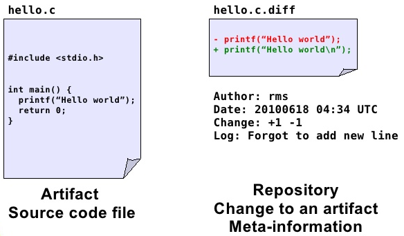

* _Usage data_. There are statistics about software downloads, logs from servers, software reviews, etc. 


Types of information stored in the repositories:

  * Meta-information about the project itself and the
people that participated.

    + Low-level information

        * Mailing Lists (ML)

        * Bug Tracking Systems (BTS) or Project Tracker System (PTS)

        * Software Configuration Management Systems (SCM)

    + Processed information. For example project management information about the effort estimation and cost of the project.

* Whether the repository is public or not

* Single project vs. multiprojects. Whether the repository contains information of a single project with multiples versions or multiples projects and/or versions.

* Type of content, open source or industrial projects

* Format in which the information is stored and formats or technologies for accessing the information:
  
    + Text. It can be just plain text, CSV (Comma Separated Values) files, Attribute-Relation File Format
(ARFF) or its variants
    
    + Through databases. Downloading dumps of the database.
    
    + Remote access such as APIs of Web services or REST


# Repositories

There is a number of open research repositories in Software Engineering. Among them:

  + PROMISE (PRedictOr Models In Software Engineering): 
[http://openscience.us/repo/](http://openscience.us/repo/)


  + Finding Faults using Ensemble Learners (ELFF) [@Shippey2016Esem]
  [http://www.elff.org.uk/](http://www.elff.org.uk/)

  + FLOSSMole [@HCC06] 
[http://flossmole.org/](http://flossmole.org/)

  + FLOSSMetrics [@herraiz2009flossmetrics]: 
[http://flossmetrics.org/](http://flossmetrics.org/)

  + Qualitas Corpus (QC) [@QualitasCorpus2010]: 
[http://qualitascorpus.com/](http://qualitascorpus.com/)

  + Sourcerer Project [@LBNRB09]: 
[http://sourcerer.ics.uci.edu/](http://sourcerer.ics.uci.edu/)

  + Ultimate Debian Database (UDD) [@NZ10] 
[http://udd.debian.org/](http://udd.debian.org/)

  + SourceForge Research Data Archive (SRDA) [@VanAntwerpM2008] 
[http://zerlot.cse.nd.edu/](http://zerlot.cse.nd.edu/)

  + SECOLD (Source code ECOsystem Linked Data): 
    [http://www.secold.org/](http://www.secold.org/)

  + Software-artifact Infrastructure Repository (SIR) 
[http://sir.unl.edu]

  + OpenHub:
[https://www.openhub.net/](https://www.openhub.net/)


Not openly available (and mainly for effort estimation):

  + The International Software Benchmarking Standards Group (ISBSG)
    [http://www.isbsg.org/](http://www.isbsg.org/)
  
  + TukuTuku
    [http://www.metriq.biz/tukutuku/](http://www.metriq.biz/tukutuku/)


Some papers and publications/theses that have been used in the literature:

  + Helix Data Set [@Vasa2010]: 
    [http://www.ict.swin.edu.au/research/projects/helix/](http://www.ict.swin.edu.au/research/projects/helix/)

  + Bug Prediction Dataset (BPD) [@DAmb2010a,@ALR11]: 
    [http://bug.inf.usi.ch/](http://bug.inf.usi.ch/)

  + Eclipse Bug Data (EBD) [@ZPZ07,@NZZH12]: 
    [http://www.st.cs.uni-saarland.de/softevo/bug-data/eclipse/](http://www.st.cs.uni-saarland.de/softevo/bug-data/eclipse/)


# Open Tools/Dashboards to extract data

Process to extract data:


Within the open source community, several toolkits allow us to extract data that can be used to explore projects:

Metrics Grimoire
[http://metricsgrimoire.github.io/](http://metricsgrimoire.github.io/)


SonarQube
[http://www.sonarqube.org/](http://www.sonarqube.org/)


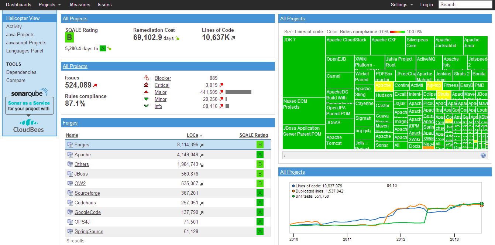


CKJM (OO Metrics tool)
[http://gromit.iiar.pwr.wroc.pl/p_inf/ckjm/](http://gromit.iiar.pwr.wroc.pl/p_inf/ckjm/)

Collects a large number of object-oriented metrics from code.

## Issues

There are problems such as different tools report different values for the same metric [@Lincke2008]

It is well-know that the NASA datasets have some problems:

 + [@Gray2011] The misuse of the NASA metrics data program data sets for automated software defect prediction

 + [@Shepperd2013] Data Quality: Some Comments on the NASA Software Defect Datasets


<!--chapter:end:110_dataSources.Rmd-->

## Effort Estimation Data in Software Engineering


It is worth highlighting the case of software effort estimation datasets with their peculiarities. First, most effort estimation datasets used in the literature are scattered through research papers with the exception of a few kept in the PROMISE repository. Mair et al [-@MairSJ05] also have analysed available datasets in the field of cost estimation identifying 65 different datasets in 50 papers. 

Second, their size is very small with the exception of ISBSG repository discussed previously which a small sample is available through PROMISE and the China dataset with 499 instances. 

Third, some can be quite old in a context and time that is not applicable to current development environments. The authors noted that the oldest datasets (COCOMO, Desharnais, Kemerer and Albrecht and Gaffney) tend to be the most studied ones and a subset of the most relevant ones. Also, from the artificial intelligence or data mining point of view  effort estimation has been mainly tackled with different types of regression techniques and more recently with techniques which are also typically considered under the umbrella of data mining techniques. However, as the number of examples per dataset is increasing, other machine learning techniques are also being studied (e.g.: Dejaeger et al [-@Dejaeger_TSE12_EffEst] report on a comparison of several machine learning techniques to effort estimation with only 5 out the 9 used datasets publicly available). From the data mining point of view, the small number of instances hinders the application of machine learning techniques. 


However, software effort and cost estimation still remain one of the main challenges in software engineering and have attracted a great deal of interest by many researchers [-@Jorgensen07]. For example, there are continuous analyses of whether software development follows economies or diseconomies of scale (see [@Dolado01_CostEst,@Banker1994,@Kitchenham2002]).


Next Table \@ref(tab:effEstimation) (following Mair et al [-@MairSJ05] ) shows the most open cost/effort datasets available in the literature with their main reference.

Table: (\#tab:effEstimation) Effort Estimation Dataset from articles

| Reference                         | Instances     | Attributes  |
| ----------------------------------| ------------: |------------:|
|Abran and Robillard [-@Abran_TSE96_FP] 		| 21 | 31|
|Albrecht-Gaffney [-@AlbrechtG83] 			    | 24 | 7 |
|Bailey and Basili [-@Bailey81]  			| 18 | 9 |
|Belady and Lehman [-@Belady79]  			| 33 |   |
|Boehm (aka COCOMO Dataset) [-@Boehm81] 		| 63 |  43 |
|China dataset[^1] | 499 | 18 |
|Desharnais [-@Desharnais88] 			| 61 |  10 |
|Dolado [-@Dolado97] 				| 24 | 7 |
|Hastings and Sajeev [-@Hastings01]  		|  8 | 14 |
|Heiat and Heiat [@Heiat97] 			| 35 | 4  |
|Jeffery and Stathis [-@Jeffery_ESE96]		| 17 | 7 |
|Jorgensen [-@Jorgensen04]			| 47 | 4 |
|Jorgensen et al. [-@Jorgensen2003] 		| 20 | 4 |
|Kemerer [-@Kemerer87] 				| 15 | 5 |
|Kitchenham (Mermaid 2) [-@Kitchenham2002]		| 30 | 5 |
|Kitchenham et al. (CSC) [-@Kitchenham02_CSC]	| 145 | 9  |
|Kitchenham and Taylor (ICL) [-@Kitchenham85]	| 10 | 6 |
|Kitchenham and Taylor (BT System X) [-@Kitchenham85]		| 10 | 3 |
|Kitchenham and Taylor (BT Software Houses) [-@Kitchenham85]	| 12 | 6 |
|Li et al.(USP05) [-@LiRAR07][^2] | 202 | 16 |
|Mišić and Tevsić [-@Misic19981]		| 6  | 16 |
|Maxwell (Dev Effort) [-@Maxwell02]			| 63  |	32 |
|Maxwell (Maintenance Eff) [-@Maxwell02]		| 67  | 28 |
|Miyazaki et al. [-@Miyazaki94] 			| 47 | 9 |
|Moser et al. [-@Moser1999]				| 37 | 4 |
|Shepperd and Cartwright [@Shepperd_TSE01] 	| 39 | 3 |
|Shepperd and Schofield (Telecom 1) [-@Shepperd97_Analogy]  | 18 | 5 |
|Schofield (real-time 1) [-@Schofield98PhD,@Shepperd97_Analogy] | 21 | 4 |
|Schofield (Mermaid) [-@Schofield98PhD] 		| 30 | 18 |
|Schofield (Finnish) [-@Schofield98PhD] 		| 39 | 30 |
|Schofield (Hughes) [-@Schofield98PhD] 		| 33 | 14|
|Woodfield et al. [-@Woodfield81] | 63 | 8 |


[^1]: Donated through PROMISE.
[^2]: Only a subset of the data in the paper, the complete dataset is donated through PROMISE

<!--chapter:end:120_dataEffortEstimation.Rmd-->

# (PART) Exploratory and Descriptive Data analysis {-}

# Exploratory Data Analysis

## Descriptive statistics

The first task with any dataset is to characterise it in terms of summary statistics and graphics. 

Displaying information graphically will help us to identify the main characteristics of the data. To describe a distribution we often want to know where it is centered and and what the spread is (mean, median, quantiles)
 
## Basic Plots

* _Histogram_ defines a sequence of breaks and then counts the number of observations in the bins formed by the breaks.
  
* _Boxplot_ used to summarize data succinctly, quickly displaying if the data is symmetric or has suspected outliers. 
    
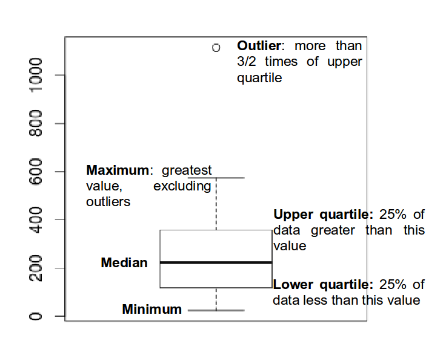

* _Q-Q plot_ is used to determine if the data is close to being normally distributed. The quantiles of the standard normal distribution is represented by a straight line. The normality of the data can be evaluated by observing the extent in which the points appear on the line. When the data is normally distributed around the mean, then the mean and the median should be equal. 

* _Scatterplot_ provides a graphical view of the relationship between two sets of numbers: one numerical variable against another. 
  
* _Kernel Density_ plot visualizes the underlying distribution of a variable. Kernel density estimatiion is a non-parametric method of estimating the probability density function of continuous random variable. It helps to identify the distribution of the variable.
    
* _Violin plot_ is a combination of a boxplot and a kernel density plot. 
    
    
## Normality 

  * A normal distribution is an arrangement of a data set in which most values cluster in the middle of the range
  * A graphical representation of a normal distribution is sometimes called a *bell curve* because of its shape.
  * Many procedures in statistics are based on this property. *Parametric* procedures require the normality property.
  * In a normal distribution about 95% of the probability lies within 2 Standard Deviations of the mean.
  * Two examples: one population with mean 60 and the standard deviation of 1, and the other with mean 60 and $sd=4$ (means shifted to 0)
  
```{r SDPlotExample, fig.cap="Plot exaple of the area within 2 and 4SD of the mean respectively", tidy=TRUE}
# Area within 2SD of the mean
par(mfrow=c(1,2))
plot(function(x) dnorm(x, mean = 0, sd = 1),
xlim = c(-3, 3), main = "SD 1", xlab = "x",
ylab = "", cex = 2)
segments(-2, 0, -2, 0.4)
segments(2, 0, 2, 0.4)
# Area within 4SD of the mean
plot(function(x) dnorm(x, mean = 0, sd = 4),
xlim = c(-12, 12), main = "SD 4", xlab = "x",
ylab = "", cex = 2)
segments(-8, 0, -8, 0.1)
segments(8, 0, 8, 0.1)
```

  - if we sample from this population we get "another population":
  
```{r, tidy=TRUE}
sample.means <- rep(NA, 1000)
for (i in 1:1000) {
  sample.40 <- rnorm(40, mean = 60, sd = 4) 
    #rnorm generates random numbers from normal distribution
  sample.means[i] <- mean(sample.40)
}
means40 <- mean(sample.means)
sd40 <- sd(sample.means)
means40
sd40
```

- These sample means are another "population". The sampling distribution of the sample mean is normally distributed meaning that the "mean of a representative sample provides an estimate of the unknown population mean". This is shown in Figure \@ref(fig:sampleMeansExample)

```{r sampleMeansExample, fig.cap="Sample means histogram"}
hist(sample.means)
```


## Using a running Example to visualise the different plots

As a running exmple we do next:

  1. Set the path to to the file
  
  2. Read the _Telecom1_ dataset and print out the summary statistics with the command `summary`
  
  
```{r telecomExample, tidy=TRUE}
options(digits=3)
telecom1 <- read.table("./datasets/effortEstimation/Telecom1.csv", sep=",",header=TRUE, stringsAsFactors=FALSE, dec = ".") #read data
summary(telecom1)
```

  * We see that this dataset has three variables (or parameters) and few data points (18)
    + *size*: the independent variable
    + *effort*: the dependent variable
    + *EstTotal*: the estimates coming from an estimation method
  * Basic Plots
  
  
```{r message=FALSE, warning=FALSE, tidy=TRUE}
par(mfrow=c(1,2)) #n figures per row
size_telecom1 <- telecom1$size
effort_telecom1 <- telecom1$effort

hist(size_telecom1, col="blue", xlab='size', ylab = 'Probability', main = 'Histogram of project Size')
lines(density(size_telecom1, na.rm = T, from = 0, to = max(size_telecom1)))
plot(density(size_telecom1))


hist(effort_telecom1, col="blue")
plot(density(effort_telecom1))

boxplot(size_telecom1)
boxplot(effort_telecom1)

# violin plots for those two variables
library(vioplot)
vioplot(size_telecom1, names = '') 
title("Violin Plot of Project Size")
vioplot(effort_telecom1, names = '')
title("Violin Plot of Project Effort")

par(mfrow=c(1,1))
qqnorm(size_telecom1, main="Q-Q Plot of 'size'")
qqline(size_telecom1, col=2, lwd=2, lty=2) #draws a line through the first and third quartiles
qqnorm(effort_telecom1,  main="Q-Q Plot of 'effort'")
qqline(effort_telecom1)
```


  * We can observe the non-normality of the data. 
  
  * We may look the posible relationship between size and effort with a scatterplot
  
```{r scatterplotExample, fig.cap="Scatterplot. Relationship between size and effort", tidy=TRUE}
plot(size_telecom1, effort_telecom1)
```


### Example with the China dataset (from the tera-Promise Repository)


```{r message=FALSE, warning=FALSE}
library(foreign)
china <- read.arff("./datasets/effortEstimation/china.arff")
china_size <- china$AFP
summary(china_size)
china_effort <- china$Effort
summary(china_effort)
par(mfrow=c(1,2))
hist(china_size, col="blue", xlab="Adjusted Function Points", main="Distribution of AFP")
hist(china_effort, col="blue",xlab="Effort", main="Distribution of Effort")
boxplot(china_size)
boxplot(china_effort)
qqnorm(china_size)
qqline(china_size)
qqnorm(china_effort)
qqline(china_effort)
```
  * We observe the non-normality of the data. 

#### Normality. Galton data

It is the data based on the famous 1885 Francis Galton's study about the relationship between the heights of adult children and the heights of their parents.


```{r galtonData, echo=FALSE, message=FALSE, warning=FALSE}
# library(UsingR); data(galton)
galton <- read.csv("./datasets/other/galton.csv")
par(mfrow=c(1,2))
hist(galton$child,col="blue") #,breaks=100)
hist(galton$parent,col="blue") #,breaks=100)
```


#### Normalization

Take $log$s in both independent variables. For example, with the _China_ dataset. 
  
```{r logExample, echo=FALSE, tidy=TRUE}
par(mfrow=c(1,2))
logchina_size = log(china_size)
hist(logchina_size, col="blue", xlab="log Adjusted Function Points", main="Distribution of log AFP")
logchina_effort = log(china_effort)
hist(logchina_effort, col="blue",xlab="Effort", main="Distribution of log Effort")
qqnorm(logchina_size)
qqnorm(logchina_effort)
```

 * If the $log$ transformation is used, then the estimation equation is:
  $$y= e^{b_0 + b_1 log(x)} $$


## Correlation

_Correlation_ is a statistical relationship between two sets of data. With the whole dataset we may check for the linear Correlation of the variables we are interested in.

As an example with the China dataset
  
```{r correlationChinaDataset}
par(mfrow=c(1,1))
plot(china_size,china_effort)
cor(china_size,china_effort)
cor.test(china_size,china_effort)
cor(china_size,china_effort, method="spearman")
cor(china_size,china_effort, method="kendall")
```


## Confidence Intervals. Bootstrap
  * Until now we have generated point estimates
  * A _confidence interval_ (CI) is an interval estimate of a population parameter. The parameter can be the mean, the median or other. The frequentist CI is an observed interval that is different from sample to sample. It frequently includes the value of the unobservable parameter of interes if the experiment is repeated. The *confidence level* is the value that measures the frequency that the constructed intervals contain the true value of the parameter. 
  * The construction of a confidence interval with an exact value of confidence level for a distribution requires some statistical properties. Usually, *normality* is one of the properties required for computing confidence intervals. 
    + Not all confidence intervals contain the true value of the parameter.
    + Simulation of confidence intervals

An example from Ugarte et al. [@ugarte2015probability]

```{r confiedenceIntervals, echo=FALSE, tidy=TRUE}
  # code from the book by Ugarte et al.
  norsim <- function(sims = 100, n = 36, mu = 100, sigma = 18, conf.level = 0.95){
  alpha <- 1 - conf.level
  CL <- conf.level * 100
  ll <- numeric(sims)
  ul <- numeric(sims)
  for (i in 1:sims){
    xbar <- mean(rnorm(n , mu, sigma))
    ll[i] <- xbar - qnorm(1 - alpha/2)*sigma/sqrt(n)
    ul[i] <- xbar + qnorm(1 - alpha/2)*sigma/sqrt(n)
  }
  notin <- sum((ll > mu) + (ul < mu))
  percentage <- round((notin/sims) * 100, 2)
  SCL <- 100 - percentage
  plot(ll, type = "n", ylim = c(min(ll), max(ul)), xlab = " ", 
       ylab = " ")
  for (i in 1:sims) {
    low <- ll[i]
    high <- ul[i]
    if (low < mu & high > mu) {
      segments(i, low, i, high)
    }
    else if (low > mu & high > mu) {
      segments(i, low, i, high, col = "red", lwd = 5)
    }
    else {
      segments(i, low, i, high, col = "blue", lwd = 5)
    }
  }
  abline(h = mu)
#   cat(SCL, "\b% of the random confidence intervals contain Mu =", mu, "\b.", "\n")
}
```

```{r tidy=TRUE}
set.seed(10)
norsim(sims = 100, n = 36, mu = 100, sigma = 18, conf.level = 0.95)
```

  * The range defined by the confidence interval will vary with each sample, because the sample size will vary each time and the standard deviation will vary too.
  * 95% confidence interval: it is the probability that the hypothetical confidence intervals (that would be computed from the hypothetical repeated samples) will contain the population mean.
  * the particular interval that we compute on one sample does not mean that the population mean lies within that interval with a probability of 95%.
  * Recommended reading: [@Hoekstra2014] *Robust misinterpretation of confidence intervals* 


## Nonparametric Bootstrap
  * For computing CIs the important thing is to know the assumptions that are made to “know” the
distribution of the statistic.
  * There is a way to compute confidence intervals without meeting the requirements of parametric methods. 
  * **Resampling** or **bootstraping** is a method to calculate estimates of a parameter taking samples from the original data and using those *resamples* to calculate statistics. Using the resamples usually gives more accurate results than using the original single sample to calculate an estimate of a parameter. 
  
  
  - An example of bootstrap CI can be found in Chapter \@ref(evaluationSE), "Evaluation in Software Engineering"

<!--chapter:end:200_exploratoryDataAnalysis.Rmd-->


# Classical Hypothesis Testing
  
  - By "classical" we mean the standard "frequentist" approach to hypothesis testing. The "frequentist" approach to probability sees it as the frequency of events in the long run. We repeat experiments over and over and we count the times that our object of interest appears in the sequence. 
  
  - The classical approach is usually called **null hypothesis significance testing** (NHST) because the process starts by setting a null hypothesis $H_0$ which is the opposite about what we think is true.
  
  - The rationale of the process is that the statistical hypothesis should be *falsifiable*, that is, we can find evidence that the hypothesis is not true. We try to find evidence against the null hypothesis in order to support our alternative hypothesis $H_A$
  
  - Usually, the null hypothesis is described as the situation of "no effect" and the alternative hypothesis describes the effect that we are looking for.
  
  - After collecting data, taking an actual sample, we measure the distance of our parameter of interest from the hypothesized population parameter, and use the facts of the sampling distribution to determine the probability of obtaining such a sample *assuming the hypothesis is true*. This is amounts to a test of the hypothesis.
  
  - If the probability of our sample, given the null hypothesis is high, this provides evidence that the null hypothesis is true. Conversely, if the probability of the sample is low (given the hypothesis), this is evidence against the null hypothesis. The hypothesis being tested in this way is named the *null hypothesis*.
  
  - The goal of the test is to determine if the null hypothesis can be rejected. A statistical test can either reject or fail to reject a null hypothesis, but never prove it true. 
  
  - We can make two types of errors: false positive (Type I) and false negative (Type II)
  
  - Type I and Type II errors
  
       
  
  
  - Two-tailed NHST
  
       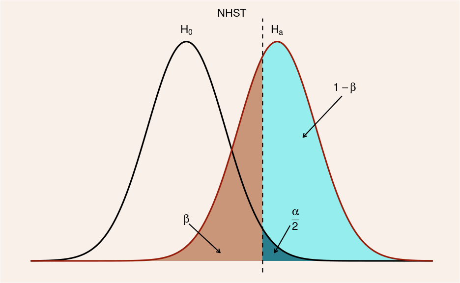
    
    
  - One-tailed NHST
  
       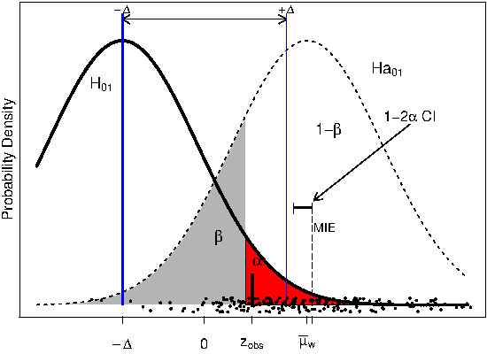


  - elementary example


```{r}
data = c(52.7, 53.9, 41.7, 71.5, 47.6, 55.1, 62.2, 56.5, 33.4, 61.8, 54.3, 50.0, 45.3, 63.4, 53.9, 65.5, 66.6, 70.0, 52.4, 38.6, 46.1, 44.4, 60.7, 56.4);
t.test(data, mu=50, alternative = 'greater')
```

- Keeping this simple, we could start hypothesis testing about one sample median with the wilcoxon test for non-normal distributions.

```{r echo=FALSE}
library(foreign)
chinaTrain <- read.arff("datasets/effortEstimation/china3AttSelectedAFPTrain.arff")
logchina_size <- log(chinaTrain$AFP)
logchina_effort <- log(chinaTrain$Effort)
linmodel_logchina_train <- lm(logchina_effort ~ logchina_size)
chinaTest <- read.arff("datasets/effortEstimation/china3AttSelectedAFPTest.arff")
b0 <- linmodel_logchina_train$coefficients[1]
b1 <- linmodel_logchina_train$coefficients[2]
china_size_test <- chinaTest$AFP
actualEffort <- chinaTest$Effort
predEffort <- exp(b0+b1*log(china_size_test))

err <- actualEffort - predEffort  #error or residual
ae <- abs(err)
```
  
  
  - "ae" is the absolute error in the China Test data
  
  
```{r}
median(ae)
mean(ae)
wilcox.test(ae, mu=800, alternative = 'greater') #change the values of mu and see the results

```
 
 - Quick introduction at https://psychstatsworkshop.wordpress.com/2014/08/06/lesson-9-hypothesis-testing/
  

## p-values
  - p-value: the p-value of a statistical test is the probability, computed assuming that $H_0$ is true, that the test statistic would take a value as extreme or more extreme than that actually observed. 
  - http://www.nature.com/news/psychology-journal-bans-p-values-1.17001
  - https://www.sciencenews.org/blog/context/p-value-ban-small-step-journal-giant-leap-science
  
  
 


<!--chapter:end:220_classicalHypothesisTesting.Rmd-->

# (PART) Preprocessing {-}

# Preprocessing

Following the data mining process, we describe what is meant by preprocessing, classical supervised models,  unsupervised models and evaluation in the context of software engineering with examples

This task is probably the hardest and where most of effort is spend in the data mining process. It is quite typical to transform the data, for example, finding inconsistencies, normalising, imputing missing values, tranforming input data, merging variables, etc.

Typically, preprocessing consist of the following tasks (subprocesses):
 
 + Data cleaning (consistency, noise detection, outliers)
 + Data integration
 + Data transformation  (normalisation, discretisation) and derivation of new attributes from existing ones (e.g., population density from population and area)
 + Missing data imputation
 + Data reduction (feature selection and instace selection)


## Data

_Consistent_ data are semantically correct based on real-world knowledge of the problem, i.e., no constrains are violated and data that can be used for inducing models and analysis. For example, the LoC or effort is constrained to non-negative values. We can also consider that to multiple attributes are consistent among them, and even datasets (e.g., same metrics but collected by different tools)


## Missing values

_Missing values_ will have a negative effect when analysing the data or learning models. The results can be biased when compared with the models induced from the complete data, the results can be harder to analyse, it may be needed to discard records with missing values depending on the algorithm and this can be an important problems with small datasets such as the effort estimation ones.

Missing data is typically classified into:
  * MCAR (Missing Completely at Random) or MAR (Missing At Random) where there is no reason for those missing values and we can assume that the distribution could follow the attribute's distribution.
  * MNAR (Missing Not At Random)  where there is a pattern for those missing values and it may may be advisable to check the data gathering process to try to understand why such information is missing. 

_Imputation_ consists in replacing missing values for estimates of those missing values. Many algorithms do cannot handle missing values and therefore, imputation methods are needed. We can use simple approaches such as the replacing the missing values with the mean or mode of the attribute. More elaborated approaches include:

  * EM (Expectation-Maximisation)
  * Distance-based
      + kNN (k Nearest Neighbours)
      + Clustering

In R, a missing value is represented with `NA` and the analyst must decide what to do with missing data. The simplest approach is to leave out instances (ignore missing -IM-) with with missing data. This functionality is supported by many base functions through the `na.rm` option.

The `mice` R package. MICE (Multivariate Imputation via Chained Equations) assumes that data are missing at random.  Other packages include `Amelia`, `missForest`, `Hmisc` and `mi`.

## Noise

Imperfections of the real-world data that influences negatively in the induced machine learning models. Approaches to deal with noisy data include:
 * Robust learners capable of handling noisy data (e.g., C4.5 through pruning strategies)
 * Data polishing methods which aim to correct noisy instances prior training
 * Noise filters which are used to identify and eliminate noisy instances from the training data.
 
 
Types of noise data: 
 * Class Noise (aka label noise). 
      + There can be contradictory cases (all attributes have the same value except the class)
      + Misclassifications. The class attribute is not labeled with the true label (golden truth)
 * Attribute Noise. Values of attributes that are noise, missing or unknown. 
 

## Outliers

There is a large amount of literature related to outlier detection, and furthermore several definitions of outlier exist. 

```{r message=FALSE, warning=FALSE}
library(DMwR)
library(foreign)

kc1 <- read.arff("./datasets/defectPred/D1/KC1.arff")
```

The LOF algorithm (`lofactor`), given a data set it produces a vector of local outlier factors for each case.

```{r message=FALSE, warning=FALSE}
kc1num <- kc1[,1:21]
outlier.scores <- lofactor(kc1num, k=5)
plot(density(na.omit(outlier.scores)))
outliers <- order(outlier.scores, decreasing=T)[1:5]
print(outliers)
```

Another simple method of Hiridoglou and Berthelot for positive observations.


## Feature selection

Feature Selection (FS) aims at identifying the most relevant attributes from a dataset. It is important in different ways:

  * A reduced volume of data allows different data mining or searching techniques to be applied.

  * Irrelevant and redundant attributes can generate less accurate and more complex models. Furthermore, data mining algorithms can be executed faster.

  * It avoids the collection of data for those irrelevant and redundant attributes in the future.


The problem of FS received a thorough treatment in pattern recognition and machine learning. Most of the FS algorithms tackle the task as a _search_ problem, where each
state in the search specifies a distinct subset of the possible attributes [@BL97]. The search procedure is combined with a criterion to evaluate the merit of each candidate subset of attributes. There are a multiple possible combinations between each procedure search and each attribute measure [@LY05].

There are two major approaches in FS from the method's output point of view: 

  * _Feature subset selection_ (FSS)

  * _Feature ranking_ in which attributes are ranked as a list of features which are ordered according to evaluation measures (a subset of features is often selected from the top of the ranking list).


FFS algorithms designed with different evaluation criteria broadly fall into two categories:

  * The _filter_ model relies on general characteristics of the data to evaluate and select feature subsets without involving any data mining algorithm.
  
  * The _wrapper_ model requires one predetermined mining algorithm and uses its performance as the evaluation criterion. It searches for features better suited to the mining algorithm aiming to improve mining performance, but it also tends to be more computationally expensive than filter model [@KJ97,@Lan94].


Feature subset algorithms search through candidate feature subsets guide by a certain evaluation measure [@LM98] which captures the goodness of each subset. An optimal (or near optimal) subset is selected when the search stops.

Some existing evaluation measures that have been shown effective in removing both irrelevant and redundant features include the consistency measure [@DLM00], the correlation measure [@Hal99] and the estimated accuracy of a learning algorithm [@KJ97].


 + _Consistency_ measure attempts to find a minimum number of features that separate classes as consistently as the full set of features can. An inconsistency is defined as to instances having the same
feature values but different class labels.

  + _Correlation_ measure evaluates the goodness of feature subsets based on the hypothesis that good feature subsets contain features highly correlated to the class, yet uncorrelated to each other.

  + _Wrapper-based_ attribute selection uses the target learning algorithm to estimate the worth of attribute subsets. The feature subset selection algorithm conducts a search for a good subset using
the induction algorithm itself as part of the evaluation function.

Langley [-@Lan94] notes that feature selection algorithms that search through the space of feature subsets must address four main issues: (i) the starting point of the search, (ii) the organization of the search, (iii) the evaluation of features subsets and (iv) the criterion used to terminate the search. Different algorithms address theses issues differently.

It is impractical to look at all possible feature subsets, even with a small number of attributes. Feature selection algorithms usually proceed greedily and are be classified into those that add features to an initially empty set (_forward selection_) and those that remove features from an initially complete set (_backwards elimination_). Hybrids both add and remove features as the algorithm progresses. Forward selection is much faster than backward elimination and therefore scales better to large data sets. A wide range of search strategies can be used: best-first, branch-and-bound, simulated annealing, genetic algorithms (see Kohavi and John [-@KJ97] for a review).


### FSelector package in R

The FSelector package in R implements many algorithms available in Weka


```{r message=FALSE, warning=FALSE}
library(FSelector)
library(foreign)

cm1 <- read.arff("./datasets/defectPred/D1/CM1.arff")

cm1RFWeigths <- random.forest.importance(Defective ~ ., cm1)
cutoff.biggest.diff(cm1RFWeigths)
```

Using the Information Gain meaure as ranking:
```{r message=FALSE, warning=FALSE}
cm1GRWeights <- gain.ratio(Defective ~ ., cm1)
cm1GRWeights
cutoff.biggest.diff(cm1GRWeights)

# After assigning weights, we can select the statistaclly significant ones
cm1X2Weights <- chi.squared(Defective ~ ., cm1)
cutoff.biggest.diff(cm1X2Weights)
```

Using CFS attribute selection

```{r message=FALSE, warning=FALSE}
library(FSelector)
library(foreign)

cm1 <- read.arff("./datasets/defectPred/D1/CM1.arff")

result <- cfs(Defective ~ ., cm1)
f <- as.simple.formula(result, "Defective")
f
```

Other packages for Feature selection in R include `FSelectorRccp` which re-implments the FSlector without WEKA dependencies.

Another popular package is `Boruta`, which is based on selection based on Random Forest. 

## Instance selection

Removal of samples (complementary to the removal of attributes) in order to scale down the dataset prior to learning a model so that there is (almost) no performance loss.

There are two types of processes: 

 * _Prototype Selection_ (PS) [@GDCH12] when the subset is used with a distance based method (kNN)

 * _Training Set Selection_ (TSS) [@CanoHL07] in which an actual model is learned.
 
It is also a search problem as with _feature selection_. Garcia et al. [-@GDCH12] provide a  comprehensive overview of the topic. 


## Discretization

This process transforms continuous attributes into discrete ones, by associating categorical values to intervals and thus transforming quantitative data into qualitative data.


## Correlation Coefficient and Covariance for Numeric Data

Two random variables $x$ and $y$ are called independent if the probability distribution of one variable is not affected by the presence of another.


$\tilde{\chi}^2=\frac{1}{d}\sum_{k=1}^{n} \frac{(O_k - E_k)^2}{E_k}$

```{r message=FALSE, warning=FALSE}
chisq.test(kc1$LOC_BLANK,kc1$BRANCH_TOTAL)
chisq.test(kc1$DESIGN_COMPLEXITY,kc1$CYCLOMATIC_COMPLEXITY)
```

## Normalization

### Min-Max Normalization

$z_i=\frac{x_i-\min(x)}{\max(x)-\min(x)}$

```{r message=FALSE, warning=FALSE}
library(caret)
preObj <- preProcess(kc1[, -22], method=c("center", "scale"))
```


### Z-score normalization
TBD

## Transformations

### Linear Transformations and  Quadratic Trans formations
TBD

### Box-cox transformation 
TBD

### Nominal to Binary tranformations
TBD


##  Preprocessing in R

### The `dplyr` package

The *[dplyr](https://cran.r-project.org/web/packages/dplyr/index.html)* package created by Hadley Wickham. Some functions are similar to SQL syntax and it key functions in dplyr include:

 + select: select columns from a dataframe
 + filter: select rows from a dataframe
 + summarize: allows us to do summary stats based upon the grouped variable
 + group_by: group by a factor variable
 + arrange: order the dataset
 + joins: as in sql left join

Tutorial:
[https://github.com/justmarkham/dplyr-tutorial](https://github.com/justmarkham/dplyr-tutorial)

Examples

```{r message=FALSE, warning=FALSE}
library(dplyr)
```

Describe the dataframe:

```{r}
str(kc1)
```

`tbl_df` creates a “local data frame” as a wrapper for better printing

```{r}
kc1_tbl <- tbl_df(kc1)
```

Filter:

```{r}
# Filter rows: use comma or & to represent AND condition
filter(kc1_tbl, Defective == "Y" & LOC_BLANK != 0)
```

Another operator is `%in%`.

Select:
```{r}
select(kc1_tbl, contains("LOC"), Defective)
```

Now, `kc1_tbl` contains("LOC"), Defective


Filter and Select together:
```{r}
# nesting method
filter(select(kc1_tbl, contains("LOC"), Defective), Defective !=0)
```

It is easier usign the chaining method:

```{r}
# chaining method
kc1_tbl %>%
    select(contains("LOC"), Defective) %>%
    filter(Defective !=0)
```


Arrange ascending
```{r}
# 
kc1_tbl %>%
    select(LOC_TOTAL, Defective) %>%
    arrange(LOC_TOTAL)
```

Arrange descending:
```{r}
kc1_tbl %>%
    select(LOC_TOTAL, Defective) %>%
    arrange(desc(LOC_TOTAL))
```


Mutate:
```{r}
kc1_tbl %>%
    filter(Defective == "Y") %>%
    select(NUM_OPERANDS, NUM_OPERATORS, Defective) %>%
    mutate(HalsteadLength = NUM_OPERANDS + NUM_OPERATORS)
```

`summarise`: Reduce variables to values

```{r}
# Create a table grouped by Defective, and then summarise each group by taking the mean of loc
kc1_tbl %>%
    group_by(Defective) %>%
    summarise(avg_loc = mean(LOC_TOTAL, na.rm=TRUE))
```


```{r}
# Create a table grouped by Defective, and then summarise each group by taking the mean of loc
kc1_tbl %>%
    group_by(Defective) %>%
    summarise_each(funs(mean, min, max), BRANCH_COUNT, LOC_TOTAL)
```


It seems than the number of _Defective_ modules is larger than the _Non-Defective_ ones. We can count them with:

```{r}
# n() or tally
kc1_tbl %>%
    group_by(Defective) %>%
    tally()
```

It seems that it's an imbalanced dataset...

```{r}
# randomly sample a fixed number of rows, without replacement
kc1_tbl %>% sample_n(2)

# randomly sample a fraction of rows, with replacement
kc1_tbl %>% sample_frac(0.05, replace=TRUE)

# Better formatting adapted to the screen width
glimpse(kc1_tbl)
```

## Other libraries and tricks

The `lubridate` package contains a number of functions facilitating the conversion of text to
POSIX dates. As an example, consider the following code. We may use this, for example, with time series.


For example [https://cran.r-project.org/doc/contrib/de_Jonge+van_der_Loo-Introduction_to_data_cleaning_with_R.pdf](https://cran.r-project.org/doc/contrib/de_Jonge+van_der_Loo-Introduction_to_data_cleaning_with_R.pdf)


```{r message=FALSE, warning=FALSE}
library(lubridate)
dates <- c("15/02/2013", "15 Feb 13", "It happened on 15 02 '13")
dmy(dates)
```

<!--chapter:end:300_basicPreprocessing.Rmd-->

# (PART) Supervised Models {-}

# Supervised Classification

A classification problem can be defined as the induction, from a dataset $\cal D$, of a classification function $\psi$ that, given the attribute vector of an instance/example, returns a class ${c}$. A regression problem, on the other hand, returns an numeric value.

Dataset, $\cal D$, is typically composed of $n$ attributes and a class attribute $C$. 

| $Att_1$  | ... | $Att_n$  | $Class$ |
|----------|-----| ---------|---------|
| $a_{11}$ | ... | $a_{1n}$ | $c_1$   |
| $a_{21}$ | ... | $a_{2n}$ | $c_2$   |
| ...      | ... | ...      | ...     |
| $a_{m1}$ | ... | $a_{mn}$ | $c_m$   |


Columns are usually called _attributes_ or _features_. Typically, there is a _class_ attribute, which can be numeric or discrete. When the class is numeric, it is a regression problem. With discrete values, we can talk about binary classification or multiclass (multinomial classification) when we have more than three values. There are variants such _multi-label_ classification (we will cover these in the advanced models section).

Once we learn a model, new instances are classified. As shown in the next figure.

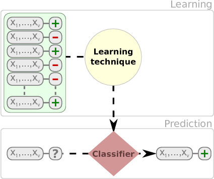


We have multiple types of models such as _classification trees_, _rules_, _neural networks_,  and _probabilistic classifiers_ that can be used to classify instances.

Fernandez et al provide an extensive comparison of 176 classifiers using the UCI dataset [@FernandezCBA14].

We will show the use of different classification techniques in the problem of defect prediction as running example. In this example,the different datasets are composed of classical metrics (_Halstead_ or _McCabe_ metrics) based on counts of operators/operands and like or object-oriented metrics (e.g. Chidamber and Kemerer) and the class attribute indicating whether the module or class was defective.


## Classification Trees

There are several packages for inducing classification trees, for example with the [party package](https://cran.r-project.org/web/packages/party/index.html) (recursive partitioning):


```{r warning=FALSE, message=FALSE}
library(foreign) # To load arff file
library(party) # Build a decision tree
library(caret) 

jm1 <- read.arff("./datasets/defectPred/D1/JM1.arff")
str(jm1)

# Stratified partition (training and test sets)
set.seed(1234)
inTrain <- createDataPartition(y=jm1$Defective,p=.60,list=FALSE)
jm1.train <- jm1[inTrain,]
jm1.test <- jm1[-inTrain,]

jm1.formula <- jm1$Defective ~ . # formula approach: defect as dependent variable and the rest as independent variables
jm1.ctree <- ctree(jm1.formula, data = jm1.train)

# predict on test data
pred <- predict(jm1.ctree, newdata = jm1.test)
# check prediction result
table(pred, jm1.test$Defective)
plot(jm1.ctree)
```

Using the C50 package, there are two ways, specifying train and testing

```{r, eval=FALSE}
library(C50)
require(utils)
# c50t <- C5.0(jm1.train[,-ncol(jm1.train)], jm1.train[,ncol(jm1.train)])
c50t <- C5.0(Defective ~ ., jm1.train)
summary(c50t)
plot(c50t)
c50tPred <- predict(c50t, jm1.train)
# table(c50tPred, jm1.train$Defective)
```


Using the ['rpart'](https://cran.r-project.org/web/packages/rpart/index.html) package

``` {r}
# Using the 'rpart' package
library(rpart)
jm1.rpart <- rpart(Defective ~ ., data=jm1.train, parms = list(prior = c(.65,.35), split = "information"))
# par(mfrow = c(1,2), xpd = NA)
plot(jm1.rpart)
text(jm1.rpart, use.n = TRUE)
jm1.rpart

library(rpart.plot)
# asRules(jm1.rpart)
# fancyRpartPlot(jm1.rpart)
```


## Rules

C5 Rules

```{r}
library(C50)
c50r <- C5.0(jm1.train[,-ncol(jm1.train)], jm1.train[,ncol(jm1.train)], rules = TRUE)
summary(c50r)
# c50rPred <- predict(c50r, jm1.train)
# table(c50rPred, jm1.train$Defective)
```


## Distanced-based Methods

In this case, there is no model as such. Given a new instance to classify, this approach finds the closest $k$-neighbours to the given instance. 


(Source: Wikipedia - https://en.wikipedia.org/wiki/K-nearest_neighbors_algorithm)


```{r}
library(class)
m1 <- knn(train=jm1.train[,-22], test=jm1.test[,-22], cl=jm1.train[,22], k=3)

table(jm1.test[,22],m1)
```

## Neural Networks

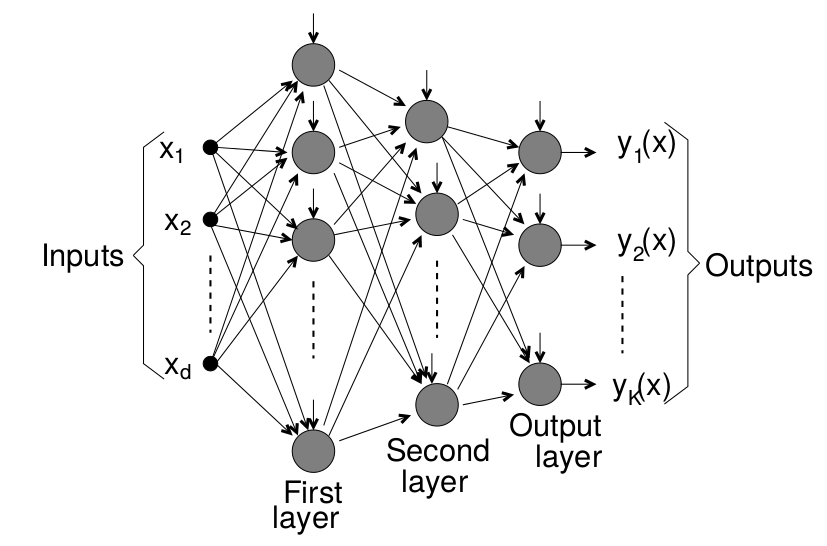


## Support Vector Machine


(Source: wikipedia https://en.wikipedia.org/wiki/Support_vector_machine)

## Probabilistic Methods

### Naive Bayes

Probabilistic graphical model assigning a probability to each possible outcome $p(C_k, x_1,\ldots,x_n)$ 


Using the `klaR` package with `caret`:

```{r warning=FALSE}
library(caret)
library(klaR)
model <- NaiveBayes(Defective ~ ., data = jm1.train)
predictions <- predict(model, jm1.test[,-22])
confusionMatrix(predictions$class, jm1.test$Defective)
```


Using the `e1071` package:

```{r warning=FALSE, message=FALSE}
library (e1071)
n1 <-naiveBayes(jm1.train$Defective ~ ., data=jm1.train)

# Show first 3 results using 'class'
head(predict(n1,jm1.test, type = c("class")),3) # class by default

# Show first 3 results using 'raw'
head(predict(n1,jm1.test, type = c("raw")),3)

```


There are other variants such as TAN and KDB that do not assume the independece condition allowin us more complex structures.


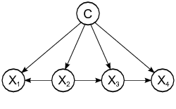


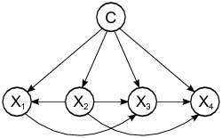


A comprehensice comparison of 


## Linear Discriminant Analysis (LDA)

One classical approach to classification is Linear Discriminant Analysis (LDA), a generalization of Fisher's linear discriminant, as a method used to find a linear combination of features to separate two or more classes.

```{r warning=FALSE}
ldaModel <- train (Defective ~ ., data=jm1.train, method="lda", preProc=c("center","scale"))
ldaModel
```

We can observe that we are training our model using `Defective ~ .` as a formula were `Defective` is the class variable separed by `~` and the ´.´ means the rest of the variables. Also, we are using a filter for the training data to (preProc) to center and scale. 

Also, as stated in the documentation about the `train` method :
> http://topepo.github.io/caret/training.html

```{r warning=FALSE}
ctrl <- trainControl(method = "repeatedcv",repeats=3)
ldaModel <- train (Defective ~ ., data=jm1.train, method="lda", trControl=ctrl, preProc=c("center","scale"))

ldaModel
```

Instead of accuracy we can activate other metrics using `summaryFunction=twoClassSummary` such as `ROC`, `sensitivity` and `specificity`. To do so, we also need to speficy `classProbs=TRUE`.

```{r warning=FALSE}
ctrl <- trainControl(method = "repeatedcv",repeats=3, classProbs=TRUE, summaryFunction=twoClassSummary)
ldaModel3xcv10 <- train (Defective ~ ., data=jm1.train, method="lda", trControl=ctrl, preProc=c("center","scale"))

ldaModel3xcv10
```


Most methods have parameters that need to be optimised and that is one of the

```{r warning=FALSE, message=FALSE}
plsFit3x10cv <- train (Defective ~ ., data=jm1.train, method="pls", trControl=trainControl(classProbs=TRUE), metric="ROC", preProc=c("center","scale"))

plsFit3x10cv

plot(plsFit3x10cv)
```


The parameter `tuneLength` allow us to specify the number values per parameter to consider.

```{r warning=FALSE}
plsFit3x10cv <- train (Defective ~ ., data=jm1.train, method="pls", trControl=ctrl, metric="ROC", tuneLength=5, preProc=c("center","scale"))

plsFit3x10cv

plot(plsFit3x10cv)
``` 


Finally to predict new cases, `caret` will use the best classfier obtained for prediction.

```{r warning=FALSE}
plsProbs <- predict(plsFit3x10cv, newdata = jm1.test, type = "prob")
```

```{r warning=FALSE}
plsClasses <- predict(plsFit3x10cv, newdata = jm1.test, type = "raw")
confusionMatrix(data=plsClasses,jm1.test$Defective)
```

### Predicting the number of defects (numerical class)

From the Bug Prediction Repository (BPR) [http://bug.inf.usi.ch/download.php](http://bug.inf.usi.ch/download.php)

Some datasets contain CK and other 11 object-oriented metrics for the last version of the system plus categorized (with severity and priority) post-release defects. Using such dataset:

```{r warning=FALSE, message=FALSE}
jdt <- read.csv("./datasets/defectPred/BPD/single-version-ck-oo-EclipseJDTCore.csv", sep=";")

# We just use the number of bugs, so we removed others
jdt$classname <- NULL
jdt$nonTrivialBugs <- NULL
jdt$majorBugs <- NULL
jdt$minorBugs <- NULL
jdt$criticalBugs <- NULL
jdt$highPriorityBugs <- NULL
jdt$X <- NULL

# Caret
library(caret)

# Split data into training and test datasets
set.seed(1)
inTrain <- createDataPartition(y=jdt$bugs,p=.8,list=FALSE)
jdt.train <- jdt[inTrain,]
jdt.test <- jdt[-inTrain,]
```

```{r warning=FALSE}
ctrl <- trainControl(method = "repeatedcv",repeats=3)
glmModel <- train (bugs ~ ., data=jdt.train, method="glm", trControl=ctrl, preProc=c("center","scale"))
glmModel
```


Others such as Elasticnet:

```{r warning=FALSE}
glmnetModel <- train (bugs ~ ., data=jdt.train, method="glmnet", trControl=ctrl, preProc=c("center","scale"))
glmnetModel
```


## Binary Logistic Regression (BLR)

Binary Logistic Regression (BLR) can models fault-proneness as follows

$$fp(X) = \frac{e^{logit()}}{1 + e^{logit(X)}}$$

where the simplest form for logit is:

$logit(X) = c_{0} + c_{1}X$

```{r warning=FALSE}
jdt <- read.csv("./datasets/defectPred/BPD/single-version-ck-oo-EclipseJDTCore.csv", sep=";")

# Caret
library(caret)

# Convert the response variable into a boolean variable (0/1)
jdt$bugs[jdt$bugs>=1]<-1

cbo <- jdt$cbo
bugs <- jdt$bugs

# Split data into training and test datasets
jdt2 = data.frame(cbo, bugs)
inTrain <- createDataPartition(y=jdt2$bugs,p=.8,list=FALSE)
jdtTrain <- jdt2[inTrain,]
jdtTest <- jdt2[-inTrain,]
```

BLR models fault-proneness are as follows $fp(X) = \frac{e^{logit()}}{1 + e^{logit(X)}}$

where the simplest form for logit is $logit(X) = c_{0} + c_{1}X$

```{r warning=FALSE}
# logit regression
# glmLogit <- train (bugs ~ ., data=jdt.train, method="glm", family=binomial(link = logit))       

glmLogit <- glm (bugs ~ ., data=jdtTrain, family=binomial(link = logit))
summary(glmLogit)

```


Predict a single point:
```{r warning=FALSE}
newData = data.frame(cbo = 3)
predict(glmLogit, newData, type = "response")
```

Draw the results, modified from:
http://www.shizukalab.com/toolkits/plotting-logistic-regression-in-r


```{r warning=FALSE}
results <- predict(glmLogit, jdtTest, type = "response")

range(jdtTrain$cbo)
range(results)

plot(jdt2$cbo,jdt2$bugs)
curve(predict(glmLogit, data.frame(cbo=x), type = "response"),add=TRUE)
# points(jdtTrain$cbo,fitted(glmLogit))
```


Another type of graph:

```{r warning=FALSE}
library(popbio)
logi.hist.plot(jdt2$cbo,jdt2$bugs,boxp=FALSE,type="hist",col="gray")
```


## The caret package

There are hundreds of packages to perform classification task in R, but many of those can be used throught the 'caret' package which helps with many of the data mining process task as described next. 

The caret package[http://topepo.github.io/caret/](http://topepo.github.io/caret/) provides a unified interface for modeling and prediction with around 150 different models with tools for:

 + data splitting
    
 + pre-processing
    
 + feature selection
    
 + model tuning using resampling
    
 + variable importance estimation, etc.


Website: [http://caret.r-forge.r-project.org](http://caret.r-forge.r-project.org)

JSS Paper: [www.jstatsoft.org/v28/i05/paper](www.jstatsoft.org/v28/i05/paper)

Book: [Applied Predictive Modeling](http://AppliedPredictiveModeling.com/) 


<!--chapter:end:400_basicModelBuildingSupervised.Rmd-->

---
output:
  html_document: default
  pdf_document: default
---

# Regression {#regression}

## Linear Regression modeling

  - _Linear Regression_ is one of the oldest and most known predictive methods. As its name says, the idea is to try to fit a linear equation between a dependent variable and an independent, or explanatory, variable. The idea is that the independent variable $x$ is something the experimenter controls and the dependent variable $y$ is something that the experimenter measures. The line is used to predict the value of $y$ for a known value of $x$. The variable $x$ is the predictor variable and $y$ the response variable.
  
  - _Multiple linear regression_ uses 2 or more independent variables for building a model. See  <https://www.wikipedia.org/wiki/Linear_regression>.
  
  - First proposed many years ago but still very useful...
  
   
  
  - The equation takes the form $\hat{y}=b_0+b_1 * x$
  - The method used to choose the values $b_0$ and $b_1$ is to minimize the sum of the squares of the residual errors.

### Regression: Galton Data

Not related to Software Engineering but ...

```{r warning=FALSE, message=FALSE}
library(UsingR)
data(galton)
par(mfrow=c(1,2))
hist(galton$child,col="blue",breaks=100)
hist(galton$parent,col="blue",breaks=100)
plot(galton$parent,galton$child,pch=1,col="blue", cex=0.4)
lm1 <- lm(galton$child ~ galton$parent)
lines(galton$parent,lm1$fitted,col="red",lwd=3)
plot(galton$parent,lm1$residuals,col="blue",pch=1, cex=0.4)
abline(c(0,0),col="red",lwd=3)
qqnorm(galton$child)
```

### Simple Linear Regression

- Given two variables $Y$ (response) and $X$ (predictor), the assumption is that there is an approximate ($\approx$) *linear* relation between those variables. 
- The mathematical model of the observed data is described as (for the case of simple linear regression):
$$ Y \approx \beta_0 + \beta_1 X$$

- the parameter $\beta_0$ is named the *intercept* and $\beta_1$ is the  *slope*
- Each observation can be modeled as

$$y_i = \beta_0 + \beta_1 x_i + \epsilon_i;
\epsilon_i \sim N(0,\sigma^2)$$ 
- $\epsilon_i$ is the *error*
- This means that the variable $y$ is normally distributed:
$$ y_i \sim N( \beta_0 + \beta_1 x_i, \sigma^2) $$


- The *predictions* or *estimations* of this model are obtained by a linear equation of the form $\hat{Y}=\hat{\beta_0} + \hat{\beta}_1X$, that is, each new prediction is computed with
$$\hat{y}_i = \hat{\beta}_0 + \hat{\beta}_1x_i $$.
- The actual parameters $\beta_0$ and $\beta_1$ are unknown
- The parameters $\hat{\beta}_0$ and $\hat{\beta}_1$ of the linear equation can be estimated with different methods. 

### Least Squares
- One of the most used methods for computing $\hat{\beta}_0$ and $\hat{\beta}_1$ is the criterion of "least squares" minimization. 
- The data is composed of $n$ pairs of observations $(x_i, y_i)$
- Given an observation $y_i$ and its corresponding estimation $\hat{y_i})$ the *residual* $e_i$ is defined as $$e_i= y_i - \hat{y_i}$$
- the Residual Sum of Squares is defined as $$RSS=e_1^2+\dots + e_i^2+\dots+e_n^2$$
- the Least Squares Approach minimizes the RSS
- as result of that minimizitation, it can be obtained, by means of calculus, the estimation of $\hat{\beta}_0$ and $\hat{\beta}_1$ as $$\hat{\beta}_1=\frac{\sum_{i=1}^{n}{(x_i-\bar{x})(y_i-\bar{y})}}{\sum_{i=1}^{n}(x_i-\bar{x})^2}$$ and $$\hat{\beta}_0=\bar{y}-\hat{\beta}_1\bar{x} $$ where $\bar{y}$ and $\bar{x}$ are the sample means.
- the variance $\sigma^2$ is estimated by 
$$\hat\sigma^2 = {RSS}/{(n-2)}$$ where n is the number of observations 
- The *Residual Standard Error* is defined as $$RSE = \sqrt{{RSS}/{(n-2)}}$$
- The equation $$ Y = \beta_0 + \beta_1 X + \epsilon$$ defines the linear model, i.e., the *population regression line*
- The *least squares line* is $\hat{Y}=\hat{\beta_0} + \hat{\beta}_1X$
- *Confidence intervals* are computed using the *standard errors* of the intercept and the slope.
- The $95\%$ confidence interval for the slope is computed as $$[\hat{\beta}_1 - 2 \cdot SE(\hat{\beta}_1), \hat{\beta}_1+SE(\hat{\beta}_1)]$$ 
- where $$ SE(\hat{\beta}_1) = \sqrt{\frac{\sigma^2}{\sum_{i=1}^{n}(x_i-\bar{x})^2}}$$

### Linear regression in R

The following are the basic commands in R:

- The basic function is `lm()`, that returns an object with the model. 
- Other commands: `summary` prints out information about the regression, `coef` gives the coefficients for the linear model, `fitted` gives the predictd value of $y$ for each value of $x$, `residuals` contains the differences between observed and fitted values. 
- [`predict`](https://stat.ethz.ch/R-manual/R-devel/library/stats/html/predict.lm.html) will generate predicted values of the response for the values of the explanatory variable. 
  
  
## Linear Regression Diagnostics

  - Several plots help to evaluate the suitability of the linear regression 
    + *Residuals vs fitted*: The residuals should be randomly distributed around the horizontal line representing a residual error of zero; that is, there should not be a distinct trend in the distribution of points. 
    + *Standard Q-Q plot*: residual errors are normally distributed
    + *Square root of the standardized residuals vs the fitted values*: there should be no obvious trend. This plot is similar to the residuals versus fitted values plot, but it uses the square root of the standardized residuals. 
    + *Leverage*: measures the importance of each point in determining the regression result. Smaller values means that removing the observation has little effect on the regression result. 


### Simulation example

#### Simulate a dataset
```{r}
set.seed(3456)
# equation is  y = -6.6 + 0.13 x +e
# range x 100,400
a <- -6.6
b <- 0.13
num_obs <- 60
xmin <- 100
xmax <- 400
x <- sample(seq(from=xmin, to = xmax, by =1), size= num_obs, replace=FALSE)

sderror <- 9 # sigma for the error term in the model
e <- rnorm(num_obs, 0, sderror) 

y <- a + b * x + e


newlm <- lm(y~x)
summary(newlm)

cfa1 <- coef(newlm)[1]
cfb2 <- coef(newlm)[2]
plot(x,y, xlab="x axis", ylab= "y axis", xlim = c(xmin, xmax), ylim = c(0,60), sub = "Line in black is the actual model")
title(main = paste("Line in blue is the Regression Line for ", num_obs, " points."))

abline(a = cfa1, b = cfb2, col= "blue", lwd=3)
abline(a = a, b = b, col= "black", lwd=1) #original line

```


##### Subset a set of points from the same sample
```{r}

# sample from  the same  x     to compare least squares lines 
# change the denominator in newsample to see how the least square lines changes accordingly. 
newsample <- as.integer(num_obs/8) # number of pairs x,y

idxs_x1 <- sample(1:num_obs, size = newsample, replace = FALSE) #sample indexes
x1 <- x[idxs_x1]
e1 <- e[idxs_x1]
y1 <- a + b * x1 + e1
xy_obs <- data.frame(x1, y1)
names(xy_obs) <- c("x_obs", "y_obs")

newlm1 <- lm(y1~x1)
summary(newlm1)

cfa21 <- coef(newlm1)[1]
cfb22 <- coef(newlm1)[2]

plot(x1,y1, xlab="x axis", ylab= "y axis", xlim = c(xmin, xmax), ylim = c(0,60))
title(main = paste("New line in red with ", newsample, " points in sample"))

abline(a = a, b = b, col= "black", lwd=1)  # True line
abline(a = cfa1, b = cfb2, col= "blue", lwd=1)  #sample
abline(a = cfa21, b = cfb22, col= "red", lwd=2) #new line
```


##### Compute a confidence interval on the original sample regression line

```{r}

newx <- seq(xmin, xmax)
ypredicted <- predict(newlm, newdata=data.frame(x=newx), interval= "confidence", level= 0.90, se = TRUE)

plot(x,y, xlab="x axis", ylab= "y axis", xlim = c(xmin, xmax), ylim = c(0,60))
# points(x1, fitted(newlm1))
abline(newlm)

lines(newx,ypredicted$fit[,2],col="red",lty=2)
lines(newx,ypredicted$fit[,3],col="red",lty=2)

# Plot the residuals or errors
ypredicted_x <- predict(newlm, newdata=data.frame(x=x))
plot(x,y, xlab="x axis", ylab= "y axis", xlim = c(xmin, xmax), ylim = c(0,60), sub = "", pch=19, cex=0.75)
title(main = paste("Residuals or errors", num_obs, " points."))
abline(newlm)
segments(x, y, x, ypredicted_x)

```

##### Take another sample from the model and explore
```{r}
# equation is  y = -6.6 + 0.13 x +e
# range x 100,400
num_obs <- 35
xmin <- 100
xmax <- 400
x3 <- sample(seq(from=xmin, to = xmax, by =1), size= num_obs, replace=FALSE)
sderror <- 14 # sigma for the error term in the model
e3 <- rnorm(num_obs, 0, sderror) 

y3 <- a + b * x3 + e3

newlm3 <- lm(y3~x3)
summary(newlm3)

cfa31 <- coef(newlm3)[1]
cfb32 <- coef(newlm3)[2]
plot(x3,y3, xlab="x axis", ylab= "y axis", xlim = c(xmin, xmax), ylim = c(0,60))
title(main = paste("Line in red is the Regression Line for ", num_obs, " points."))
abline(a = cfa31, b = cfb32, col= "red", lwd=3)
abline(a = a, b = b, col= "black", lwd=2) #original line
abline(a = cfa1, b = cfb2, col= "blue", lwd=1) #first sample

# confidence intervals for the new sample

newx <- seq(xmin, xmax)
ypredicted <- predict(newlm3, newdata=data.frame(x3=newx), interval= "confidence", level= 0.90, se = TRUE)

lines(newx,ypredicted$fit[,2],col="red",lty=2, lwd=2)
lines(newx,ypredicted$fit[,3],col="red",lty=2, lwd=2)

```


### Diagnostics fro assessing the regression line

#### Residual Standard Error
- It gives us an idea of the typical or average error of the model. It is the estimated standard deviation of the residuals.

#### $R^2$ statistic
- This is the proportion of variability in the data that is explained by the model. Best values are those close to 1.


## Multiple Linear Regression

### Partial Least Squares
- If several predictors are highly correlated, the least squares approach has high variability. 
- PLS finds linear combinations of the predictors, that are called *components* or *latent* variables. 


## Linear regression in Software Effort estimation

Fitting a linear model to log-log
  - the predictive power equation is $y= e^{b_0 + b_1 log(x)}$, ignoring the bias corrections
  - First, we are fitting the model to the whole dataset. But it is not the right way to do it, because of overfitting.


```{r warning=FALSE, message=FALSE}
library(foreign)
china <- read.arff("./datasets/effortEstimation/china.arff")
china_size <- china$AFP
summary(china_size)
china_effort <- china$Effort
summary(china_effort)
par(mfrow=c(1,2))
hist(china_size, col="blue", xlab="Adjusted Function Points", main="Distribution of AFP")
hist(china_effort, col="blue",xlab="Effort", main="Distribution of Effort")
boxplot(china_size)
boxplot(china_effort)
qqnorm(china_size)
qqline(china_size)
qqnorm(china_effort)
qqline(china_effort)
```
  
Applying the `log` function

```{r, echo=FALSE}
par(mfrow=c(1,2))
logchina_size = log(china_size)
hist(logchina_size, col="blue", xlab="log Adjusted Function Points", main="Distribution of log AFP")
logchina_effort = log(china_effort)
hist(logchina_effort, col="blue",xlab="Effort", main="Distribution of log Effort")
qqnorm(logchina_size)
qqnorm(logchina_effort)
```
  
  
  
```{r}
linmodel_logchina <- lm(logchina_effort ~ logchina_size)
par(mfrow=c(1,1))
plot(logchina_size, logchina_effort)
abline(linmodel_logchina, lwd=3, col=3)
par(mfrow=c(1,2))
plot(linmodel_logchina, ask = FALSE)
linmodel_logchina
```


## References

- The New Statistics with R, Andy Hector, 2015
- An Introduction to R, W.N. Venables and D.M. Smith and the R Development Core Team
- Practical Data Science with R, Nina Zumel and John Mount
- G. James et al, An Introduction to Statistical Learning with Applications in R, Springer, 2013 

<!--chapter:end:417_regression.Rmd-->

# (PART) Unsupervised Models {-}

# Unsupervised or Descriptive modeling

From the descriptive (unsupervised) point of view, patterns are found to predict future behaviour or estimate. This include association rules, clustering, or tree clustering which aim at grouping together objects (e.g., animals) into successively larger clusters, using some measure of similarity or distance. The dataset will be as the previous table without the $C$ class attribute

| Att~1~|     | Att~n~ |
|-------|-----| -------|
| a~11~ | ... | a~1n~  |
| a~21~ | ... | a~2n~  |
| ...   | ... | ...    |
| a~m1~ | ... | a~mn~  |


## Clustering

```{r warning=FALSE, message=FALSE}
library(foreign)
library(fpc)

kc1 <- read.arff("./datasets/defectPred/D1/KC1.arff")

# Split into training and test datasets
set.seed(1)
ind <- sample(2, nrow(kc1), replace = TRUE, prob = c(0.7, 0.3))
kc1.train <- kc1[ind==1, ]
kc1.test <- kc1[ind==2, ]

# No class
kc1.train$Defective <- NULL

ds <- dbscan(kc1.train, eps = 0.42, MinPts = 5)

kc1.kmeans <- kmeans(kc1.train, 2)

```

### k-Means

```{r warning=FALSE, message=FALSE}
library(reshape, quietly=TRUE)
library(graphics)
kc1kmeans <- kmeans(sapply(na.omit(kc1.train), rescaler, "range"), 10)
#plot(kc1kmeans, col = kc1kmeans$cluster)
#points(kc1kmeans$centers, col = 1:5, pch = 8)
```

## Association rules
```{r warning=FALSE, message=FALSE}
library(arules)

# x <- as.numeric(kc1$LOC_TOTAL)
# str(x)
# summary(x)
# hist(x, breaks=30, main="LoC Total")
# xDisc <- discretize(x, categories=5)
# table(xDisc)

for(i in 1:21) kc1[,i] <- discretize(kc1[,i],  method = "interval", breaks = 5)

rules <- apriori(kc1,
   parameter = list(minlen=3, supp=0.05, conf=0.35),
   appearance = list(rhs=c("Defective=Y"),
   default="lhs"),
   control = list(verbose=F))

#rules <- apriori(kc1,
 #   parameter = list(minlen=2, supp=0.05, conf=0.3),
 #   appearance = list(rhs=c("Defective=Y", "Defective=N"),
 #   default="lhs"))
  
inspect(rules)
 
library(arulesViz)
plot(rules)
```


<!--chapter:end:420_basicModelBuildingUnsupervised.Rmd-->

# (PART) Evaluation {-}

# Evaluation of Models

Once we obtain the model with the training data, we need to evaluate it with some new data (testing data). 

> **No Free Lunch theorem**
> In the absence of any knowledge about the prediction problem, no model
> can be said to be uniformly better than any other


## Building and Validating a Model

We cannnot use the the same data for training and testing (it is like evaluating a student with the exercises previouly solved in class, the sudent's marks will be “optimistic” and we do not know about student capability to generalise the learned concepts).

Therefore, we should, at a minimun, divide the dataset into _training_ and _testing_, learn the model with the training data and test it with the rest of data as explained next.


### Holdout approach

**Holdout approach** consists of dividing the dataset into *training* (typically approx. 2/3 of the data) and *testing* (approx 1/3 of the data).
  + Problems: Data can be skewed, missing classes, etc. if randomly divided. Stratification ensures that each class is represented with approximately equal proportions (e.g., if data contains aprox 45% of positive cases, the training and testing datasets should mantain similar proportion of positive cases).

Holdout estimate can be made more reliable by repeating the process with different subsamples (repeated holdout method)

The error rates on the different iterations are averaged (overall error rate)

  - Usually, part of the data points are used for building the model and the remaining points are used for validating the model. There are several approaches to this process.
  - *Validation Set approach*: it is the simplest method. It consists of randomly dividing the available set of oservations into two parts, a *training set* and a *validation set* or hold-out
set. Usually 2/3 of the data points are used for training and 1/3 is used for testing purposes.

    


### Cross Validation (CV)


*k-fold Cross-Validation* involves randomly dividing the set of observations into $k$ groups, or folds, of approximately equal size. One fold is treated as a validation set and the method is trained on the remaining $k-1$ folds. This procedure is repeated $k$ times. If $k$ is equal to $n$ we are in the previous method.
  
  + 1st step: split dataset ($\cal D$) into $k$ subsets of approximatelly equal size $C_1, \dots, C_k$ 
  
  + 2nd step: we construct a dataset $D_i = D-C_i$ used for training and test the accuracy of the classifier $D_i$ on $C_i$ subset for testing
  
Having done this for all $k$ we estimate the accuracy of the method by averaging the accuracy over the $k$ cross-validation trials
  
   
  

  - *Leave-One-Out Cross-Validation*: This is a special case of CV. Instead of creating two subsets for training and testing, a single observation is used for the validation set, and the remaining observations make up the training set. This approach is repeated n times (the total number of observations) and the estimate for the test mean squared error is the average of the n test estimates.
  
    
  


<!--chapter:end:430_evaluation.Rmd-->

---
output:
  html_document: default
  pdf_document: default
---
## Evaluation of Classification Models

The confusion matrix (which can be extended to multiclass problems) is a table that presents the results of a classification algorithm. The following table shows the possible outcomes for binary classification problems:


|           |$Act Pos$ | $Act Neg$ |
|-----------|-----------|------------|
| $Pred Pos$ |   $TP$    | $FP$       |
| $Pred Neg$ |   $FN$    | $TN$       |


where *True Positives* ($TP$) and *True Negatives* ($TN$) are respectively the number of positive and negative instances correctly classified, *False Positives* ($FP$) is the number of negative instances misclassified as positive (also called Type I errors), and *False Negatives* ($FN$) is the number of positive instances misclassified as negative (Type II errors).

+ [Confusion Matrix in Wikipedia](https://en.wikipedia.org/wiki/Confusion_matrix)

From the confusion matrix, we can calculate:

   + *True positive rate*, or *recall * ($TP_r = recall = r = TP/TP+FN$) is the proportion of positive cases correctly classified as belonging to the positive class.
   
   + *False negative rate* ($FN_r=FN/TP+FN$) is the proportion of positive cases misclassified as belonging to the negative class.
   
   + *False positive rate* ($FP_r=FP/FP+TN$) is the proportion of negative cases misclassified as belonging to the positive class.
   
   + *True negative rate* ($TN_r=TN/FP+TN$) is the proportion of negative cases correctly classified as belonging to the negative class.


There is a tradeoff between $FP_r$ and $FN_r$ as the objective is minimize both metrics (or conversely, maximize the true negative and positive rates). It is possible to combine both metrics into a single figure, predictive $accuracy$:

$$accuracy = \frac{TP + TN}{TP + TN + FP + FN}$$

to measure performance of classifiers (or the complementary value, the _error rate_ which is defined as $1-accuracy$)

+ Precision, fraction of relevant instances among the retrieved instances, $$\frac{TP}{TP+FP}$$

+ Recall$ ($sensitivity$ probability of detection, $PD$) is the fraction of relevant instances that have been retrieved over total relevant instances, $\frac{TP}{TP+FN}$

+ _f-measure_ is the harmonic mean of precision and recall, 
$2 \cdot \frac{precision \cdot recall}{precision + recall}$

+ G-mean: $\sqrt{PD \times Precision}$

+ G-mean2: $\sqrt{PD \times Specificity}$

+ J coefficient, $j-coeff = sensitivity + specificity - 1 = PD-PF$

(Jiang, Cubic and Ma, 2008 ESE)


+ A suitable and interesting performance metric for binary classification when data are imbalanced is the Matthew's Correlation Coefficient ($MCC$)~\cite{Matthews1975Comparison}: 

$$MCC=\frac{TP\times TN - FP\times FN}{\sqrt{(TP+FP)(TP+FN)(TN+FP)(TN+FN)}}$$

$MCC$ can also be calculated from the confusion matrix. Its range goes from -1 to +1; the closer to one the better as it indicates perfect prediction whereas a value of 0 means that classification is not better than random prediction and negative values mean that predictions are worst than random.


### Prediction in probabilistic classifiers

A probabilistic classifier estimates the probability of each of the posible class values given the attribute values of the instance $P(c|{x})$. Then, given a new instance, ${x}$, the class value with the highest a posteriori probability will be assigned to that new instance (the *winner takes all* approach):

$\psi({x}) = argmax_c (P(c|{x}))$

 
 

## Other Metrics used in Software Engineering with Classification


In the domain of defect prediction and when two classes are considered, it is also customary to refer to the *probability of detection*, ($pd$) which corresponds to the True Positive rate ($TP_{rate}$ or \emph{Sensitivity}) as a measure of the goodness of the model, and *probability of false alarm* ($pf$) as performance measures~\cite{Menzies07}. 

The objective is to find which techniques that maximise $pd$ and minimise $pf$. As stated by Menzies et al., the balance between these two measures depends on the project characteristics (e.g. real-time systems vs. information management systems) it is formulated as the Euclidean distance from the sweet spot $pf=0$ and $pd=1$ to a pair of $(pf,pd)$. 

$$balance=1-\frac{\sqrt{(0-pf^2)+(1-pd^2)}}{\sqrt{2}}$$

It is normalized by the maximum possible distance across the ROC square ($\sqrt{2}, 2$), subtracted this value from 1, and expressed it as a percentage.


 

<!--chapter:end:435_evaluationClassifiers.Rmd-->


## Graphical Evaluation

### Receiver Operating Characteristic (ROC)

The *Receiver Operating Characteristic* ($ROC$)[@Fawcett2006] curve which provides a graphical visualisation of the results.


The Area Under the ROC Curve (AUC) also provides a quality measure between positive and negative rates with a single value. 

A simple way to approximate the AUC is with the following equation:
$AUC=\frac{1+TP_{r}-FP_{r}}{2}$


### Precision-Recall Curve (PRC)

Similarly to ROC, another widely used evaluation technique is the Precision-Recall Curve (PRC), which depicts a trade off between precision and recall and can also be summarised into a single value as the Area Under the Precision-Recall Curve (AUPRC)~\cite{Davis2006}.

%AUPCR is more accurate than the ROC for testing performances when dealing with imbalanced datasets as well as optimising ROC values does not necessarily optimises AUPR values, i.e., a good classifier in AUC space may not be so good in PRC space.
%The weighted average uses weights proportional to class frequencies in the data.
%The weighted average is computed by weighting the measure of class (TP rate, precision, recall ...) by the proportion of instances there are in that class. Computing the average can be sometimes be misleading. For instance, if class 1 has 100 instances and you achieve a recall of 30%, and class 2 has 1 instance and you achieve recall of 100% (you predicted the only instance correctly), then when taking the average (65%) you will inflate the recall score because of the one instance you predicted correctly. Taking the weighted average will give you 30.7%, which is much more realistic measure of the performance of the classifier.


<!--chapter:end:436_evaluationGraphical.Rmd-->


 

## Numeric Prediction Evaluation

RSME 


Mean Square Error = $MSE$ = $\frac{(p_1-a_1)^2 + \ldots  +(p_n-a_n)^2}{n}$

${MSE}=\frac{1}{n}\sum_{i=1}^n(\hat{y_i} - y_i)^2$
 
${RMSD}=\sqrt{\frac{\sum_{t=1}^n (\hat y_t - y)^2}{n}}$ 
 

Mean-absolute error $MAE$

$\frac{|p_1-a_1| + \ldots  +|p_n-a_n|}{n}$

Relative absolute error:

$RAE = \frac{ \sum^N_{i=1} | \hat{\theta}_i - \theta_i | } {  \sum^N_{i=1} | \overline{\theta} - \theta_i | }$

Root relative-squared error:

$RAE = \sqrt{ \frac{ \sum^N_{i=1} | \hat{\theta}_i - \theta_i | } {  \sum^N_{i=1} | \overline{\theta} - \theta_i | } }$

where $\hat{\theta}$ is a mean value of $\theta$.


Relative-squared error
$\frac{(p_1-a_1)^2 + \ldots  +(p_n-a_n)^2}{(a_1-\hat{a})^2 + \ldots + (a_n-\hat{a})^2}$
($\hat{a}$ is the mean value over the training data)


Relative Absolut Error

Correlation Coefficient

Correlation coefficient between two random variables $X$ and $Y$ is defined as $\rho(X,Y) = \frac{{\bf Cov}(X,Y)}{\sqrt{{\bf Var}(X){\bf Var}(Y)}}$. The sample correlation coefficient} $r$ between two samples $x_i$ and $y_j$ is vvdefined as $r = S_{xy}/\sqrt{S_{xx}S_{yy}}$ 

Example: Is there any linear relationship between the effort estimates ($p_i$) and actual effort ($a_i$)? 

$a\|39,43,21,64,57,47,28,75,34,52$

$p\|65,78,52,82,92,89,73,98,56,75$

```{r}
p<-c(39,43,21,64,57,47,28,75,34,52)
a<-c(65,78,52,82,92,89,73,98,56,75)
#
cor(p,a)
```

$R^2$


<!--chapter:end:437_evaluationRegression.Rmd-->


# Measures of Evaluation in Software Engineering {#evaluationSE}
  
There are several measures typically used in software engieering. In particular for effort estimation, the following metrics are extensively used in addition or instead of statistical measures.

  - *Mean of the Absolute Error (MAR)*: compute the absolute errors and take the mean

  - *Geometric Mean of the Absolute Error (gMAR)*: more appropriate when the distribution is skewed

  - *Mean Magnitude of the Relative Error (MMRE)*: this measure has been critisized many times as a biased measure 
($\frac{\sum_{i=1}^{n}{|{\hat{y}_i-y_i}|}/y_i}{n}$)

  - *Median Magnitude of the Relative Error (MdMRE)*: using the median insted of the mean

  - *Level of Prediction* ($Pred(l)$) defined as the percentage of estimates that are within the percentage level $l$ of the actual values. The level of prediction is typically set at 25% below and above the actual value and an estimation method is considered good if it gives a result of more than 75%.
 
  - *Standardised Accuracy (SA)* (proposed by Shepperd&MacDonnell): this measure overcomes all the problems of the MMRE. It is defined as the MAR relative to random guessing
($SA=1-{\frac{MAR}{\overline{MAR}_{P_0}}\times100}$)

  - *Random guessing*: $\overline{MAR}_{P_0}$ is defined as: predict a $\hat{y}_t$ for the target case *t* by randomly sampling (with equal probability) over all the remaining n-1 cases and take $\hat{y}_t=y_r$ where $r$ is drawn randomly from $1$ to $n$ and $r\neq t$.
  - *Exact $\overline{MAR}_{P_0}$*: it is an improvement over $\overline{MAR}_{P_0}$. For small datasets the "random guessing" can be computed exactly by iterating over all data points. 

## Evaluation of the model in the Testing data

```{r}
library(foreign)
gm_mean = function(x, na.rm=TRUE){
  exp(sum(log(x[x > 0]), na.rm=na.rm) / length(x))}

chinaTrain <- read.arff("./datasets/effortEstimation/china3AttSelectedAFPTrain.arff")
logchina_size <- log(chinaTrain$AFP)
logchina_effort <- log(chinaTrain$Effort)
linmodel_logchina_train <- lm(logchina_effort ~ logchina_size)


chinaTest <- read.arff("./datasets/effortEstimation/china3AttSelectedAFPTest.arff")
b0 <- linmodel_logchina_train$coefficients[1]
b1 <- linmodel_logchina_train$coefficients[2]
china_size_test <- chinaTest$AFP
actualEffort <- chinaTest$Effort
predEffort <- exp(b0+b1*log(china_size_test))

err <- actualEffort - predEffort  #error or residual
ae <- abs(err)
hist(ae, main="Absolute Error in the China Test data")
mar <- mean(ae)
mre <- ae/actualEffort
mmre <- mean(mre)
mdmre <- median(mre)
gmar <- gm_mean(ae)
mar
mmre
mdmre
gmar
```

```{r}
level_pred <- 0.25 #below and above (both)
lowpred <- actualEffort*(1-level_pred)
uppred <-  actualEffort*(1+level_pred)
pred  <-  predEffort <= uppred & predEffort >= lowpred  #pred is a vector with logical values 
Lpred <- sum(pred)/length(pred)
Lpred
```


## Building a Linear Model on the Telecom1 dataset  
  - Although there are few datapoints we split the file into Train (2/3) and Test (1/3)
  
```{r}
telecom1 <- read.table("./datasets/effortEstimation/Telecom1.csv", sep=",",header=TRUE, stringsAsFactors=FALSE, dec = ".") #read data

samplesize <- floor(0.66*nrow(telecom1))
set.seed(012) # to make the partition reproducible
train_idx <- sample(seq_len(nrow(telecom1)), size = samplesize)
telecom1_train <- telecom1[train_idx, ]
telecom1_test <- telecom1[-train_idx, ]

par(mfrow=c(1,1))
# transformation of variables to log-log
xtrain <- log(telecom1_train$size)
ytrain <- log(telecom1_train$effort)

lmtelecom1 <- lm( ytrain ~ xtrain)
plot(xtrain, ytrain)


abline(lmtelecom1, lwd=2, col="blue")


b0_tel1 <- lmtelecom1$coefficients[1]
b1_tel1 <- lmtelecom1$coefficients[2]
# calculate residuals and predicted values
res <- signif(residuals(lmtelecom1), 5)

xtest <- telecom1_test$size
ytest <- telecom1_test$effort
pre_tel1 <- exp(b0_tel1+b1_tel1*log(xtest))
# plot distances between points and the regression line
plot(xtest, ytest)
curve(exp(b0_tel1+b1_tel1*log(x)), from=0, to=300, add=TRUE, col="blue", lwd=2)
segments(xtest, ytest, xtest, pre_tel1, col="red")

```

## Building a Linear Model on the Telecom1 dataset with all observations

  - Just to visualize results
  
```{r}
par(mfrow=c(1,1))

effort_telecom1 <- telecom1$effort
size_telecom1 <- telecom1$size

lmtelecom <- lm(effort_telecom1 ~ size_telecom1)
plot(size_telecom1, effort_telecom1)
abline(lmtelecom, lwd=3, col="blue")
# calculate residuals and predicted values
res <- signif(residuals(lmtelecom), 5) 
predicted <- predict(lmtelecom)
# plot distances between points and the regression line
segments(size_telecom1, effort_telecom1, size_telecom1, predicted, col="red")

level_pred <- 0.25 #below and above (both)
lowpred <- effort_telecom1*(1-level_pred)
uppred <-  effort_telecom1*(1+level_pred)
predict_inrange  <-  predicted <= uppred & predicted >= lowpred  #pred is a vector with logical values 
Lpred <- sum(predict_inrange)/length(predict_inrange)
Lpred
#Visually plot lpred
segments(size_telecom1, lowpred, size_telecom1, uppred, col="red", lwd=3)

err_telecom1 <- abs(effort_telecom1 - predicted)
mar_tel1 <- mean(err_telecom1)
mar_tel1

```


## Standardised Accuracy. MARP0. ChinaTest

- Computing $MARP_0$ in the China Test data

```{r}
estimEffChinaTest <- predEffort  # This will be overwritten, no problem
numruns <- 9999
randguessruns <- rep(0, numruns)
for (i in 1:numruns) { 
  for (j in 1:length(estimEffChinaTest)) {
    estimEffChinaTest[j] <- sample(actualEffort[-j],1)}#replacement with random guessingt    
  randguessruns[i] <- mean(abs(estimEffChinaTest-actualEffort))
  } 
marp0Chinatest <- mean(randguessruns)
marp0Chinatest
hist(randguessruns, main="MARP0 distribution of the China dataset")

saChina = (1- mar/marp0Chinatest)*100
saChina
```


## Standardised Accuracy. MARP0. Telecom1
  - Computing $MARP_0$

```{r}
telecom1 <- read.table("./datasets/effortEstimation/Telecom1.csv", sep=",",header=TRUE, stringsAsFactors=FALSE, dec = ".") #read data
#par(mfrow=c(1,2))
#size <- telecom1[1]$size   not needed now
actualEffTelecom1 <- telecom1[2]$effort
estimEffTelecom1 <- telecom1[3]$EstTotal # this will be overwritten
numruns <- 9999
randguessruns <- rep(0, numruns)
for (i in 1:numruns) { 
  for (j in 1:length(estimEffTelecom1)) {
    estimEffTelecom1[j] <- sample(actualEffTelecom1[-j],1)}#replacement with random guessingt    
  randguessruns[i] <- mean(abs(estimEffTelecom1-actualEffTelecom1))
  } 
marp0telecom1 <- mean(randguessruns)
marp0telecom1
hist(randguessruns, main="MARP0 distribution of the Telecom1 dataset")
saTelecom1 <- (1- mar_tel1/marp0telecom1)*100
saTelecom1

```

### MARP0 in the Atkinson dataset
  - For checking results you may use figure Atkinson in Shepperd&MacDonnell
```{r, echo=FALSE}
act_effort <- c(670,912,218,595,267,344,229,190,869,109,289,616,557,416,578,438)
estim_effort <- rep(0, length(act_effort))
numruns <- 9999
randnaiveruns <- rep(0, numruns)
for (i in 1:numruns) { 
  for (j in 1:length(act_effort)) {
    estim_effort[j] <- sample(act_effort[-j],1)}#replacement with random guessingt    
  randnaiveruns[i] <- mean(abs(estim_effort-act_effort))
  } 
marp0atkinson <- mean(randnaiveruns)
marp0atkinson
hist(randnaiveruns, main="MARP0 distribution of the Atkinson dataset")
```

## Exact MARP0
# WBL simple R code to calculate Shepperd and MacDonell's marp0 exactly

```{r}
#example dataset
atkinson_actual_effort <-
  c(670,912,218,595,267,344,229,190,869,109,289,616,557,416,578,438)
myabs <- function(x,y) abs(x-y)

#diffs is square array whose i,jth element = abs(actual_i - actual_j)
#in practice this is good enough but could be made more efficient by not
#explicitly storing the matrix and only using the values below the diagonal.

diffs <- outer(atkinson_actual_effort,atkinson_actual_effort,myabs)
marp0 <- mean(diffs)
marp0


#### same procedure without using the outer function
act_effort <-
  c(670,912,218,595,267,344,229,190,869,109,289,616,557,416,578,438)
n <- length(act_effort)
diffs_guess <- matrix(nrow=n, ncol=n)
colnames(diffs_guess) <- act_effort
rownames(diffs_guess) <- act_effort 
for (i in 1:n){
  diffs_guess[i,] <- act_effort - act_effort[i]
}

diffs_guess <- abs(diffs_guess)
means_per_point <- apply(diffs_guess, 2, mean)
marp0 <- mean(means_per_point)
marp0

```


```{r, echo=FALSE}
## ISBSG dataset
##   to do
# isbsgTrain8 <- read.arff("ISBSGv10_AttributesSelected_952Instances_8Att_Train_CLast.arff")
# isbsgTest8 <- read.arff("ISBSGv10_AttributesSelected_952Instances_8Att_Test_CLast.arff")
```

  
## Computing the bootstraped confidence interval of the mean for the Test observations of the China dataset:
  
```{r}
library(boot)
hist(ae, main="Absolute Errors of the China Test data")
level_confidence <- 0.95
repetitionsboot <- 9999
samplemean <- function(x, d){return(mean(x[d]))}
b_mean <- boot(ae, samplemean, R=repetitionsboot)
confint_mean_China <- boot.ci(b_mean)
confint_mean_China
```

  - Computing the bootstraped geometric mean


```{r}
boot_geom_mean <- function(error_vec){
  log_error <- log(error_vec[error_vec > 0])
  log_error <-log_error[is.finite(log_error)] #remove the -Inf value before calculating the mean, just in case
  samplemean <- function(x, d){return(mean(x[d]))}
  b <- boot(log_error, samplemean, R=repetitionsboot) # with package boot
  # this is a boot for the logs
  return(b)
}
# BCAconfidence interval for the geometric mean
BCAciboot4geommean <- function(b){  
  conf_int <- boot.ci(b, conf=level_confidence, type="bca")$bca #following 10.9 of Ugarte et al.'s book
  conf_int[5] <- exp(conf_int[5]) # the boot was computed with log. Now take the measure back to its previous units
  conf_int[4] <- exp(conf_int[4])
  return (conf_int)
}
# this is a boot object
b_gm <- boot_geom_mean(ae) #"ae" is the absolute error in the China Test data
print(paste0("Geometric Mean of the China Test data: ", round(exp(b_gm$t0), digits=3)))
b_ci_gm <- BCAciboot4geommean(b_gm)
print(paste0("Confidence Interval: ", round(b_ci_gm[4], digits=3), " - ", round(b_ci_gm[5], digits=3)))

# Make a % confidence interval bca
# BCAciboot <- function(b){  
#   conf_int <- boot.ci(b, conf=level_confidence, type="bca")$bca #following 10.9 of Ugarte et al.'s book
#   return (conf_int)
# }
```


<!--chapter:end:440_evaluationInSoftEng.Rmd-->


# (PART) Advanced Topics {-}


# Feature Selection


This technique consists in selecting the most relevant attributes. The need of applying FS includes the following points:

  + A reduced volume of data allows different data mining or searching techniques to be applied.

  + Irrelevant and redundant attributes can generate less accurate and more complex models. Furthermore, data mining algorithms can be executed faster.

  + It is possible to avoid the collection of data for those irrelevant and redundant attributes in the future.


FS algorithms designed with different evaluation criteria broadly fall into two categories [21, 14, 13, 3, 1, 12, 5]:

  + The filter model relies on general characteristics of the data to evaluate and select feature subsets without involving any data mining algorithm.

  + The wrapper model requires one predetermined mining algorithm and uses its performance as the evaluation criterion. It searches for features better suited to the mining algorithm aiming to improve mining performance, but it also tends to be more computationally expensive than filter model [11, 12].


## Instance Selection


## Missing Data Imputation

<!--chapter:end:500_advancedPreprocessingTechniques.Rmd-->

# Feature Selection Example


Feature Selection in R and Caret


```{r}
library(caret)
library(doParallel) # parallel processing
library(dplyr) # Used by caret
library(pROC) # plot the ROC curve

library(foreign)

### Use the segmentationData from caret
# Load the data and construct indices to divided it into training and test data sets.
#set.seed(10)
kc1 <- read.arff("./datasets/defectPred/D1/KC1.arff")
```


```{r}
 inTrain <- createDataPartition(y = kc1$Defective,
  ## the outcome data are needed
  p = .75,
  ## The percentage of data in the
  ## training set
  list = FALSE)
```

The function `createDataPartition` does a stratified partitions.

```{r}
training <- kc1[inTrain,]
nrow(training)

testing <- kc1[-inTrain, ]
nrow(testing)
```


The train function can be used to
  + evaluate, using resampling, the effect of model tuning parameters on performance
  + choose the "optimal" model across these parameters
  + estimate model performance from a training set

```{r}
fitControl <- trainControl(## 10-fold CV
                           method = "repeatedcv",
                           number = 10,
                           ## repeated ten times
                           repeats = 10)


```
gbmFit1 <- train(Defective ~ ., data = training,
                 method = "gbm",
                 trControl = fitControl,
                 ## This last option is actually one
                 ## for gbm() that passes through
                 verbose = FALSE)
gbmFit1

```{r}
plsFit <- train(Defective ~ .,
 data = training,
 method = "pls",
 ## Center and scale the predictors for the training
 ## set and all future samples.
 preProc = c("center", "scale")
)

```

To fix ```{r}
testPred <- predict(plsFit, testing)
postResample(testPred, testing$Defective)
sensitivity(testPred, testing$Defective)
confusionMatrix(testPred, testing$Defective)
```

When there are three or more classes, confusionMatrix will show the confusion matrix and a set of "one-versus-all" results. 

<!--chapter:end:505_featureSelectionExample.Rmd-->

# Advanced Models

## Genetic Programming for Symbolic Regression

This technique is inspired by Darwin's evolution theory.
  + 1960s by I. Rechenberg in his work "Evolution strategies“
  + 1975 Genetic Algorithms (GAs) invented by J Holland and published in his book "Adaption in Natural and Artificial Systems“
  + 1992 J. Koza has used genetic algorithm to evolve programs to perform certain tasks. He called his method "genetic programming" 
 

Other reference for GP: Langdon WB, Poli R (2001) Foundations of Genetic Programming. Springer.

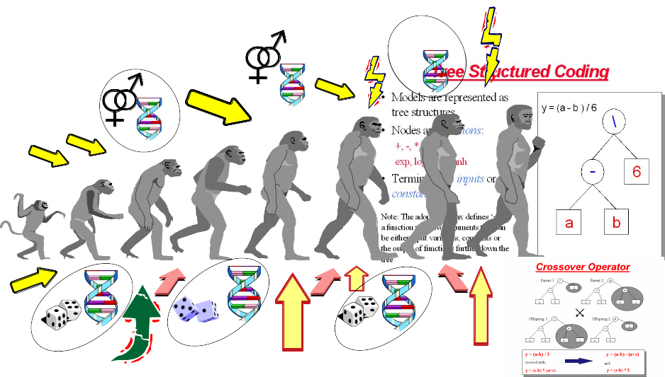


  - Depending on the function set used and the function to be minimised, GP can generate almost any type of curve
  
  
  
  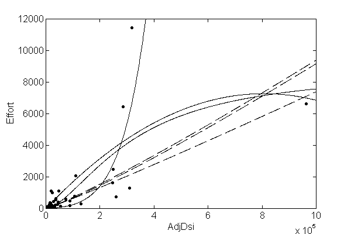


  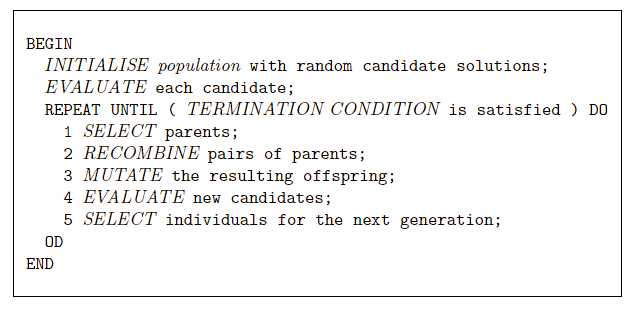

In R, we can use the "rgp" package

## Genetic Programming Example

### Load Data

```{r loadData, }
library(foreign)

#read data
telecom1 <- read.table("./datasets/effortEstimation/Telecom1.csv", sep=",",header=TRUE, stringsAsFactors=FALSE, dec = ".") 
 
size_telecom1 <- telecom1$size
effort_telecom1 <- telecom1$effort

chinaTrain <- read.arff("./datasets/effortEstimation/china3AttSelectedAFPTrain.arff")
china_train_size <- chinaTrain$AFP 
china_train_effort <- chinaTrain$Effort
chinaTest <- read.arff("./datasets/effortEstimation/china3AttSelectedAFPTest.arff")
china_size_test <- chinaTest$AFP
actualEffort <- chinaTest$Effort
```


### Genetic Programming for Symbolic Regression: China dataset.

```{r geneticProgramingExample, message=FALSE, warning=FALSE}
library("rgp")
options(digits = 5)
stepsGenerations <- 100
initialPopulation <- 100
Steps <- c(10)
y <- china_train_effort   #
x <- china_train_size  # 

data2 <- data.frame(y, x)  # create a data frame with effort, size
# newFuncSet <- mathFunctionSet
# alternatives to mathFunctionSet
# newFuncSet <- expLogFunctionSet # sqrt", "exp", and "ln"
# newFuncSet <- trigonometricFunctionSet
# newFuncSet <- arithmeticFunctionSet
newFuncSet <- functionSet("+","-","*", "/","sqrt", "log", "exp") # ,, )

gpresult <- symbolicRegression(y ~ x, 
                                data=data2, functionSet=newFuncSet,
                                populationSize=initialPopulation,
                                stopCondition=makeStepsStopCondition(stepsGenerations))

bf <- gpresult$population[[which.min(sapply(gpresult$population, gpresult$fitnessFunction))]]
wf <- gpresult$population[[which.max(sapply(gpresult$population, gpresult$fitnessFunction))]]

bf1 <- gpresult$population[[which.min((gpresult$fitnessValues))]]
plot(x,y)
lines(x, bf(x), type = "l", col="blue", lwd=3)
lines(x,wf(x), type = "l", col="red", lwd=2)

x_test <- china_size_test
estim_by_gp <- bf(x_test)
ae_gp <- abs(actualEffort - estim_by_gp)
mean(ae_gp)

```


### Genetic Programming for Symbolic Regression. Telecom1 dataset.

  - For illustration purposes only. We use all data points. 
  
```{r}
# y <- effort_telecom1   # all data points
# x <- size_telecom1   # 
# 
# data2 <- data.frame(y, x)  # create a data frame with effort, size
# # newFuncSet <- mathFunctionSet
# # alternatives to mathFunctionSet
# newFuncSet <- expLogFunctionSet # sqrt", "exp", and "ln"
# # newFuncSet <- trigonometricFunctionSet
# # newFuncSet <- arithmeticFunctionSet
# # newFuncSet <- functionSet("+","-","*", "/","sqrt", "log", "exp") # ,, )
# 
# gpresult <- symbolicRegression(y ~ x, 
#                                 data=data2, functionSet=newFuncSet,
#                                 populationSize=initialPopulation,
#                                 stopCondition=makeStepsStopCondition(stepsGenerations))
# 
# bf <- gpresult$population[[which.min(sapply(gpresult$population, gpresult$fitnessFunction))]]
# wf <- gpresult$population[[which.max(sapply(gpresult$population, gpresult$fitnessFunction))]]
# 
# bf1 <- gpresult$population[[which.min((gpresult$fitnessValues))]]
# plot(x,y)
# lines(x, bf(x), type = "l", col="blue", lwd=3)
# lines(x,wf(x), type = "l", col="red", lwd=2)

```


## Neural Networks 

A neural network (NN) simulates some of the learning functions of the human brain. 

It can recognize patterns and "learn" . Through the use of a trial and error method the system “learns” to become an “expert” in the field.

A NN is composed of a set of nodes (units, neurons, processing elements) 
  + Each node has input and output
  + Each node performs a simple computation by its node function

Weighted connections between nodes
  + Connectivity gives the structure/architecture of the net
  + What can be computed by a NN is primarily determined by the connections and their weights

  
  

There are several packages in R to work with NNs 
  + [neuralnet](https://cran.r-project.org/web/packages/neuralnet/index.html)
  + [nnet](https://cran.r-project.org/web/packages/nnet/index.html)
  + [RSNNS](https://cran.r-project.org/web/packages/RSNNS/index.html)

TO BE FIXED!!!: The following is an example with the neuralnet package (TO DO, denormalize!).  Neural nets need scaling of variables to work properly.
    
```{r NeuralNetExample, message=FALSE, warning=FALSE}
library(foreign)
library(neuralnet)

chinaTrain <- read.arff("datasets/effortEstimation/china3AttSelectedAFPTrain.arff")

afpsize <- chinaTrain$AFP
effort_china <- chinaTrain$Effort

chinaTest <- read.arff("datasets/effortEstimation/china3AttSelectedAFPTest.arff")
AFPTest <- chinaTest$AFP
actualEffort <- chinaTest$Effort

trainingdata <- cbind(afpsize,effort_china)
colnames(trainingdata) <- c("Input","Output")

testingdata <- cbind(afpsize,effort_china)
colnames(trainingdata) <- c("Input","Output")

#Normalize data
norm.fun = function(x){(x - min(x))/(max(x) - min(x))}
data.norm = apply(trainingdata, 2, norm.fun)
#data.norm

testdata.norm <- apply(trainingdata, 2, norm.fun)
#testdata.norm


#Train the neural network
#Going to have 10 hidden layers
#Threshold is a numeric value specifying the threshold for the partial
#derivatives of the error function as stopping criteria.
#net_eff <- neuralnet(Output~Input,trainingdata, hidden=5, threshold=0.25)
net_eff <- neuralnet(Output~Input, data.norm, hidden=10, threshold=0.01)

# Print the network
# print(net_eff)

#Plot the neural network
plot(net_eff)

#Test the neural network on some training data
#testdata.norm<-data.frame((testdata[,1] - min(data[, 'displ']))/(max(data[, 'displ'])-min(data[, 'displ'])),(testdata[,2] - min(data[, 'year']))/(max(data[, 'year'])-min(data[, 'year'])),(testdata[,3] - min(data[, 'cyl']))/(max(data[, 'cyl'])-min(data[, 'cyl'])),(testdata[,4] - min(data[, 'hwy']))/(max(data[, 'hwy'])-min(data[, 'hwy'])))

# Run them through the neural network
# net.results <- compute(net_eff, testdata.norm[,2]) 


#net.results <- compute(net_eff, dataTest.norm) # With normalized data

#Lets see what properties net.sqrt has
#ls(net.results)
#Lets see the results
#print(net.results$net.result)

#Lets display a better version of the results
#cleanoutput <- cbind(testdata.norm[,2],actualEffort,
#                     as.data.frame(net.results$net.result))
#colnames(cleanoutput) <- c("Input","Expected Output","Neural Net Output")
#print(cleanoutput)
```


## Support Vector Machines

SVM

## Ensembles

Ensembles or meta-learners combine multiple models to obtain better predictions i.e., this technique consists in combining single classifiers (sometimes are also called weak classifiers). 

A problem with ensembles is that their models are difficult to interpret (they behave as blackboxes) in comparison to
decision trees or rules which provide an explanation of their
decision making process.

They are typically classified as Bagging, Boosting and Stacking (Stacked generalization). 

### Bagging
Bagging (also known as Bootstrap aggregating) is an ensemble technique in which a base learner is applied to multiple equal size datasets created from the original data using bootstraping. Predictions are based on voting of the individual predictions. An advantage of bagging is that it does not require any modification to the learning algorithm and takes advantage of the instability of the base classifier to create diversity among individual ensembles so that individual members of the ensemble perform well in different regions of the data. Bagging does not perform well with classifiers if their output is robust to perturbation of the data such as
nearest-neighbour (NN) classifiers.

### Boosting
Boosting techniques generate multiple models that complement each other inducing models that improve regions of the data where previous induced models preformed poorly. This is achieved by increasing the weights of instances wrongly classified, so new learners focus on those instances. Finally, classification is based on a weighted voted among all members of the ensemble. 

In particular, AdaBoost.M1 [15] is a popular boosting algorithm for classification. The set of training examples is assigned an equal weight at the beginning and the weight of instances is either increased or
decreased depending on whether the learner classified that instance incorrectly or not. The following iterations focus on those instances with higher weights. AdaBoost.M1 can be applied to any base learner.

### Rotation Forests

Rotation Forests [40] combine randomly chosen subsets of attributes (random subspaces) and bagging approaches with principal components feature generation to construct an ensemble of decision trees. Principal Component Analysis is used as a feature selection technique combining subsets of
attributes which are used with a bootstrapped subset of the training data by the base classifier. 


### Boosting in R

In R, there are three packages to deal with Boosting: gmb, ada and the mboost packages. An example of gbm using the caret package.

```{r}
# load libraries
library(caret)
library(pROC)

#################################################
# model it
#################################################

# Get names of caret supported models (just a few - head)
head(names(getModelInfo()))

# Show model info and find out what type of model it is
getModelInfo()$gbm$tags
getModelInfo()$gbm$type
```


```{r}
library(foreign)
library(caret)
library(pROC)

kc1 <- read.arff("./datasets/defectPred/D1/KC1.arff")

# Split data into training and test datasets
# TODO: Improve this with createDataParticion from Caret
set.seed(1234)
ind <- sample(2, nrow(kc1), replace = TRUE, prob = c(0.7, 0.3))
kc1.train <- kc1[ind==1, ]
kc1.test <- kc1[ind==2, ]


# create caret trainControl object to control the number of cross-validations performed
objControl <- trainControl(method='cv', number=3, returnResamp='none', summaryFunction = twoClassSummary, classProbs = TRUE)


# run model
objModel <- train(Defective ~ .,
                  data = kc1.train,
                  method = 'gbm', 
                  trControl = objControl,  
                  metric = "ROC" #,
                  #preProc = c("center", "scale")
                  )

# Find out variable importance
summary(objModel)

# find out model details
objModel


#################################################
# evalutate model
#################################################
# get predictions on your testing data

# class prediction
predictions <- predict(object=objModel, kc1.test[,-22], type='raw')
head(predictions)
postResample(pred=predictions, obs=as.factor(kc1.test[,22]))

# probabilities 
predictions <- predict(object=objModel, kc1.test[,-22], type='prob')
head(predictions)
postResample(pred=predictions[[2]], obs=ifelse(kc1.test[,22]=='yes',1,0))
auc <- roc(ifelse(kc1.test[,22]=="Y",1,0), predictions[[2]])
print(auc$auc)
```


<!--chapter:end:510_advancedModelBuilding.Rmd-->


# Further Classification Models 


## Multilabel classification

Some datasets, for example, reviews of applications and mobile applications repositories such as App Store or Google play contain reviews that can have several labels at the same time (e.g. bugs, feature requests, etc.)


## Semi-supervised Learning

Self train a model on semi-supervised data
[http://www.inside-r.org/packages/cran/dmwr/docs/SelfTrain](http://www.inside-r.org/packages/cran/dmwr/docs/SelfTrain)

```{r ssl, message=FALSE, warning=FALSE}

library(DMwR)

## Small example with the Iris classification data set
data(iris)
 
## Dividing the data set into train and test sets
idx <- sample(150,100)
tr <- iris[idx,]
ts <- iris[-idx,]
 
## Learn a tree with the full train set and test it
stdTree <- rpartXse(Species~ .,tr,se=0.5)
table(predict(stdTree,ts,type='class'),ts$Species)
 
## Now let us create another training set with most of the target
## variable values unknown
trSelfT <- tr
nas <- sample(100,70)
trSelfT[nas,'Species'] <- NA
 
## Learn a tree using only the labelled cases and test it
baseTree <- rpartXse(Species~ .,trSelfT[-nas,],se=0.5)
table(predict(baseTree,ts,type='class'),ts$Species)
 
## The user-defined function that will be used in the self-training process
f <- function(m,d) { 
      l <- predict(m,d,type='class')
      c <- apply(predict(m,d),1,max)
      data.frame(cl=l,p=c)
}
 
## Self train the same model using the semi-superside data and test the
## resulting model
treeSelfT <- SelfTrain(Species~ .,trSelfT,learner('rpartXse',list(se=0.5)),'f')
table(predict(treeSelfT,ts,type='class'),ts$Species)
```


<!--chapter:end:600_SSL.Rmd-->


# Social Network Analysis in SE


In this example, we will data from the MSR14 challenge. Further information and datasets:
[http://openscience.us/repo/msr/msr14.html](http://openscience.us/repo/msr/msr14.html)

Similar databases can be obtained using MetricsGrimoire or other tools.

In this simple example, we create a network form the users and following extracted from GitHub and stored in a MySQL database.

We can read a file directely from MySQL dump 

```{r  eval = FALSE}	
library(RMySQL)

# Connecting to MySQL
mydb = dbConnect(MySQL(), user='msr14', password='msr14', dbname='msr14', host='localhost')

# Retrieving data from MySQL
sql <- "select user_id, follower_id from followers limit 100;"
rs = dbSendQuery(mydb, sql)
data <- fetch(rs, n=-1)
```

Alternatively, we can create e CSV file directly from MySQL and load it

```{r eval = FALSE}

$mysql -u msr14 -pmsr14 msr14


> SELECT 'user','follower'
UNION ALL
SELECT user_id,follower_id 
	FROM followers 
	LIMIT 1000 
	INTO OUTFILE "/tmp/followers.csv"
	FIELDS TERMINATED BY ','
	LINES TERMINATED BY '\n';
```

```{r}
# Data already extracted and stored as CSV file (for demo purposes)
dat = read.csv("./datasets/sna/followers.csv", header = FALSE, sep = ",")
dat <- head(dat,100)
```

We can now create the graph

```{r}
library(igraph)
```

```{r}
# Create a graph
g <- graph.data.frame(dat, directed = TRUE)
```


Some values:
```{r}
summary(g); 
```


Plotting the graph:


```{r}
layout1 <-  layout.fruchterman.reingold(g)
plot(g, layout1)
```


Other layout
```{r}
plot(g, layout=layout.kamada.kawai)
```

A tk application can launched to show the plot interactively:
```{r eval = FALSE}
plot(g, layout = layout.fruchterman.reingold)
```


Some metrics:
```{r}
metrics <- data.frame(
  deg = degree(g),
  bet = betweenness(g),
  clo = closeness(g),
  eig = evcent(g)$vector,
  cor = graph.coreness(g)
)

#
head(metrics)
```


To fix and to do: Explain metrics and better graphs

```{r eval = FALSE}
library(ggplot2)

ggplot(
  metrics,
  aes(x=bet, y=eig,
    label=rownames(metrics),
    colour=res, size=abs(res))
)+
xlab("Betweenness Centrality")+
ylab("Eigenvector Centrality")+
geom_text()
+
theme(title="Key Actor Analysis")


V(g)$label.cex <- 2.2 * V(g)$degree / max(V(g)$degree)+ .2
V(g)$label.color <- rgb(0, 0, .2, .8)
V(g)$frame.color <- NA
egam <- (log(E(g)$weight)+.4) / max(log(E(g)$weight)+.4)
E(g)$color <- rgb(.5, .5, 0, egam)
E(g)$width <- egam
# plot the graph in layout1
plot(g, layout=layout1)
```

Further information:

http://sna.stanford.edu/lab.php?l=1


<!--chapter:end:700_SNAinSE.Rmd-->

---
output:
  html_document: default
  pdf_document: default
---

# Text Mining Software Engineering Data 

In software engineering, there is a lot of information in plain text such as requirements, bug reports, mails, reviews from applicatons,  etc.  Typically that information can be extracted from Software Configuration Management Systems (SCM), Bug Tracking Systems (BTS) such as Bugzilla or application stores such as Google Play or Apple's AppStore, etc. can be mined to extract relevant information. Here we briefly explain the text mining process and how this can be done with R.

The main package for _text mining_ is `tm` [@FeinererH15,@FeinererHM08]. Another popular package is `wordcloud`. 

```{r setup, message=FALSE, eval=FALSE, echo=FALSE, warning=FALSE}
# - Install packages

#pckgs_needed <- c("tm", "wordcloud")
#install.packages(pckgs_needed, dependencies = TRUE)
```

## Terminology 

  The workflow that we follow for analyzing a set of text documents are: 

  1. Importing data. A _Corpus_ is a collection of text documents, implemented as VCorpus (corpora are R object held in memory). The `tm` provides several corpus constructors: `DirSource`, `VectorSource`, or `DataframeSource` (`getSources()`). 
  
  There are several parameters that control the creation of a _Corpus_.
  ((The parameter readerControl of the corpus constructor has to be a list with the named components reader and language))  

  2. Preprocessing: in this step we may remove common words, punctuation and we may perform other operations. We may do this operations after creating the DocumentTermMatrix.
  
  3. Inspecting and exploring data: Individual documents can be accessed via [[

  4. Transformations: Transformations are done via the `tm_map()` function. 
    + `tm_map(_____, stripWhitespace)`  
    + `tm_map(_____, content_transformer(tolower))`
    + `tm_map(_____, removeWords, stopwords("english"))`
    + `tm_map(_____, stemDocument)`
  5. Creating `Term-Document` Matrices: TermDocumentMatrix and DocumentTermMatrix
    + A document term matrix is a matrix with documents as the rows and terms as the columns. Each cell of the matrix contains the count of the frequency of words. We use DocumentTermMatrix()
to create the matrix.
    + `inspect(DocumentTermMatrix( newsreuters, list(dictionary = c("term1", "term2", "term3"))))`.   It displays detailed information on a corpus or a term-document matrix.

  6. Relationships between terms.
    + `findFreqTerms(_____, anumber)`
    + `findAssocs(Mydtm, "aterm", anumbercorrelation)`
    + A dictionary is a (multi-)set of strings. It is often used to denote relevant terms in text mining. 

  7. Clustering and Classification
  
    


## Example of classifying bugs from Bugzilla 


Bugzilla is Issue Tracking System that allow us to follow the evolution of a project.

The following example shows how to work with entries from Bugzilla. It is assumed that the data has been extracted and we have the records in a flat file (this can be done using Web crawlers or directly using the SQL database).


```{r readFileCompendiumARFF, message=FALSE, warning=FALSE}
library(foreign)
# path_name <- file.path("C:", "datasets", "textMining")
# path_name
# dir(path_name)

#Import data
options(stringsAsFactors = FALSE)
d <- read.arff("./datasets/textMining/reviewsBugs.arff" )
str(d) #print out information about d

head(d,2) # the first two rows of d. 
# fifth entry
d$revContent[5]
d$revBug[5]
```

Creating a Document-Term Matrix (DTM)

```{r Create DTM, message=FALSE, warning=FALSE, include=FALSE}
library(tm)

# creation of a data frame
ds <- DataframeSource(data.frame(doc_id=row.names(d),
                                 text=d$revContent))

# Corpus is the command that creates the corpus
dsc <- Corpus(ds)
str(dsc)

# weighting=TfIdf weighting is Tf*Idf. See documentation 'tm'.Term frequency*inverse term frequency
# minWordLength=WL the minimum word length is WL
# minDocFreq=ND each word must appear at least in ND docs

# Other options of DTM
# These are not really needed, if preprocessing has been carried out:
# stemming=TRUE stemming is applied
# stopwords=TRUE stopwords are eliminated
# removeNumbers=TRUE numbers are eliminated

dtm <- DocumentTermMatrix(dsc, control = list(weighting = weightTfIdf, minDocFreq=3, stopwords = TRUE, removeNumbers = TRUE))

dim(dtm)
inspect(dtm [1:5,1:10]) # view 5 first docs, 10 terms

# dtm.70=removeSparseTerms(dtm,sparse=0.7)
# dtm.70 # or dim(dtm.70)
# note that the term-document matrix needs to be transformed (casted)
# to a matrix form in the following barplot command
```

Now, we can explore things such as "which words are associated with "feature"?"

```{r}
# which words are associated with "bug"?
findAssocs(dtm, 'bug', .3) # minimum correlation of 0.3. Change accordingly. 
```

And find frequent terms.

```{r frequentTerms, message=FALSE}
findFreqTerms(dtm, 15) #terms that appear 15 or more times, in this case
```


Remove some terms 
```{r }
sparseparam <- 0.90 # will make the matrix 90% empty space, maximum. Change this, as you like.
dtm_sprs <- removeSparseTerms(dtm,sparse=sparseparam)
inspect(dtm_sprs)
maintitle <-paste0("Most frequent terms (sparseness=" ,sparseparam , "  )")
barplot(as.matrix(dtm_sprs),xlab="terms",ylab="number of occurrences", main=maintitle)

# organize terms by their frequency 

freq_dtm_sprs <- colSums(as.matrix(dtm_sprs))
length(freq_dtm_sprs)
sorted_freq_dtm_sprs <- sort(freq_dtm_sprs, decreasing = TRUE)
sorted_freq_dtm_sprs
```

Create a data frame that will be the input to the classifier.
Last column will be the label. 

As data frame:

```{r message=FALSE,results='hide'}
#dtmdf <- as.data.frame(dtm.90)
#dtmdf <- as.data.frame(inspect(dtm_sprs))
dtmdf <- as.data.frame(as.matrix(dtm_sprs))
# rownames(dtm)<- 1:nrow(dtm)

class <- d$revBug
dtmdf <- cbind(dtmdf,class)
head(dtmdf, 3)
```

Use any classifier now:
  - split the dataframe into training and testing
  - Build the classification model using the training subset
  - apply the model to the testing subset and obtain the Confusion Matrix
  - Analise the results

```{r tmCaret, message=FALSE}
library(caret)
library(randomForest)


inTraining <- createDataPartition(dtmdf$class, p = .75, list = FALSE)
training <- dtmdf[ inTraining,]
testing  <- dtmdf[-inTraining,]

fitControl <- trainControl(## 5-fold CV
                           method = "repeatedcv",
                           number = 5,
                           ## repeated ten times
                           repeats = 5)


gbmFit1 <- train(class ~ ., data = training,
                 method = "gbm",
                 trControl = fitControl,
                 ## This last option is actually one
                 ## for gbm() that passes through
                 verbose = FALSE)

gbmFit1

# trellis.par.set(caretTheme())
# plot(gbmFit1)
# 
# trellis.par.set(caretTheme())
# plot(gbmFit1, metric = "Kappa")

head(predict(gbmFit1, testing, type = "prob"))

conf_mat <- confusionMatrix(testing$class, predict(gbmFit1, testing))
conf_mat
```

We may compute manually all derived variables from the Confusion Matrix. See Section -- with the description of the Confusion Matrix

```{r confmat, message=FALSE}
# str(conf_mat)
TruePositive <- conf_mat$table[1,1]
TruePositive
FalsePositive <- conf_mat$table[1,2]
FalsePositive
FalseNegative <- conf_mat$table[2,1]
FalseNegative
TrueNegative <- conf_mat$table[2,2]
TrueNegative

# Sum columns in the confusion matrix
ConditionPositive <- TruePositive + FalseNegative
ConditionNegative <- FalsePositive + TrueNegative
TotalPopulation <- ConditionPositive + ConditionNegative
TotalPopulation

#Sum rows in the confusion matrix
PredictedPositive <- TruePositive + FalsePositive
PredictedNegative <- FalseNegative + TrueNegative
# Total Predicted must be equal to the total population
PredictedPositive+PredictedNegative

SensitivityRecall_TPR <- TruePositive / ConditionPositive
SensitivityRecall_TPR

Specificity_TNR_SPC <- TrueNegative / ConditionNegative
Specificity_TNR_SPC

Precision_PPV <- TruePositive / PredictedPositive
Precision_PPV 

NegativePredictedValue_NPV <- TrueNegative / PredictedNegative
NegativePredictedValue_NPV

Prevalence <- ConditionPositive / TotalPopulation
Prevalence

Accuracy_ACC <- (TruePositive + TrueNegative) / TotalPopulation
Accuracy_ACC

FalseDiscoveryRate_FDR <- FalsePositive / PredictedPositive
FalseDiscoveryRate_FDR

FalseOmisionRate_FOR <- FalseNegative / PredictedNegative 
FalseOmisionRate_FOR

FallOut_FPR <- FalsePositive / ConditionNegative
FallOut_FPR

MissRate_FNR <- FalseNegative / ConditionPositive
MissRate_FNR 

```

And finally, a word cloud as an example that appears everywhere these days.

```{r WordCloud, message=FALSE}
library(wordcloud)

# calculate the frequency of words and sort in descending order.
wordFreqs=sort(colSums(as.matrix(dtm_sprs)),decreasing=TRUE)

wordcloud(words=names(wordFreqs),freq=wordFreqs)
```


## Extracting data from Twitter

The hardest bit is to link with Twitter. Using the TwitteR package is explained following this [example](./twitter.Rmd).


<!--chapter:end:800_textMiningSE.Rmd-->


# Time Series


Many sources of information are time related. For example, data from Software Configuration Management (SCM) such as Git, [GitHub](http://www.github.com)) systems or Dashboards such as [Metrics Grimoire](http://metricsgrimoire.github.io/) from [Bitergia](http://bitergia.com/) or [SonarQube](http://www.sonarqube.org/) 


With MetricsGrimore or SonarQube we can extract datasets or dump of databases. For example, a dashboard for the OpenStack project is located at [http://activity.openstack.org/dash/browser/](http://activity.openstack.org/dash/browser/) and provides datasets as MySQL dumps or JSON files.

With R we can read a JSON file as follows:

```{r}
library(jsonlite)
# Get the JSON data 
# gm <- fromJSON("http://activity.openstack.org/dash/browser/data/json/nova.git-scm-rep-evolutionary.json")
gm <- fromJSON('./datasets/timeSeries/nova.git-scm-rep-evolutionary.json')
str(gm)
```

Now we can use time series packages. First, after loading the libraries, we need to create a time series object.

```{r}
# TS libraries
library(xts)
library(forecast)

# Library to deal with dates
library(lubridate)

# Ceate a time series object
gmts <- xts(gm$commits,seq(ymd('2010-05-22'),ymd('2015-11-16'), by = '1 week'))

# TS Object
str(gmts)

head(gmts, 3)
```


Visualise the time series object
```{r}
plot(gmts)
```

Arima model:
```{r}
fit <- auto.arima(gmts)
fit
```

```{r}
forecast(fit, 5)
plot(forecast(fit, 5))
```

## Web tutorials about Time Series:

http://www.statoek.wiso.uni-goettingen.de/veranstaltungen/zeitreihen/sommer03/ts_r_intro.pdf

http://www.statmethods.net/advstats/timeseries.html

http://a-little-book-of-r-for-time-series.readthedocs.org/en/latest/

https://media.readthedocs.org/pdf/a-little-book-of-r-for-time-series/latest/a-little-book-of-r-for-time-series.pdf

http://www.stat.pitt.edu/stoffer/tsa3/


<!--chapter:end:900_timeSeries.Rmd-->

`r if (knitr:::is_latex_output()) {'# (PART) Bibliography {-}'} else {'# References {-}'}`


<!--chapter:end:999_references.Rmd-->

