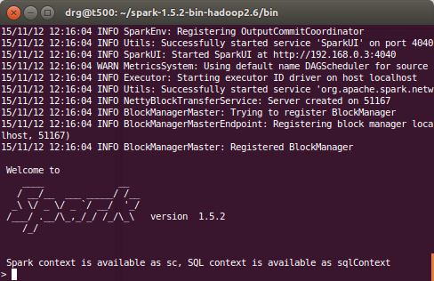
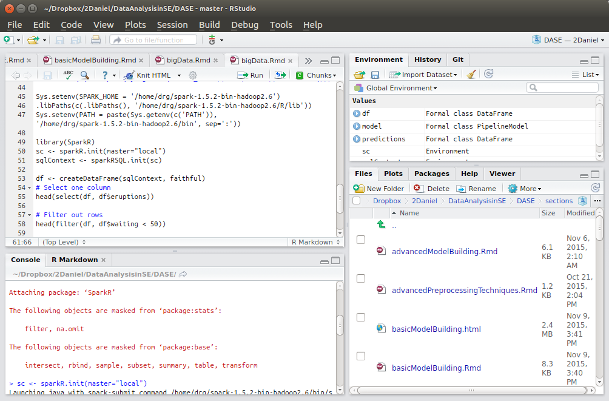

# Big Data in Software Engineering

Spark is becoming the most popular approach in Big Data. Large Volumes of data can be collected the repositories such as GitHub.

Download Spark from [https://spark.apache.org/](https://spark.apache.org/) and uncompress. Basic quick start guide:

[https://spark.apache.org/docs/latest/quick-start.html](https://spark.apache.org/docs/latest/quick-start.html)


RDD (Resiliant Distributed Dataset)

Basic examples can be run interactively in R, Python and Scala:


Scala:
```{}
  # Create a textfile RDD (Resilient Distributed Dataset)
  scala> val textFile = sc.textFile("spark-shell")
  textFile: org.apache.spark.rdd.RDD[String] = MapPartitionsRDD[3] at textFile at <console>:21

  # Show number of lines
  scala> textFile.count
  res1: Long = 92

  # Show the first line
  scala> textFile.first
  res2: String = #!/usr/bin/env bash

  # Count lines containing the word "spark"
  scala> textFile.filter(line => line.contains("spark")).count
  res3: Long = 5

scala> 
```


R:




Spark with RStudio:




```{r echo=FALSE}
# Setup
# Sys.setenv(SPARK_HOME="/home/drg/spark-1.5.2-bin-hadoop2.6")
#.libPaths(c(file.path(Sys.getenv("SPARK_HOME"), "R", "lib"), .libPaths()))

Sys.setenv(SPARK_HOME = '/home/drg/spark-1.5.2-bin-hadoop2.6')
.libPaths(c(.libPaths(), '/home/drg/spark-1.5.2-bin-hadoop2.6/R/lib'))
Sys.setenv(PATH = paste(Sys.getenv(c('PATH')), '/home/drg/spark-1.5.2-bin-hadoop2.6/bin', sep=':'))

library(SparkR)
sc <- sparkR.init(master="local")
sqlContext <- sparkRSQL.init(sc)
```


A DataFrame is a distributed collection of data organized into named columns. (from [https://spark.apache.org/docs/latest/sparkr.html](https://spark.apache.org/docs/latest/sparkr.html))

```{r}
df <- createDataFrame(sqlContext, faithful)
# Select one column
head(select(df, df$eruptions))
```

```{r}
# Filter out rows
head(filter(df, df$waiting < 50))
```

```{r}
# try simple generalized linear model 
model <- glm(waiting ~ eruptions, data = df, family = "gaussian")
summary(model)
```

```{r}
# see how well it predicts
predictions <- predict(model, newData = df)
head(select(predictions, "waiting", "prediction"))
```


Package to get data (https://github.com/databricks/spark-csv)


https://github.com/databricks/spark-csv

drg@t500:~/spark-1.5.2-bin-hadoop2.6/bin$ ./sparkR --packages com.databricks:spark-csv_2.11:1.2.0

> f <- read.df(sqlContext, "nycflights13.csv", source = "com.databricks.spark.csv", inferSchema = "true")


...
customSchema <- structType(
    structField("size", "integer"), 
    structField("effort", "integer"),
    structField("estimate", "integer"))

f <- read.df(sqlContext, "./datasets/Telecom1-noHead.csv", source = "com.databricks.spark.csv", schema = customSchema, inferSchema = "true")
...